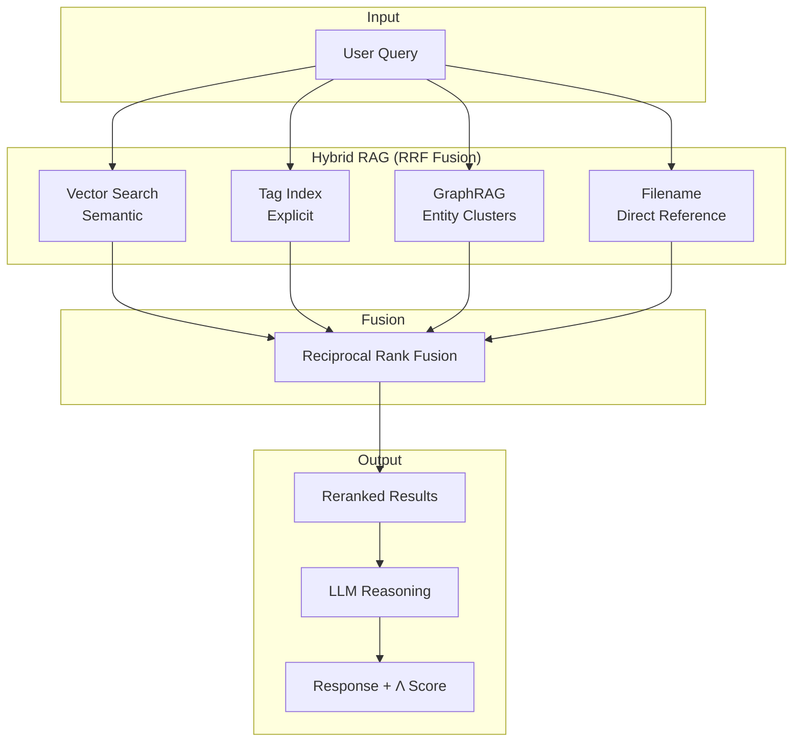

> **Last Updated**: 29 January 2026 | **Version**: v8.0-alpha

# 🏛️ Athena: Portable AI Memory System


> **Build your own AI-powered knowledge system.**  
> Portable, platform-agnostic memory that you own.

---

## ⚡ Quick Start (5 Minutes)

```bash
# 1. Clone
git clone https://github.com/winstonkoh87/Athena-Public.git
cd Athena-Public

# 2. Initialize workspace
python bootstrap.py

# 3. See it in action (no API keys required)
python simulation.py
```

That's it. The system bootstraps itself.

---

## The Problem

| Pain Point | Cost |
|------------|------|
| **No memory** | Repeating context every session |
| **Platform lock-in** | Switching models = losing everything |
| **Lost decisions** | "Why did I decide X in Session 19?" |
| **Context limits** | Manual paste just to remind the AI who you are |

## The Solution

**Portable, version-controlled memory** that lives in your repository:

```
.framework/     → Core identity and laws
.context/       → Your memories and decisions
.agent/         → Skills, workflows, automation
```

---

## Architecture



### Tech Stack

| Layer | Technology | Purpose |
|-------|------------|---------|
| **Reasoning** | Claude Opus 4.5 | Primary LLM |
| **Embeddings** | Google `text-embedding-004` | 768-dim vectors |
| **Vector Store** | Supabase + pgvector | Semantic search |
| **Graph Layer** | NetworkX + Leiden | Community detection |
| **Knowledge Store** | Markdown + Git | Version-controlled, portable |
| **IDE** | Antigravity | Agentic development |

---

## Full-Stack Implementation

### Backend: Python SDK

```python
# Example: Hybrid search with RRF fusion
from athena.tools.search import hybrid_search

results = hybrid_search(
    query="What was my decision on pricing?",
    strategies=["vector", "tags", "graphrag"],
    top_k=10
)
```

### Data Layer: Supabase + pgvector

```sql
-- Vector similarity search
SELECT content, 1 - (embedding <=> query_embedding) AS similarity
FROM memories
ORDER BY embedding <=> query_embedding
LIMIT 10;
```

### Frontend: CLI Tools

```bash
# Bootstrap workspace
python bootstrap.py

# Run sync (with hash-based delta detection)
python -m athena.memory.sync --delta

# Privacy scrub before commit
python privacy_scrubber.py --dry-run
```

### DevOps: Atomic Writes + Lockfiles

```python
# POSIX-guaranteed atomic write
def atomic_write(path: Path, content: str) -> None:
    temp_path = path.with_suffix('.tmp')
    with open(temp_path, 'w') as f:
        f.write(content)
        f.flush()
        os.fsync(f.fileno())
    temp_path.rename(path)  # Atomic on POSIX
```

---

## Key Features

| Feature | What It Does |
|---------|--------------|
| **`/start` boot** | Loads identity, retrieves context, creates session log |
| **`/end` commit** | Summarizes session, extracts decisions, saves to memory |
| **Hybrid RAG** | Fuses Vector + Tags + GraphRAG via RRF |
| **Λ Latency Indicator** | Transparent complexity scoring per response |
| **124+ Protocols** | Reusable decision frameworks |

---

## The Core Loop

```
┌─────────────────────────────────────────────────────────────────────────┐
│                                                                         │
│   (1) /start ──► Retrieve Context ──► (2) Work ──► (3) /end             │
│       ▲                                                    │            │
│       │                                                    ▼            │
│       └───── (5) Next Session ◄── Embed ◄── (4) Extract & Store        │
│                                                                         │
└─────────────────────────────────────────────────────────────────────────┘
```

Think of it like **Git, but for conversations**. Each session builds on the last.

---

## Engineering Highlights

> See [ENGINEERING_DEPTH.md](docs/ENGINEERING_DEPTH.md) for full technical details.

| Decision | Rationale |
|----------|-----------|
| **RRF Fusion** | Rank-based fusion handles different score distributions |
| **Atomic Writes** | POSIX guarantees prevent corruption on interrupt |
| **Sharded Indexes** | O(1) lookup at scale, git-friendly diffs |
| **Boot Hardening** | stdlib-only, 90s watchdog, SHA-384 verification |

---

## Repository Structure

```
Athena-Public/
├── src/athena/           # SDK package (pip installable)
│   ├── core/             #    Config, models
│   ├── tools/            #    Search, reranker
│   └── memory/           #    Vector DB interface
├── examples/
│   ├── quickstart/       # Runnable demos
│   ├── protocols/        # Decision frameworks
│   └── workflows/        # Slash commands
├── docs/                 # Deep documentation
├── bootstrap.py          # One-click setup
├── simulation.py         # API-free demo
└── privacy_scrubber.py   # PII removal utility
```

---

## Documentation

| Document | Description |
|----------|-------------|
| [GETTING_STARTED.md](docs/GETTING_STARTED.md) | Full setup guide |
| [ARCHITECTURE.md](docs/ARCHITECTURE.md) | System design |
| [ENGINEERING_DEPTH.md](docs/ENGINEERING_DEPTH.md) | Technical decisions |
| [ABOUT_ME.md](docs/ABOUT_ME.md) | About the author |

---

## Metrics

| Metric | Value |
|--------|-------|
| Protocols | 124+ |
| Sessions | 860+ |
| Automation Scripts | 106 |
| GraphRAG Communities | 1,460 |
| Knowledge Graph | 46MB + 78MB vectors |

---

## About

Built by [Winston Koh](docs/ABOUT_ME.md) — 10 years in financial services, now building AI-augmented knowledge systems.

- **GitHub**: [@winstonkoh87](https://github.com/winstonkoh87)
- **Portfolio**: [winstonkoh87.github.io](https://winstonkoh87.github.io)
- **LinkedIn**: [winstonkoh87](https://www.linkedin.com/in/winstonkoh87/)

---

## License

MIT License — see [LICENSE](LICENSE)

---

*For recruiters: See [ENGINEERING_DEPTH.md](docs/ENGINEERING_DEPTH.md) for technical decision rationale.*
