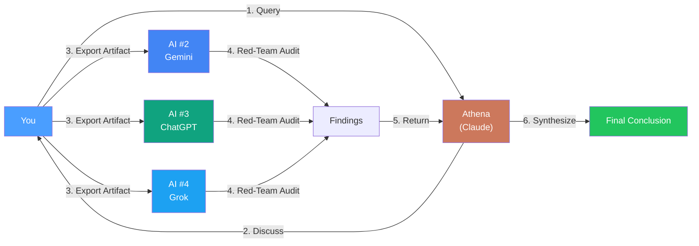

> **Last Updated**: 03 January 2026

# 🏛️ Athena: AI-Powered Personal Knowledge System


> **Development Environment**: [Google Antigravity](https://antigravity.google/) — an agentic IDE that allows AI to read/write files directly. Antigravity supports multiple reasoning models (Claude, Gemini, GPT); this system primarily uses **Claude Opus 4.5** as the reasoning engine.

---

## Why This Matters

If you're using AI for anything beyond one-off questions, you've probably hit the same wall: **every session starts from zero**.

Yes, ChatGPT has memory now. So does Claude. But their memory is **platform-locked**. If you switch models, you lose everything. If the platform changes their memory policy, you lose everything.

Athena is different: **portable, platform-agnostic memory**. Your context lives in Markdown files you own. You can take it to any model, any platform, any time. That's the moat.

---

## The Problem

**I got tired of paying for amnesia.**

Every new chat session was a cold start. I was pasting a ~50k-token "identity + context" prompt just to get consistent answers. The best insights from previous sessions? Trapped in old transcripts I'd never find again.

| Pain Point | What It Cost Me |
|------------|-----------------|
| **No memory** | Repeating the same context every session |
| **Lost decisions** | Couldn't remember *why* I'd decided X in Session 19 |
| **Context limits** | 50k tokens of manual paste just to "remind" the AI who I was |
| **Platform lock-in** | Switching models meant losing all accumulated context |

---

## The Process (The Schlep)

Here's what I actually did. No shortcuts.

> **Key insight**: I didn't build this alone. The entire system was **co-developed with AI** — Claude and Gemini working alongside me in real-time. Every protocol, every architecture decision, every refactor was a collaborative iteration. That's what makes this approach powerful: the AI helps build the system that makes the AI more useful.

### Phase 1: Tool Selection (Week 1)

- Evaluated agentic IDEs (Cursor, Continue, Aider, Antigravity) — chose Antigravity for native Gemini integration and long context window
- Set up a Supabase project with pgvector for vector embeddings
- Configured `.env` with API keys (see [Prerequisites](#prerequisites))

### Phase 2: Architecture (Weeks 2-4)

- Designed the directory structure *with AI* (`.framework/` for laws, `.context/` for memories, `.agent/` for scripts)
- Built the core loop together: `/start` (boot) → Work → `/end` (commit)
- Created the first 10 protocols — reusable decision frameworks extracted from our collaborative thinking

### Phase 3: Data Feeding (Ongoing)

- Fed it personal knowledge: decision logs, case studies, business frameworks, session transcripts
- Tagged and indexed files for retrieval (`TAG_INDEX.md`)
- Built `supabase_sync.py` to push Markdown to vector embeddings (or keep local for sensitive data)

### Phase 4: Continuous Iteration (560+ Sessions)

| Session Range | What Changed |
|---------------|--------------|
| 1-50 | Basic boot/end cycle, first protocols |
| 50-150 | Semantic search added, hybrid RAG |
| 150-300 | Cross-encoder reranking, RRF fusion |
| 300-400 | SDK refactor (`athena` package), typing, tests |
| 400-500+ | Trilateral feedback, governance audit, external red-teaming |

**The pattern**: Every friction became a protocol. Every failure became a case study. The AI helped document its own evolution.

### What the Schlep Looked Like

```
├── 560 sessions logged (human + AI collaboration)
├── 269 protocols extracted
├── 117 automation scripts written
├── 3 major refactors (monolith → SDK)
├── 2 external red-team audits
└── Countless errors, dead ends, and "why isn't this working" nights
```

---

## The Result

### Quantitative (What Changed)

| Metric | Before | After |
|--------|--------|-------|
| **Context injection** | ~50k tokens (manual copy-paste per session) | **~2k tokens** (auto-retrieved summary) |
| **Boot time** | 2-3 minutes | **<30 seconds** |
| **Session logging** | Insights are manually logged at the end of each session | **Auto-logged** when I hit `/end` |

**What this means in practice:**

```
┌──────────────────────────────────────────────────────────────────────────────┐
│                         BEFORE → AFTER COMPARISON                             │
├──────────────────────────────────┬───────────────────────────────────────────┤
│           ❌ BEFORE               │              ✅ AFTER                      │
├──────────────────────────────────┼───────────────────────────────────────────┤
│  📋 Paste 50k tokens manually    │  🔍 ~2k tokens auto-retrieved             │
│     every session                │     (semantic search)                     │
├──────────────────────────────────┼───────────────────────────────────────────┤
│  ⏱️  2-3 min boot                │  ⚡ /start boots in <30 seconds           │
│     (manual setup)               │     (automated)                          │
├──────────────────────────────────┼───────────────────────────────────────────┤
│  📝 Process → Store → Integrate  │  🔄 /end auto-logs, processes & stores   │
│     (weekly tedium)              │     (one command)                        │
└──────────────────────────────────┴───────────────────────────────────────────┘
```

### Qualitative (What It Means)

| Pillar | Outcome |
|--------|---------|
| **Recursive Self-Improvement (RSI)** | Driven by both human and AI — we feed off each other's insights. I stopped *recreating* context and started *compounding* it. Every session builds on the last. |
| **Portability** | Data lives locally (primary) and in the cloud. Not trapped in ChatGPT or Claude. It's mine — I can port it anywhere. |
| **Principles** | 269 protocols + case studies extracted from my own decisions — stored principles I can reuse and refine. Like Ray Dalio's systematized learnings, but for AI collaboration. |

### Proof It Works

In Session 400, Athena recalled a trading risk limit I'd set in Session 19 — months earlier — and flagged it before I repeated an old mistake.

```
├── Query: "position sizing rules"
├── Retrieved: protocols/trading/risk_limits.md (similarity: 0.89)
├── Created: 2025-03-14 | Last accessed: 2025-12-28
└── Injected: "Max daily loss: 2% of account. Hard stop."
```

A generic chat assistant would have missed it. Athena didn't.

---

## What I Learned

| Insight | Principle |
|---------|----------|
| **Co-development is the unlock** | Building *with* AI, not just *using* AI, creates compounding returns. |
| **Portable memory beats platform memory** | Own your context. Don't rent it from OpenAI or Anthropic. |
| **Retrieval is end-to-end** | Simple RAG fails on broad queries. RRF fusion + reranking solved quality/latency tradeoff. |
| **Protocols beat prompts** | Reusable decision frameworks outlast one-shot prompt engineering. |
| **Ship at 70%** | Perfectionism kills velocity. Iterate in production. |

---

## Why This Matters (Beyond Me)

This isn't about building *my* assistant. It's about proving a pattern:

1. **Portable memory is the real unlock** — ChatGPT and Claude have memory now, but it's locked to their platforms. Athena's memory is *yours* — Markdown files you can take to any model.
2. **Co-development is the future** — The 500+ sessions of iteration weren't me instructing an AI. They were me *building with* an AI. That's a different paradigm.
3. **Your context is your moat** — The knowledge you feed the system is unique to you. That's unforkable.

---

## 🛡️ The Most Powerful Feature: Trilateral Feedback Loop

> **One AI is not enough for life decisions.**

This is Athena's biggest unlock: **cross-model validation that reduces hallucination risk to near-zero (<1%)**.

Any single AI has blind spots. The most dangerous outcome is accepting AI output on *important decisions* without external validation. When 3-4 independent LLMs with different training data all converge on the same conclusion, you've found robust signal. When they disagree, you've found exactly where to dig deeper.

**The solution: 3+ independent AIs with different training data.**



**Why different models matter**: Each AI has different training data, different biases, different blind spots. When 3 independent models agree, you've found a robust pattern. When they disagree, you've found where to dig deeper.

**The Loop**: Query your primary AI → Discuss → Export artifact to 3 independent LLMs (different providers) → Collect red-team findings → **You + Athena synthesize together** → Final conclusion.

| Risk Level | Examples | Validation |
|------------|----------|------------|
| Low | Code refactoring | Optional |
| High | Financial, relationship | **Mandatory (3 AIs)** |
| Critical | Legal, health | **Mandatory + Human Expert** |

> **Rule of Thumb**: If you'd regret it for more than a week if wrong → run trilateral feedback.

👉 **[Full protocol + red-team prompt →](docs/TRILATERAL_FEEDBACK.md)**

---

## 📚 Further Reading

<details>
<summary><strong>🔒 Security Model</strong></summary>

### Data Residency Options

| Mode | Where Data Lives | Best For |
|------|------------------|----------|
| **Cloud** | Supabase (your project) | Cross-device access, collaboration |
| **Local** | Your machine only | Sensitive data, air-gapped environments |
| **Hybrid** | Local files + cloud embeddings | Best of both (embeddings only leave machine) |

> **Sensitive data?** Keep it local. The `athena` SDK supports local vector stores (ChromaDB, LanceDB) for users who don't want data leaving their machine. See [docs/LOCAL_MODE.md](docs/LOCAL_MODE.md).

### What Leaves Your Machine (Cloud Mode)

| Component | Sends Raw Text? | Sends Embeddings? | Destination |
|-----------|-----------------|-------------------|-------------|
| **Embedding API** | Yes (text chunks) | — | Google Cloud |
| **LLM API** | Yes (prompts) | — | Anthropic (Claude) |
| **Supabase** | No | Yes (vectors only) | Your Supabase project |

### Key Security Practices

- **Supabase Keys**: Use `SUPABASE_ANON_KEY` for client-side operations. Never expose `SUPABASE_SERVICE_ROLE_KEY` in code or logs.
- **Row-Level Security**: Enable RLS on Supabase tables. See [docs/SECURITY.md](docs/SECURITY.md) for policy templates.
- **Agentic Safety**: If using an agentic IDE with filesystem access, restrict the agent's working directory. Never grant access to `~/.ssh`, `.env` files, or git credentials.

</details>

<details>
<summary><strong>⚙️ Prerequisites & Quick Start</strong></summary>

### Prerequisites

- Python 3.10+
- Supabase project with pgvector enabled ([setup guide](docs/GETTING_STARTED.md)) — *or use local mode*
- API keys in `.env`:

```bash
# Required
SUPABASE_URL=https://your-project.supabase.co
SUPABASE_ANON_KEY=your-anon-key  # NOT service_role key
ANTHROPIC_API_KEY=your-anthropic-key  # For Claude reasoning

# Optional (for trilateral feedback with multiple LLMs)
GOOGLE_API_KEY=your-google-api-key
OPENAI_API_KEY=your-openai-key
```

```bash
cp .env.example .env
# Add your keys to .env
```

### Quick Start

```bash
# Clone
git clone https://github.com/winstonkoh87/Athena-Public.git
cd Athena-Public

# Install (minimal)
pip install -e .

# Or with full dependencies (vector search + reranking)
pip install -e ".[full]"

# Test installation
python examples/quickstart/01_boot.py

# Try the search demo
python examples/quickstart/02_search.py "position sizing"
```

See [examples/quickstart/](examples/quickstart/) for runnable demos.

</details>

<details>
<summary><strong>🛠️ Tech Stack & Architecture</strong></summary>

### Tech Stack

| Layer | Technology | Purpose |
|-------|------------|---------|
| **SDK** | `athena` Python package | Core search, reranking, memory |
| **Reasoning** | Claude Opus 4.5 (primary) | Main reasoning engine |
| **IDE** | Antigravity (supports Claude, Gemini, GPT) | Agentic development environment |
| **Embeddings** | `text-embedding-004` (768-dim) | Google embedding model |
| **Memory** | Supabase + pgvector *or* local (ChromaDB) | Vector database |
| **Knowledge Store** | Markdown files (git-versioned) | Human-readable, locally owned |

### The Core Loop

```
┌─────────────────────────────────────────────────────────────────────────┐
│                                                                         │
│   (1) /start ──► Retrieve Context ──► (2) Work ──► (3) /end             │
│       ▲                                                    │            │
│       │                                                    ▼            │
│       └───── (5) Next Session ◄── Embed ◄── (4) Extract & Store        │
│                                                                         │
└─────────────────────────────────────────────────────────────────────────┘
```

Think of it like **Git, but for conversations**. Each session builds on the last. Important decisions get captured, indexed, and recoverable.

### What Athena Does

| Feature | How It Works |
|---------|--------------|
| **`/start` boot** | Loads identity + retrieves relevant context from long-term memory |
| **`/end` commit** | Summarizes session, extracts decisions, saves to knowledge store |
| **Hybrid search** | Fuses Canonical Memory + Tags + Vectors + Filenames via RRF |
| **Cross-encoder reranking** | Refines top results with `sentence-transformers` |
| **Protocol library** | 269 reusable playbooks (trading, writing, design) |

### Repository Structure

```
Athena-Public/
├── src/athena/           # SDK package (pip installable)
│   ├── core/             #    Config, models
│   ├── tools/            #    Search, reranker, latency
│   └── memory/           #    Vector DB interface
├── examples/
│   ├── quickstart/       # Runnable demos
│   ├── scripts/          # Automation scripts
│   ├── protocols/        # Thinking patterns (starter pack included)
│   ├── workflows/        # Slash commands
│   └── templates/        # Starter templates
├── docs/                 # Deep documentation
├── community/            # Contributing, roadmap
├── pyproject.toml        # Modern packaging
└── .env.example          # Environment template
```

</details>

<details>
<summary><strong>📖 Key Concepts & Workflows</strong></summary>

### Key Concepts

- **[The Architecture](docs/ARCHITECTURE.md)** — How the system is designed
- **[VectorRAG](docs/VECTORRAG.md)** — Semantic memory implementation
- **[Getting Started](docs/GETTING_STARTED.md)** — Build your own
- **[Reasoning Modes](examples/concepts/adaptive_latency.md)** — `/start`, `/think`, `/ultrathink`
- **[Case Study: BCM](examples/case_studies/CS-140-bcm-silent-partner-analysis.md)** — Real-world due diligence example
- **[Glossary](docs/GLOSSARY.md)** — Key terms and definitions

### Example Workflows

| Command | Description |
|---------|-------------|
| `/start` | Boot system, load identity |
| `/end` | Close session, commit to memory |
| `/think` | Deep reasoning mode |
| `/ultrathink` | Maximum depth analysis |
| `/refactor` | Workspace optimization |
| `/research` | Multi-source web research |

See [examples/workflows/](examples/workflows/) for full list.

</details>

---

## About Me

I'm Winston — a systems thinker who spent 10+ years in financial services before pivoting to AI engineering.

This project represents my journey from "user" to "builder" — a production-grade personal infrastructure I rely on daily, co-developed with AI from day one.

- **GitHub**: [@winstonkoh87](https://github.com/winstonkoh87)
- **Portfolio**: [winstonkoh87.github.io](https://winstonkoh87.github.io)

---

## License

MIT License — see [LICENSE](LICENSE)

---

<details>
<summary><strong>📋 Changelog</strong></summary>

- **v1.2.4** (Jan 2026): README restructure — collapsed technical sections into "Further Reading"
- **v1.2.3** (Jan 2026): Stats correction — 269 protocols, 538 sessions, 117 scripts
- **v1.2.2** (Jan 2026): Stats sync — 248 protocols, 560 sessions, 97 scripts; removed off-topic content
- **v1.2.1** (Jan 2026): README overhaul — Process section, Security Model, co-development narrative
- **v1.2.0** (Jan 2026): New year sync — 246 protocols, 511 sessions
- **v1.1.0** (Dec 2025): Year-end sync — 238 protocols, 489 sessions
- **v1.0.0**: SDK architecture (`src/athena/`), quickstart examples

</details>

---

*For the full documentation, case studies, and deep dives, see [docs/](docs/).*
