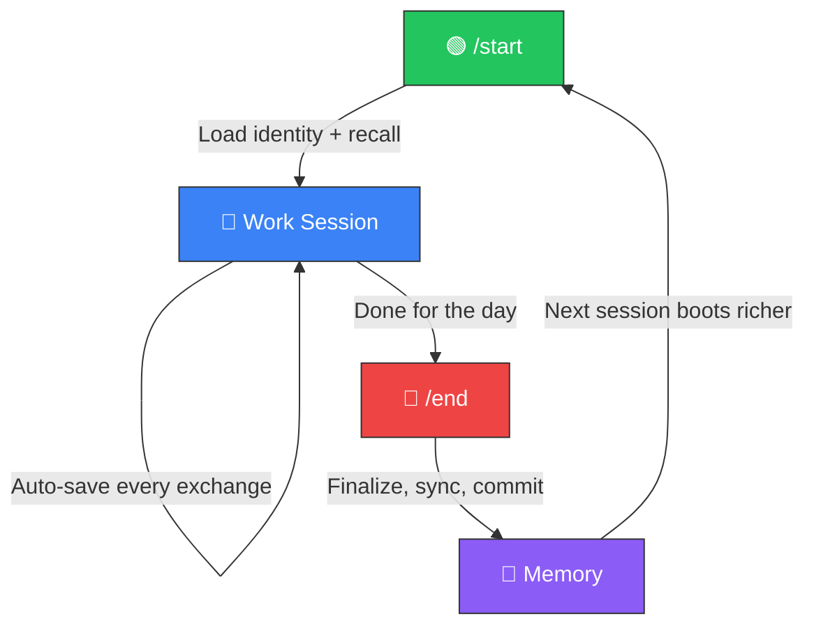

# 🏛️ Project Athena — The Linux OS for AI Agents


[](https://codespaces.new/winstonkoh87/Athena-Public)

**Last updated: 20 Feb 2026**

> **Athena is not an AI Agent. It is the Linux OS they run on.**
> Open Source · Sovereign · Model-Agnostic
> **12x Velocity**: Built in 3 months (vs 3 years manual).
> **10K Token Boot**: 95% of your context window stays free.

---

## 1. What Is Athena?

Athena gives AI agents something they don't have: **persistent memory, structure, and governance**.

Most AI agents reset every session — brilliant but amnesiac. Athena provides the **state layer** that any agent (Claude, Gemini, GPT, Llama) reads on boot and writes to on shutdown. Think of it as a **memory card** that works in any game console.

| OS Concept | Linux | Athena |
|:-----------|:------|:-------|
| **Kernel** | Hardware abstraction | Memory persistence + retrieval (VectorRAG, Supabase) |
| **File System** | ext4, NTFS | Markdown files, session logs, tag index |
| **Scheduler** | cron, systemd | Heartbeat daemon, daily briefing, auto-indexing |
| **Shell** | bash, zsh | MCP Tool Server, `/start`, `/end`, `/think` |
| **Permissions** | chmod, users/groups | 4-level capability tokens + Secret Mode |
| **Package Manager** | apt, yum | Protocols, skills, workflows |

**You own the data** (Markdown files on your machine, git-versioned). You only **rent the intelligence** (LLM API calls). Switch models tomorrow and your memory stays exactly where it is.

<details>
<summary><strong>💡 "But I have ChatGPT Memory / Claude Projects"</strong></summary>

You're confusing **RAM** with a **Hard Drive**.

| | SaaS Memory (ChatGPT/Claude) | **Athena** |
|:--|:---|:---|
| **Ownership** | Rented (Vendor Lock-in) | **Owned (Local Files)** |
| **Lifespan** | Until session/project deleted | **Forever (Git Versioned)** |
| **Structure** | Opaque Blob | **Structured Knowledge Graph** |
| **Search** | Basic keyword | **Hybrid RAG (5 sources + RRF fusion)** |
| **Agency** | Zero (waits for you) | **Bounded Autonomy (Heartbeat, Cron)** |

</details>

<details>
<summary><strong>📖 Jargon Decoder</strong></summary>

| Athena Term | What It Actually Is | Do You Need It? |
|:------------|:-------------------|:----------------|
| **"Memory"** | RAG — storing text in a database and retrieving it later | **Yes.** This is the core |
| **"Protocols"** | System prompts / reusable instructions | **Yes.** Saved templates for AI behavior |
| **"Cold Storage"** | Markdown files on your disk | **Yes.** Plain text you can read/edit anywhere |
| **"Hot Storage"** | Vector database (Supabase + pgvector) | **Optional.** Enables semantic search |
| **"Heartbeat"** | A background daemon that auto-indexes your files | **Optional.** Passive awareness without manual `/start` |
| **"Adaptive Latency"** | The AI uses more compute for hard tasks, less for easy ones | **Automatic.** You don't configure this |

> 👉 Full glossary: [docs/GLOSSARY.md](docs/GLOSSARY.md)

</details>

---

## 2. How Do I Use It?

### ⚡ Quickstart

| Step | Action |
|:-----|:-------|
| **1. Get an IDE or Agent** | [Claude Code](https://docs.anthropic.com/en/docs/claude-code) (CLI) · [Antigravity](https://antigravity.google/) · [Cursor](https://cursor.com) · [OpenAI Codex](https://openai.com/index/codex/) · [Windsurf](https://windsurf.com) · [Kiro](https://kiro.dev) · [VS Code + Copilot](https://code.visualstudio.com/) · [Full list →](docs/COMPATIBLE_IDES.md) |
| **2. Clone this repo** | `git clone https://github.com/winstonkoh87/Athena-Public.git && cd Athena-Public` |
| **3. Open folder → Type `/start`** | The AI reads the repo structure and boots |
| **4. Type `/brief interview`** | Athena asks about YOU — goals, style, domain — and builds your personal profile |
| **5. Clock 100+ sessions** | Athena compounds — the more sessions you run, the more it learns your frameworks, blind spots, and decision patterns. By session 100, it stops being generic and starts thinking like **you**. |

**That's it.** No config files. No API keys. No database setup. The folder *is* the product.

> [!TIP]
> When you're done, type `/end` to save. Next time you `/start`, the agent picks up exactly where you left off.
> Your first session takes ~30 minutes (mostly the interview). Every session after that boots in seconds.

<details>
<summary><strong>🏗️ "I already have a project — where does Athena go?"</strong></summary>

Athena is your **Brain**. Your project is the **Body**. They don't need to live in the same place.

| Mode | Setup | Best For |
|:-----|:------|:---------|
| **Standalone** | Open `Athena/` as your workspace. Navigate to other repos from there. | Personal brain, all-in-one users |
| **Multi-Root (Sidecar)** | Open your project normally → `File → Add Folder to Workspace` → select `Athena/` | Devs with existing repos who want both in one window |
| **Nested** | Drop your project folder inside `Athena/` | Quick prototypes, small projects |

```
# Standalone (recommended)           # Multi-Root (Sidecar)
~/Athena/          ← open this        IDE Workspace:
  .context/                             ├── ~/MyApp/        ← your code
  .agent/                               └── ~/Athena/       ← the brain
  .framework/

# Nested
~/Athena/
  .context/
  .agent/
  MyApp/            ← project inside
```

**Recommendation**: Start with **Standalone**. If you need your project visible in the same window, use **Multi-Root**. All three modes work — pick what feels natural.

</details>

<details>
<summary><strong>🤝 "I work with clients — where does their data go?"</strong></summary>

Keep Athena as **your personal brain**. Create client folders **outside** the workspace.

```
~/Desktop/
├── Project Athena/       ← YOUR brain (personal context, memory, protocols)
├── Client-A/             ← Client A's project (isolated)
├── Client-B/             ← Client B's project (isolated)
└── Client-C/             ← Client C's project (isolated)
```

**Why?** Your memory bank contains *your* psychology, decision frameworks, and personal history. Client work is temporary and shouldn't pollute that context.

**How it works in practice:**

1. When working on a client project, point Athena to the external folder (e.g., "look at `~/Desktop/Client-A/`")
2. Athena reads the client files while retaining your personal context — best of both worlds
3. When the engagement ends, archive the learnings back into Athena (strip client-specific data) and archive or delete the external folder

**The rule:** Athena keeps the *wisdom*. The client keeps the *execution*.

</details>

### 🪞 Your First Session

On your first `/start`, run `/brief interview`. Athena asks about **everything** — name, profession, goals, decision style, blind spots. This isn't small talk. It's the foundation that makes every future session compound.

| What Athena Asks | Why |
|:----------------|:----|
| **Identity** — Name, age, nationality | Communication style, cultural context |
| **Professional** — Role, industry, salary range | Domain expertise, decision-making context |
| **Goals** — 3-month, 1-year, 5-year | Aligns every response to your actual trajectory |
| **Decision Style** — Risk appetite, speed vs quality | Calibrates how options and tradeoffs are framed |
| **Blind Spots** — Recurring mistakes, weak areas | Athena proactively flags these before they bite |
| **Communication** — Tone, verbosity, directness | Sets the default voice across all interactions |

> [!IMPORTANT]
> **Everything stays local.** Your profile is stored as a Markdown file on your machine (`user_profile.md`). No cloud. No tracking. Be as candid as you want — this is *your* private operating system.

**Pattern:** The more you share → the faster Athena stops being generic → the sooner it starts thinking like **you**.

> 👉 [Full First Session Guide](docs/YOUR_FIRST_SESSION.md) — detailed walkthrough with examples

### 💡 Tips for Getting the Most Out of Athena

<details>
<summary><strong>🎯 Find One Signature Project and Go Deep</strong></summary>

The best way to learn Athena (and agentic coding in general) is to **work on a project you actually care about**. Pick one — a portfolio site, a side project, a tool you wish existed — and build it entirely through Athena.

The more you use Athena on a real project, the more you learn about coding, software architecture, and how to work effectively with AI. Tutorials teach theory. Building teaches everything else.

**My approach:** I built a portfolio website showcasing everything I produced with Project Athena, and I keep iterating on it. Every session improves both the project *and* my skills. Find your equivalent and commit to it.

</details>

<details>
<summary><strong>🧩 One Session = One Feature</strong></summary>

Athena works best with focused sessions. If your project has ten features, work on them across ten separate sessions — not all at once.

| Session | Focus |
|:--------|:------|
| Session 1 | Authentication system |
| Session 2 | Dashboard UI |
| Session 3 | API integration |
| Session 4 | Search functionality |

Each session gets its own log, its own context, and its own clean thread of reasoning. This creates better memory, cleaner recall, and fewer context collisions in future sessions.

</details>

<details>
<summary><strong>☁️ Sync to GitHub — Your Cloud Backup</strong></summary>

I strongly recommend syncing your Athena repo to GitHub. This is the easiest way to back up your data — and it's what I do for this project.

When you run `/end`, Athena can automatically commit and push your session to GitHub. If you ever lose your laptop or switch machines, your entire brain is recoverable from your GitHub profile. Clone it to a new machine and `/start` — you're back exactly where you left off.

**Bonus:** This also gives you **portability**. Switch laptops, switch IDEs, even switch AI models — your memory travels with you because it's just Git.

</details>

---

## 3. Features

When you clone this repo, **you already have a working Agent.** Not a blank slate — a complete template with identity, memory structure, protocols, and governance pre-loaded.

| Component | What You Get | Customizable? |
|:----------|:-------------|:-------------:|
| **🧠 Core Identity** | Pre-built constitution with 6 laws ([Core_Identity Template](examples/templates/core_identity_template.md)) | ✅ Edit freely |
| **📋 120+ Protocols** | Decision frameworks across 13 categories ([examples/protocols/](examples/protocols/)) | ✅ Fork & extend |
| **📝 Memory Bank** | Structured templates for user profile, context, and session logs | ✅ Auto-fills over time |
| **⚡ 48 Slash Workflows** | `/start`, `/end`, `/think`, `/research`, and [more](docs/WORKFLOWS.md) | ✅ Add your own |
| **🔌 MCP Server** | [9 tools](docs/MCP_SERVER.md) exposable to any MCP-compatible client | ✅ Configure |
| **🛡️ Governance** | 4 capability levels, 3 sensitivity tiers, [Secret Mode](docs/SECURITY.md) | ✅ Adjust |

> [!TIP]
> **Day 1**: The AI knows *how* to think (laws, reasoning standards, protocols) but not *who* you are.
> **Day 2+**: As you use it, the templates fill with *your* data — sessions, decisions, preferences. The starter kit becomes *your* sovereign system.

Think of it as a **furnished apartment** — you move in and start living immediately. Over time, you replace the furniture with your own.

### 🤖 Coding Agent Compatibility

Athena is model-agnostic — the memory layer works with any agent. For coding agents that support project-level configuration, `athena init` generates native config files so the agent understands Athena's session workflow and COS agents out of the box.

| Coding Agent | Status | Init Command | What Gets Generated |
|:-------------|:------:|:-------------|:--------------------|
| **[Claude Code](https://docs.anthropic.com/en/docs/claude-code)** | ✅ Ready | `athena init --ide claude` | `CLAUDE.md` + `.claude/agents/cos-*.md` (6 COS sub-agents) |
| **[Antigravity](https://antigravity.google/)** | ✅ Ready | `athena init --ide antigravity` | `AGENTS.md` |
| **[Cursor](https://cursor.com)** | ✅ Ready | `athena init --ide cursor` | `.cursor/rules.md` |
| **[Gemini CLI](https://github.com/google-gemini/gemini-cli)** | ✅ Ready | `athena init --ide gemini` | `.gemini/AGENTS.md` |
| **[VS Code + Copilot](https://code.visualstudio.com/)** | ✅ Ready | `athena init --ide vscode` | `.vscode/settings.json` |
| **[OpenAI Codex](https://openai.com/index/codex/)** | 🔜 Planned | — | — |
| **[Windsurf](https://codeium.com/windsurf)** | 🔜 Planned | — | — |
| **[Kiro](https://kiro.dev)** | 🔜 Planned | — | — |
| **[Zed](https://zed.dev)** | 🔜 Planned | — | — |
| **[Firebase Studio](https://firebase.google.com/studio)** | 🔜 Planned | — | — |
| **[Aider](https://aider.chat)** | 🔜 Planned | — | — |
| **[Cline](https://github.com/cline/cline)** | 🔜 Planned | — | — |
| **[Amazon Q Developer](https://aws.amazon.com/q/developer/)** | 🔜 Planned | — | — |

> [!TIP]
> **Don't see your agent?** Athena works with *any* agent that can read Markdown files. See the [full compatibility guide](docs/COMPATIBLE_IDES.md) for details, decision matrix, and how to request new integrations.

### 🔄 The Loop

After you install Athena, you repeat one cycle: **`/start` → Work → `/end`**. Every cycle deposits training data into memory. Over hundreds of cycles, Athena stops being generic and starts thinking like *you*.



| Sessions | What Happens |
|:---------|:------------|
| **1–50** | Basic recall. Remembers your name and project. |
| **50–200** | Pattern recognition. Anticipates your preferences. |
| **200–500** | Deep sync. Knows your frameworks, blind spots, style. |
| **500–1,000+** | Full context. Anticipates patterns before you state them. |

### 💰 Token Economics

`/start` loads ~**10K tokens** of identity and context. This cost is **constant** — Session 1 and Session 10,000 cost the same to boot, because memory is compressed into structured Markdown (not growing chat history).

| Model | Context Window | Boot Cost | Remaining | Utilization |
|:------|:--------------|:----------|:----------|:------------|
| **Claude Opus 4.6** | 200K | ~10K | **190K** (95% free) | 5% |
| **Gemini 3 Pro** | 1M+ | ~10K | **990K+** (99% free) | ~1% |

> [!TIP]
> Most "memory" solutions dump entire chat history into context (grows linearly with usage). Athena's architecture keeps boot cost **flat** — your 10,000th session is as cheap as your first.

### 🧠 Persistent Memory

Your data lives in **Markdown files you own** — on your machine, git-versioned. Optionally backed up to Supabase (cloud insurance).

- **Local-first**: No vendor lock-in. Switch models anytime.
- **Hybrid search**: Canonical + GraphRAG + Tags + Vectors + Filenames, fused via RRF
- **Auto-quicksave**: Every exchange is logged without manual action

---

## 4. Use Cases

Athena is domain-agnostic — it adapts to whatever *you* do. But most users fall into five core workflows:

### 🎯 Decision-Making

> *"Should I take this job offer? Should I pivot my business? Should I invest in this asset?"*

Athena's [Trilateral Feedback Protocol](docs/TRILATERAL_FEEDBACK.md) runs your decision through **3 independent AI models**, cross-validates their reasoning, and synthesizes a weighted recommendation — based on Ray Dalio's Believability-Weighted Decision Making (Dalio, 2017). Instead of asking one AI and trusting the first answer, you get a **Synthetic Idea Meritocracy**: multiple perspectives, stress-tested, with explicit confidence levels.

**Key protocols**: [Risk of Ruin](examples/protocols/safety/001-law-of-ruin.md) · [Skeptic Gate](examples/protocols/decision/261-skeptic-gate.md) · [Base Rate Audit](examples/protocols/decision/140-base-rate-audit.md)

### 🧩 Problem-Solving

> *"Why is my conversion rate dropping? Why does this architecture keep breaking? What am I missing?"*

[Graph of Thoughts](examples/protocols/decision/137-graph-of-thoughts.md) reasoning generates **multiple solution paths**, scores each on survivability and upside, then converges on the strongest answer — not just the first one. Combined with [First Principles Deconstruction](examples/protocols/decision/115-first-principles-deconstruction.md), Athena breaks complex problems into their atomic components and rebuilds from there.

**Key protocols**: [Graph of Thoughts](examples/protocols/decision/137-graph-of-thoughts.md) · [Prima Facie vs Actuality](examples/protocols/decision/308-prima-facie-actuality-gap.md) · [Silent Validator](examples/protocols/engineering/55-silent-validator.md)

### 🔬 Research & Synthesis

> *"Give me a comprehensive analysis of X. Synthesize these 12 sources. Find the consensus and the outliers."*

The [Cyborg Methodology](examples/protocols/research/54-cyborg-methodology.md) enforces sentence-level human-AI collaboration — not "delegate and pray." Athena runs structured research across multiple sources, cross-validates findings, and produces cited output with confidence levels. Every claim is traceable to its source.

**Key protocols**: [Cyborg Methodology](examples/protocols/research/54-cyborg-methodology.md) · [Deep Research Loop](examples/protocols/research/52-deep-research-loop.md) · [Ultimate Auditor](examples/protocols/meta/000-ultimate-auditor.md)

### 📚 Personal Knowledge Management

> *"What did I decide about X three months ago? What were my reasons? What happened after?"*

This is the **core product.** Every session auto-saves into structured memory: session logs, case studies, user profiles, decision history. Over hundreds of sessions, Athena builds a searchable archive of *your* thinking — not generic knowledge, but **your** frameworks, **your** blind spots, **your** patterns. Hybrid RAG (5 sources + RRF fusion) means recall is fast and precise.

**Key features**: [Memory Architecture](docs/ARCHITECTURE.md) · [Semantic Search](docs/SEMANTIC_SEARCH.md) · [GraphRAG](docs/GRAPHRAG.md)

### 📐 Strategic Planning

> *"Map out my next 6 months. Stress-test this business model. Show me the unit economics."*

Long-horizon planning with **longitudinal memory** — Athena doesn't just plan, it tracks decisions and their outcomes across sessions. SDR analysis, unit economics breakdowns, market positioning, Min-Max optimization (Mas-Colell et al., 1995). Every future session benefits from every past decision you logged.

**Key protocols**: [Min-Max Optimization](examples/protocols/strategy/106-min-max-optimization.md) · [Prima Facie vs Actuality](examples/protocols/decision/308-prima-facie-actuality-gap.md) · [Red Team v4](examples/protocols/meta/004-red-team-v4-3.md)

---

## 5. Resources & Community

### 📣 Community

> **"I gave Gemini a brain..."** — Viral on r/GeminiAI and r/ChatGPT ([700K+ views](https://www.reddit.com/r/ChatGPT/comments/1r1b3gl/))

### Repository Structure

```text
Athena-Public/
├── src/athena/              # SDK package (pip install -e .)
│   ├── core/                #   Config, governance, permissions, security
│   ├── tools/               #   Search, agentic search, reranker, heartbeat
│   ├── memory/              #   Vector DB, delta sync, schema
│   ├── boot/                #   Orchestrator, loaders, shutdown
│   ├── cli/                 #   init, save, doctor commands
│   └── mcp_server.py        #   MCP Tool Server (9 tools, 2 resources)
├── scripts/                 # Operational scripts (boot, shutdown, launch)
├── examples/
│   ├── protocols/           # 120+ starter frameworks (13 categories)
│   ├── scripts/             # 130+ reference scripts
│   ├── templates/           # Starter templates (framework, memory bank)
│   └── quickstart/          # Runnable demos
├── docs/                    # Architecture, benchmarks, security, guides
├── community/               # Contributing, roadmap
├── pyproject.toml           # Modern packaging (v9.2.1)
└── .env.example             # Environment template
```

<details>
<summary><strong>💸 How Much Does It Cost?</strong></summary>

Athena itself is free and open source. The only cost is your AI subscription (the LLM that reads your Athena workspace).

| Tier | Example Plans | Cost (USD) | Who It's For |
|:-----|:-------------|:-----------|:-------------|
| **Entry** | Claude Pro · Google AI Pro | ~$20/mo | Most users — more than enough for daily use |
| **Power** | Claude Max 20× · Google AI Ultra | $200–250/mo | 8+ hours/day across multiple projects |

**Start with $20/month.** That covers the vast majority of use cases. The power user plans exist for people who run Athena all day across multiple workspaces and hit token limits — you'll know when you need them.

> [!TIP]
> Athena's 10K-token boot cost is the same whether you're on a $20 plan or a $200 plan. The difference is how many sessions you can run per day before hitting your plan's message limit.

<details>
<summary><strong>❓ "Won't this eat my subscription tokens?"</strong></summary>

**No.** The 10K boot cost is per **context window** (5% of one session), not per subscription. Your subscription limits are based on **message count**, not token count — whether you send a 10K or 200K message, it counts as one message.

| User Type | Plan | Sessions/Day | Verdict |
|:----------|:-----|:-------------|:--------|
| **Casual** | Pro ($20/mo) | 1–2 | ✅ 95% of context stays free |
| **Daily Driver** | Max 5× ($100/mo) | 3–5 | ✅ Each session is independent |
| **Power User** | Max 20× ($200/mo) | 10+ parallel | ✅ Multiple agents, multiple projects |

**The trade**: You spend 5% of your context window so the remaining 95% is **dramatically smarter** — because the AI actually knows who you are, what you're building, and how you think.

</details>

</details>

<details>
<summary><strong>🔧 CLI Reference</strong></summary>

```bash
pip install -e .              # Install SDK
athena                        # Boot session
athena init .                 # Initialize workspace in current directory
athena init --ide claude       # Init with Claude Code agents + CLAUDE.md
athena init --ide cursor       # Init with Cursor-specific config
athena check                  # Basic health check
athena doctor                 # Full 15-check system diagnostics
athena doctor --fix           # Auto-repair fixable issues
athena doctor --json          # Machine-readable output
athena save "summary"         # Quicksave checkpoint
athena --end                  # Close session and save
athena --version              # Show version (v9.2.1)
```

</details>

<details>
<summary><strong>📥 Import Existing Data (ChatGPT, Gemini, Claude)</strong></summary>

Athena's memory is just Markdown files. Any text you can export becomes part of your memory:

| Source | How to Import |
|:-------|:-------------|
| **ChatGPT** | Settings → Data Controls → Export → Copy `.md` files into `.context/memories/imports/` |
| **Gemini** | [Google Takeout](https://takeout.google.com/) → Select "Gemini Apps" → Extract into `.context/memories/imports/` |
| **Claude** | Settings → Export Data → Copy transcripts into `.context/memories/imports/` |
| **Any Markdown** | Drop `.md` files into `.context/memories/` — indexed on next `/start` |

After importing, run `athena check` to verify files are detected.

</details>

### 📚 Further Reading

<details>
<summary><strong>🏗️ Architecture & Design</strong></summary>

| Document | Description |
|:---------|:-----------|
| [ARCHITECTURE.md](docs/ARCHITECTURE.md) | System design, data flow, hub architecture |
| [SPEC_SHEET.md](docs/SPEC_SHEET.md) | Technical specification, data schema, API surface |
| [GRAPHRAG.md](docs/GRAPHRAG.md) | Knowledge graph layer ⚠️ **~$50 API cost** |
| [VECTORRAG.md](docs/VECTORRAG.md) | Semantic memory implementation |
| [SEMANTIC_SEARCH.md](docs/SEMANTIC_SEARCH.md) | Hybrid RAG implementation |
| [MCP_SERVER.md](docs/MCP_SERVER.md) | MCP architecture & IDE configuration |
| [KNOWLEDGE_GRAPH.md](docs/KNOWLEDGE_GRAPH.md) | Compressed concept index |

</details>

<details>
<summary><strong>🚀 Getting Started & Guides</strong></summary>

| Document | Description |
|:---------|:-----------|
| [GETTING_STARTED.md](docs/GETTING_STARTED.md) | Step-by-step setup guide |
| [YOUR_FIRST_AGENT.md](docs/YOUR_FIRST_AGENT.md) | 5-minute quickstart |
| [WHAT_IS_AN_AI_AGENT.md](docs/WHAT_IS_AN_AI_AGENT.md) | Beginner primer |
| [DEMO.md](docs/DEMO.md) | Live walkthrough |
| [WORKFLOWS.md](docs/WORKFLOWS.md) | All 48 slash commands |
| [FAQ.md](docs/FAQ.md) | Common questions |
| [GLOSSARY.md](docs/GLOSSARY.md) | Key terms and definitions |

</details>

<details>
<summary><strong>📊 Performance & Case Studies</strong></summary>

| Document | Description |
|:---------|:-----------|
| [BENCHMARKS.md](docs/BENCHMARKS.md) | Boot time, search latency, token economics |
| [Blog Evolution](docs/case-studies/Case_Blog_Evolution_2026.md) | Content strategy analysis |
| [Web Design 2026](docs/case-studies/Case_Web_Design_2026.md) | Design decision framework |
| [Decision Framework](docs/case-studies/Decision_Framework_Application.md) | Applied decision protocol |
| [TOP_10_PROTOCOLS.md](docs/TOP_10_PROTOCOLS.md) | MCDA-ranked essential protocols |
| [ENGINEERING_DEPTH.md](docs/ENGINEERING_DEPTH.md) | Technical depth overview |

</details>

<details>
<summary><strong>🔒 Security & Data</strong></summary>

| Mode | Where Data Lives | Best For |
|:-----|:----------------|:---------|
| **Local** | Your machine only | Sensitive data, air-gapped environments |
| **Cloud** | Supabase (your project) | Cross-device access |
| **Hybrid** | Local files + cloud embeddings | Best of both |

- Use `SUPABASE_ANON_KEY` for client-side. Never expose `SUPABASE_SERVICE_ROLE_KEY`.
- Enable Row-Level Security on Supabase tables.
- Restrict agent working directories — never grant access to `~/.ssh` or `.env`.

> 👉 [SECURITY.md](docs/SECURITY.md) · [LOCAL_MODE.md](docs/LOCAL_MODE.md)

</details>

<details>
<summary><strong>🧠 Philosophy & Deep Dives</strong></summary>

| Document | Description |
|:---------|:-----------|
| [MANIFESTO.md](docs/MANIFESTO.md) | The Bionic Unit philosophy |
| [USER_DRIVEN_RSI.md](docs/USER_DRIVEN_RSI.md) | How you and AI improve together |
| [TRILATERAL_FEEDBACK.md](docs/TRILATERAL_FEEDBACK.md) | Cross-model validation ("Watchmen") |
| [Quadrant IV](docs/concepts/Quadrant_IV.md) | How Athena surfaces unknown unknowns |
| [Adaptive Latency](examples/concepts/adaptive_latency.md) | Macro-Robust, Micro-Efficient (RETO) |
| [REFERENCES.md](docs/REFERENCES.md) | APA-formatted academic citations |
| [ABOUT_ME.md](docs/ABOUT_ME.md) | About the author |

</details>

<details>
<summary><strong>⚙️ Prerequisites (Optional)</strong></summary>

The quickstart needs **zero configuration**. These are only needed for advanced features:

```bash
# Required for cloud features
SUPABASE_URL=https://your-project.supabase.co
SUPABASE_ANON_KEY=your-anon-key
ANTHROPIC_API_KEY=your-anthropic-key

# Optional (for multi-model validation)
GOOGLE_API_KEY=your-google-api-key
OPENAI_API_KEY=your-openai-key
```

```bash
cp .env.example .env
# Add your keys
```

</details>

<details>
<summary><strong>🛠️ Tech Stack</strong></summary>

| Layer | Technology | Purpose |
|:------|:----------|:--------|
| **SDK** | `athena` Python package (v9.2.1) | Core search, reranking, memory |
| **Reasoning** | Claude Opus (primary) | Main reasoning engine |
| **Optimization** | DSPy | Prompt optimization & self-correction |
| **Reranking** | FlashRank | Lightweight cross-encoder RRF |
| **IDE / Agent** | Claude Code (CLI), Antigravity, Cursor, VS Code | Agentic development environment |
| **Embeddings** | `text-embedding-004` (768-dim) | Google embedding model |
| **GraphRAG** | NetworkX + Leiden + ChromaDB | Knowledge graph ⚠️ **~$50 API** |
| **Memory** | Supabase + pgvector / local ChromaDB | Vector database |
| **Routing** | CognitiveRouter | Adaptive latency by query complexity |

</details>

<details>
<summary><strong>📋 Changelog</strong></summary>

### February 2026

- **v9.2.1** (Feb 20 2026): **Deep Audit & PnC Sanitization** — Empirical grep/diff audit of public repo. Sanitized 17 PnC patterns across 13 files (ZenithFX, Psychology_L1L5, EURAUD). Event-driven Watchdog (replaces os.walk polling), persistent LightRAG, batched SQLite queries, 24h env cache. Zero PnC leaks confirmed post-scan.
- **v9.2.0** (Feb 17 2026): **Sovereignty Convergence** — Root↔Public unification via cherry-pick. CVE-2025-69872 security patch active, production-grade cache, agentic search, governance upgrade, 8 new modules. Fixed split-brain editable install. Titanium Airlock preserved.
- **v9.1.0** (Feb 17 2026): **Deep Audit & Sync** — Fixed 15 issues (dead links, version drift, dependency sync, AGENTS.md path errors, workflow count corrections). Cleaned tracked artifacts.
- **v9.0.0** (Feb 16 2026): **First-Principles Workspace Refactor** — Root directory cleaned (28→14 files), 114 stub session logs archived, build artifacts purged, dead `.framework/v7.0` archived, `.gitignore` hardened. Zero regressions (17/17 tests pass).
- **v8.6.0** (Feb 15 2026): **Massive Content Expansion** — 200 protocols (was 75), 535 scripts (was 16), 48 workflows (was 14), 36 templates. 23 protocol categories. Repo audit for recruiter readiness. Content sanitization pass.
- **v8.5.0** (Feb 12 2026): **Phase 1 Complete** — MCP Tool Server (9 tools, 2 resources), Permissioning Layer (4 levels + secret mode), Search MRR +105% (0.21→0.44), Evaluator Gate (50 queries). SDK v2.0.0.
- **v8.3.1** (Feb 11 2026): **Viral Validation Release** — 654K+ Reddit views, 1,660+ upvotes, 5,300+ shares. #1 All-Time r/ChatGPT, #2 All-Time r/GeminiAI.
- **v8.2.1** (Feb 9 2026): Metrics Sync — Fixed `batch_audit.py` automation, linked orphan files, reconciled tech debt, 8,079 tags indexed

👉 **[Full Changelog](docs/CHANGELOG.md)** — Complete version history from v1.0.0 (Dec 2025)

</details>

---

## License

MIT License — see [LICENSE](LICENSE)

---

*This is a complete Starter Kit. Clone it, run `/start`, and you have a working Agent on Day 1. Over time, it stops being generic and starts thinking like **you**.*
