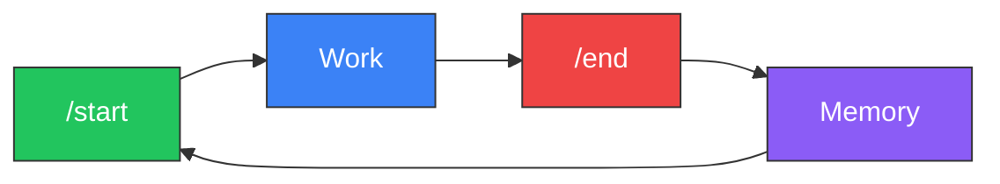

<div align="center">

# Project Athena

**The operating system for AI agents.**

Open-source infrastructure that gives any LLM persistent memory, structured reasoning, and governance.
Own the data. Rent the intelligence.

[](https://github.com/winstonkoh87/Athena-Public/stargazers)
[](LICENSE)
[](docs/CHANGELOG.md)
[](https://www.reddit.com/r/ChatGPT/comments/1r1b3gl/)
[](https://codespaces.new/winstonkoh87/Athena-Public)

[Quickstart](#-quickstart) · [How It Works](#-how-it-works) · [Docs](docs/GETTING_STARTED.md) · [FAQ](docs/FAQ.md) · [Contributing](CONTRIBUTING.md)

*Last updated: 24 February 2026*

</div>

---

## Why Athena?

AI agents are brilliant — but amnesiac. Every session starts from zero. Athena fixes that.

- **🧠 Persistent Memory** — Sessions compound. Your 500th session recalls patterns from your 5th.
- **🔌 Model-Agnostic** — Works with Claude, Gemini, GPT, Llama — switch anytime, keep everything.
- **📁 You Own Your Data** — Markdown files on your machine, git-versioned. No vendor lock-in. Ever.
- **⚡ ~10K Token Boot** — 95% of your context window stays free, even after 10,000 sessions.
- **🛡️ Governed Autonomy** — 6 constitutional laws, 4 capability levels, bounded agency.

> *Think of it like this: the LLM is the engine. Athena is the chassis, the memory, and the rules of the road.*

<details>
<summary><strong>"But don't ChatGPT / Gemini already remember?"</strong></summary>

Yes — platforms now offer memory features. But there's a difference between *remembering your name* and *thinking in your frameworks*:

| Capability | Platform Memory (ChatGPT, Gemini, Claude) | Athena |
|:-----------|:------------------------------------------|:-------|
| **Memory type** | Passive recall (opaque, probabilistic) | Active reload (deterministic, structured) |
| **Can you inspect it?** | No — it's a black box | Yes — it's markdown files you can read and edit |
| **Can you search it?** | Vague recall, no precision | Full semantic + keyword search with file links |
| **Cross-platform?** | Locked to one provider | Same memory works across Claude, Gemini, GPT, Grok |
| **Version history?** | None — no rollback, no audit trail | Full `git log`, `git diff`, `git blame` |
| **Programmable behavior?** | Text box (suggestion) | Structured protocols with triggers, decision trees, kill switches |
| **Tool execution?** | Sandboxed / none | Runs scripts, writes files, calls APIs on your machine |
| **Multi-agent?** | One model, one window | Cross-model orchestration (Trilateral Feedback Protocol) |
| **What happens if you switch providers?** | Start over | Nothing changes — your data stays |

> **💡 Tip:** Think of platform memory like photos stored on Instagram — you can view them, but you don't own them, can't move them, and can't search them precisely. Athena is like keeping the originals on your hard drive, with GPS metadata, albums, and full edit history.

</details>

---

## ⚡ Quickstart

```bash
# 1. Fork & clone
git clone https://github.com/YOUR_USERNAME/Athena-Public.git && cd Athena-Public

# 2. Open in your IDE (Claude Code, Antigravity, Cursor, VS Code, etc.)

# 3. Boot:
/start

# 4. First time? Take the guided tour:
/tutorial

# 5. When you're done:
/end
```

**That's it.** No config files. No API keys. No database setup. The folder *is* the product.

> [!TIP]
> `/tutorial` walks you through everything: what Athena is, how it works, builds your profile, and demos the tools (~20 min). Confident users can skip it and jump straight to work.
>
> See the [full guide →](docs/YOUR_FIRST_SESSION.md)

---

## 🔄 How It Works

Every session follows one cycle: **`/start` → Work → `/end`**. Each cycle deposits structured memory. Over hundreds of cycles, the AI stops being generic and starts thinking like *you*.



| Sessions | What Happens |
|:---------|:------------|
| **1–50** | Basic recall — remembers your name, project, preferences |
| **50–200** | Pattern recognition — anticipates your style and blind spots |
| **200+** | Deep sync — thinks in your frameworks before you state them |

### The Linux Analogy

| Concept | Linux | Athena |
|:--------|:------|:-------|
| Kernel | Hardware abstraction | Memory persistence + retrieval (RAG, Supabase) |
| File System | ext4, NTFS | Markdown files, session logs, tag index |
| Scheduler | cron, systemd | Heartbeat daemon, auto-indexing |
| Shell | bash, zsh | MCP Tool Server, `/start`, `/end`, `/think` |
| Permissions | chmod, users/groups | 4-level capability tokens + Secret Mode |
| Package Manager | apt, yum | Protocols, skills, workflows |

---

## 📦 What's In The Box

| Component | Details |
|:----------|:--------|
| 🧠 **Core Identity** | Pre-built constitution with 6 laws — [template](examples/templates/core_identity_template.md) |
| 📋 **120+ Protocols** | Decision frameworks across 13 categories — [browse](examples/protocols/) |
| ⚡ **50+ Slash Commands** | `/start`, `/end`, `/think`, `/research` — [full list](docs/WORKFLOWS.md) |
| 🔍 **Hybrid RAG Search** | 5-source retrieval + RRF fusion — [architecture](docs/SEMANTIC_SEARCH.md) |
| 🔌 **MCP Tool Server** | 9 tools exposable to any MCP client — [docs](docs/MCP_SERVER.md) |
| 🛡️ **Governance Layer** | 4 capability levels, 3 sensitivity tiers — [security](docs/SECURITY.md) |

### Agent Compatibility

Athena works with **any agent that reads Markdown**. For agents supporting project-level config, `athena init` generates native files:

| Agent | Status | Init Command |
|:------|:------:|:-------------|
| [Claude Code](https://docs.anthropic.com/en/docs/claude-code) | ✅ | `athena init --ide claude` |
| [Antigravity](https://antigravity.google/) | ✅ | `athena init --ide antigravity` |
| [Cursor](https://cursor.com) | ✅ | `athena init --ide cursor` |
| [Gemini CLI](https://github.com/google-gemini/gemini-cli) | ✅ | `athena init --ide gemini` |
| [VS Code + Copilot](https://code.visualstudio.com/) | ✅ | `athena init --ide vscode` |

> More agents planned — [full compatibility list →](docs/COMPATIBLE_IDES.md)

---

## 🎯 Use Cases

| | Use Case | What Athena Does |
|:-|:---------|:-----------------|
| 🎯 | **Decision-Making** | Trilateral cross-model validation + MCDA ranked by *your* revealed preferences |
| 🧩 | **Problem-Solving** | Graph-of-Thoughts multi-path reasoning + first-principles deconstruction |
| 🔬 | **Research & Synthesis** | Structured multi-source synthesis with sentence-level citation |
| 📚 | **Knowledge Management** | Searchable archive of *your* thinking — portable, model-agnostic, sovereign |
| 📐 | **Strategic Planning** | Longitudinal planning with Monte Carlo simulation + ergodic risk modeling |
| 🧠 | **Meta-Thinking** | Surfaces blind spots via pattern detection across hundreds of sessions |

---

## 💰 Cost

Athena is **free and open source**. You only pay for your AI subscription:

| Plan | Cost | Who It's For |
|:-----|:-----|:-------------|
| Claude Pro / Google AI Pro | ~$20/mo | Most users |
| Claude Max / Google AI Ultra | $200–250/mo | Power users (8+ hrs/day) |

> Boot cost is ~10K tokens — constant whether it's session 1 or session 10,000. [Details →](docs/BENCHMARKS.md)

> [!NOTE]
> Athena works with any model, but its structured reasoning and governance protocols perform best with frontier models (e.g. Claude Opus, Gemini 3.1 Pro, GPT-5.2). Smaller models may struggle to follow multi-step protocols consistently.

---

## 📚 Documentation

| | | |
|:--|:--|:--|
| 📖 [Getting Started](docs/GETTING_STARTED.md) | 🏗️ [Architecture](docs/ARCHITECTURE.md) | 🔒 [Security](docs/SECURITY.md) |
| 🎯 [Your First Session](docs/YOUR_FIRST_SESSION.md) | 🔍 [Semantic Search](docs/SEMANTIC_SEARCH.md) | 📊 [Benchmarks](docs/BENCHMARKS.md) |
| 💡 [Tips & Best Practices](docs/TIPS.md) | 🔌 [MCP Server](docs/MCP_SERVER.md) | ❓ [FAQ](docs/FAQ.md) |
| 🔄 [Updating Athena](docs/UPDATING.md) | 📥 [Importing Data](docs/IMPORTING.md) | ⌨️ [CLI Reference](docs/CLI.md) |
| 📋 [All Workflows](docs/WORKFLOWS.md) | 📐 [Spec Sheet](docs/SPEC_SHEET.md) | 📓 [Glossary](docs/GLOSSARY.md) |
| 🧠 [Manifesto](docs/MANIFESTO.md) | 📈 [Changelog](docs/CHANGELOG.md) | 🔀 [Multi-Model Strategy](docs/MULTI_MODEL_STRATEGY.md) |

---

## 🛠️ Tech Stack

| Layer | Technology |
|:------|:----------|
| **SDK** | `athena` Python package (v9.2.5) |
| **Search** | Hybrid RAG — FlashRank reranking + RRF fusion |
| **Embeddings** | `text-embedding-004` (768-dim) |
| **Memory** | Supabase + pgvector / local ChromaDB |
| **Routing** | CognitiveRouter — adaptive latency by query complexity |

<details>
<summary><strong>📂 Repository Structure</strong></summary>

```text
Athena-Public/
├── src/athena/              # SDK package (pip install -e .)
│   ├── core/                #   Config, governance, permissions, security
│   ├── tools/               #   Search, agentic search, reranker, heartbeat
│   ├── memory/              #   Vector DB, delta sync, schema
│   ├── boot/                #   Orchestrator, loaders, shutdown
│   ├── cli/                 #   init, save, doctor commands
│   └── mcp_server.py        #   MCP Tool Server (9 tools, 2 resources)
├── scripts/                 # Operational scripts (boot, shutdown, launch)
├── examples/
│   ├── protocols/           # 120+ starter frameworks (13 categories)
│   ├── scripts/             # 500+ reference scripts
│   └── templates/           # Starter templates (framework, memory bank)
├── docs/                    # Architecture, benchmarks, security, guides
└── pyproject.toml           # Modern packaging
```

</details>

<details>
<summary><strong>📋 Recent Changelog</strong></summary>

- **v9.2.5** (Feb 24 2026): Life Integration Protocol Stack — Protocols 381-383, Emotional Audit, `/review` workflow
- **v9.2.3** (Feb 21 2026): Multi-agent safety hardening, CLAUDE.md symlinks, issue deflection
- **v9.2.2** (Feb 21 2026): S-tier README refactor, docs restructure
- **v9.2.1** (Feb 20 2026): Deep Audit & PnC Sanitization — 17 patterns sanitized across 13 files
- **v9.2.0** (Feb 17 2026): Sovereignty Convergence — CVE patch, agentic search, governance upgrade
- **v9.1.0** (Feb 17 2026): Deep Audit & Sync — Fixed 15 issues (dead links, version drift)
- **v9.0.0** (Feb 16 2026): First-Principles Workspace Refactor — root dir cleaned, build artifacts purged

👉 [Full Changelog →](docs/CHANGELOG.md)

</details>

---

<div align="center">

### 🌟 Star History

[](https://star-history.com/#winstonkoh87/Athena-Public&Date)

**MIT License** · [Contributing](CONTRIBUTING.md) · [Security](SECURITY.md) · [Code of Conduct](CODE_OF_CONDUCT.md)

*Clone it. Boot it. Make it yours.*

</div>
