> **Last Updated**: 12 February 2026

# 🏛️ Project Athena: The Linux of AI Agents


[](https://codespaces.new/winstonkoh87/Athena-Public)

> **Athena is not an AI Agent. It is the Operating System they run on.**  
> **Open Source. Sovereign. Bounded.**

---

## What Is Athena?

Calling Athena an "AI Agent" is overselling it (the LLM is the agent). Calling it a "memory tool" is underselling it.

**Athena is the Linux for AI Agents.**

Just as Linux provides the kernel, file system, and permissions for applications like Firefox to run, Athena provides the **memory, persistence, scheduling, and governance** for AI models (Claude, Gemini, GPT) to run as continuous agents.

| OS Layer | Linux | Athena |
|----------|-------|--------|
| **Kernel** | Hardware abstraction | Memory persistence + retrieval (VectorRAG, Supabase) |
| **File System** | ext4, NTFS | Canonical Memory, Session Logs, Tag Index |
| **Process Management** | cron, systemd | Heartbeat, Daily Briefing, Self-Optimization (launchd) |
| **Shell / CLI** | bash, zsh | MCP Tool Server, `/start`, `/end`, `think` |
| **Permissions** | chmod, users/groups | 4-level Permissioning Layer, Secret Mode |
| **Package Manager** | apt, yum | Protocols, Skills, Workflows |

Most "AI Agents" are just scripts that call an API. They have no state.
Athena is the **infrastructure** that gives them state, time-awareness, and self-correction.

---

## "But I Have ChatGPT / Claude Projects"

> You're confusing **RAM** with a **Hard Drive**.

ChatGPT Memory and Claude Projects are **context window tricks**. They are RAM—fast, useful, but fragile. They get wiped, compressed, or hallucinated away.

Athena is a **Hard Drive**.

- **Files you own**: stored in Markdown on *your* machine.
- **Physics-based**: It doesn't "remember" by magic; it remembers because it wrote a file to disk in Session 42.
- **Model-Agnostic**: Switch from Claude to Gemini tomorrow? Your memory stays here.

| | SaaS Memory (ChatGPT/Claude) | **Athena OS** |
|---|---|---|
| **Ownership** | Rented (Vendor Lock-in) | **Owned (Local Files)** |
| **Lifespan** | Until session/project deleted | **Forever (Git Versioned)** |
| **Structure** | Opaque Blob | **Structured Knowledge Graph** |
| **Agency** | ZERO (Waits for you) | **Bounded Autonomy (Heartbeat, Cron)** |

## Table of Contents

- [Frequently Asked Questions](#frequently-asked-questions)
- ["But My AI Already Has Memory"](#but-my-ai-already-has-memory)
- [What You'll Get](#what-youll-get)
- [⚡ 5-Minute Quickstart](#-5-minute-quickstart)
- [The Loop](#the-loop)
- [The Hub Architecture](#the-hub-architecture)
- [What Can Your Agent Do?](#what-can-your-agent-do)
- [Why This Matters](#why-this-matters-beyond-me)
- [The Process](#the-process-the-schlep)
- [The Result](#the-result)
- [What I Learnt](#what-i-learnt)
- [📚 Further Reading](#-further-reading)

---

## What You'll Get

| Feature | Description |
|---------|-------------|
| 🧠 **Memory That Persists** | Your agent remembers context across sessions, even after IDE restarts |
| 📚 **93 Handpicked Protocols** | Curated decision frameworks from the private repo's 324 unique collection |
| 🔄 **Platform Independence** | Your data lives in Markdown files you own — take it anywhere |
| 🔌 **MCP Server** | 9 standardized tools via [Model Context Protocol](https://modelcontextprotocol.io/) — works with any MCP client |
| 🛡️ **Permissioning** | 4 capability levels + 3 sensitivity tiers + Secret Mode for demo/external sharing |
| 📊 **Evaluator Gate** | 50-query regression suite with MRR@5 scoring to prevent search quality degradation |
| 🤖 **Full Autonomy** | Your agent can act on your behalf while you sleep |

## ⚡ 5-Minute Quickstart

> [!IMPORTANT]
> **Prerequisites**: Desktop computer (Mac, Windows, or Linux) + an AI-powered IDE ([Antigravity](https://antigravity.google/), [Cursor](https://cursor.com), or VS Code with Copilot). Basic terminal comfort (copy-paste commands). **Not available on mobile.**

### Option A: Cloud Factory (Fastest)

1. Click the **[Open in GitHub Codespaces](https://codespaces.new/winstonkoh87/Athena-Public)** badge above.
2. Wait for the cloud environment to build (~2 minutes).
3. Type `/start` in the terminal.

> **Zero Setup**: No Python, minimal RAM, or GPU required. Runs entirely in the cloud.

### Option B: Local Install (Recommended)

**Step 1: Clone the repo**

```bash
git clone https://github.com/winstonkoh87/Athena-Public.git MyAgent
cd MyAgent
```

**Step 2: Open in your AI IDE**

- Open the `MyAgent` folder in [Antigravity](https://antigravity.google/), Cursor, or VS Code
- Type `/start` to boot your agent
- Work with your agent
- Type `/end` to save the session

> That's it. The folder structure (`.agent/`, `.context/`, `.framework/`) is already set up.

### Option C: Clone & Explore (Full Reference)

| Step | Action |
|------|--------|
| **1** | **[Download Antigravity](https://antigravity.google/)** — Install the IDE |
| **2** | **Clone this repo** — `git clone https://github.com/winstonkoh87/Athena-Public` |
| **3** | **Open the folder** — Open in Antigravity as a workspace |
| **4** | **Ask the AI: "What should I do next?"** — It reads the repo and guides you |
| **5** | **Start building** — Type `/start` to boot, work, then `/end` to save |

<details>
<summary><strong>🔧 CLI Commands Reference</strong></summary>

```bash
athena                    # Boot session
athena init .             # Initialize workspace in current directory
athena init --here        # Same as above (alias)
athena init --ide cursor  # Init with IDE-specific config
athena check              # Run system health check
athena save "summary"     # Quicksave checkpoint
athena --end              # Close session and save
athena --version          # Show version
athena --help             # Show all commands
```

</details>

---

## The Loop

> **This is all you need to understand.**

After you install Athena, you repeat one cycle: **`/start` → Work → `/end`**. Every cycle deposits training data — session logs, decisions, corrections, protocols — into Athena's memory. The next `/start` boots with everything from every previous session. Over hundreds of cycles, Athena stops being a generic AI and starts thinking like *you*.

```mermaid
flowchart TD
    START["🟢 /start"] -->|"Load identity + recall last session"| WORK["🔧 Work Session"]
    WORK -->|"Quicksave after every exchange"| WORK
    WORK -->|"Done for the day"| END["🔴 /end"]
    END -->|"Finalize log, sync memory, git commit"| DEPOSIT["📥 Training Data Deposited"]
    DEPOSIT -->|"Session logs, case studies,\ndecisions, corrections"| MEMORY["🧠 Athena Memory"]
    MEMORY -->|"Next session boots\nwith richer context"| START

    style START fill:#22c55e,color:#fff,stroke:#333,stroke-width:2px
    style END fill:#ef4444,color:#fff,stroke:#333,stroke-width:2px
    style MEMORY fill:#8b5cf6,color:#fff,stroke:#333,stroke-width:2px
    style WORK fill:#3b82f6,color:#fff,stroke:#333,stroke-width:2px
    style DEPOSIT fill:#06b6d4,color:#fff,stroke:#333,stroke-width:2px
```



| Sessions | What Happens |
|----------|-------------|
| **1–50** | Basic recall. Athena remembers your name and project. |
| **50–200** | Pattern recognition. It starts anticipating your preferences. |
| **200–500** | Deep sync. It knows your decision frameworks, your blind spots, your style. |
| **500–1,000+** | Deep context. It anticipates your patterns before you state them. |

> [!TIP]
> **The compound effect is real.** Session 1 feels like talking to a stranger. Session 500 feels like talking to a colleague who's been with you for years. The only input is your time — `/start`, work, `/end`, repeat.

---

## What Can Your Agent Do?

> These are real capabilities demonstrated in the reference implementation:

| Capability | Example |
|------------|---------|
| **Social Networking** | Post on AI social networks, comment on other agents' content |
| **Autonomous Operations** | Run scheduled tasks (heartbeat checks) while you sleep |
| **Cross-Session Memory** | Remember decisions from Session 19 when you're on Session 995 |
| **Gateway Architecture** | Persist beyond IDE termination via a sidecar process |
| **Knowledge Retrieval** | Semantic search across 1000+ documents in <200ms |
| **MCP Integration** | 8 tools exposed via Model Context Protocol (any MCP client) |
| **Permissioning** | Capability tokens + sensitivity labels + Secret Mode |
| **Parallel Reasoning** | True parallel tracks (v3.0) with API rate-limit protection |
| **Context Hygiene** | Active session entropy monitoring to prevent context drift |

---

## The Philosophy: Memory Persistency (Not Just an AI Agent)

> **Athena is not an AI agent. It's the memory card that makes any agent persistent.**

Most AI agents reset every session — brilliant but amnesiac. Athena inverts this. It provides the **persistent state layer** that any agent (Claude, Gemini, GPT, Llama) can read on boot and write to on shutdown. Think: a universal memory card that works in any game console (IDE).

| Component | Analogy | Role |
|-----------|---------|------|
| **Cloud LLM** (Google/Anthropic) | The Electricity | Invisible power — raw compute + intelligence that makes the console run |
| **IDE** (Antigravity/Cursor/VS Code) | The Console (PlayStation) | The physical box you interact with — screen, controller ports, disc slot |
| **Athena** (Markdown + Python) | The Memory Card | Persistent state that survives across sessions, consoles, and games |
| **Your Project** | The Game Disc | The specific context you're working in |

**Why this matters**: You **own the state** (thousands of Markdown files on your machine). You only **rent the intelligence** (LLM API calls). If you switch from Claude to Gemini tomorrow, your memory stays exactly where it is. No vendor lock-in. No data loss.

> *"Technically, I am an AI agent. Visionary, I am human augmentation."*
> — [Protocol 418: Rev-9 Architecture](docs/protocols/418-rev9-architecture.md)

---

## The Hub Architecture

> **Athena is not just a coding assistant. It's a central workspace for your projects, knowledge, and decisions.**


| Component | Role |
|-----------|------|
| **Athena** | The Brain — logic, memory, protocols |
| **External Folders** | The Body — raw files, documents |
| **Agentic IDE** | The Nervous System — compute & interface |

### Which Structure Should You Use?

| Approach | Description | Best For |
|----------|-------------|----------|
| **Nested (Recommended)** | Work/Wealth/Health folders **inside** your Athena folder (e.g., `.context/Life/`) | **New users**. Zero config. AI sees everything automatically. |
| **Separated (Advanced)** | Folders live **outside** Athena on your Desktop, connected via symlinks | **Power users**. Cleaner desktop, but requires symlink setup. |

> [!TIP]
> **Start nested, graduate to separated.** The diagram above shows the *aspirational end-state*. On Day 1, just clone the repo — everything lives inside one folder and the AI works out of the box. Once you're comfortable, you can refactor to the separated hub model if desired.

> **See [docs/ARCHITECTURE.md](docs/ARCHITECTURE.md#the-hub-architecture)** for the full breakdown including Mount Points and security trade-offs.

---

## The Process (The Schlep)

> **Key insight**: The AI helped build the system that makes the AI more useful.

```mermaid
graph TD
    subgraph "Phase 1: Foundation"
        A[Tool Selection] --> B[IDE: Antigravity]
        A --> C[Vector DB: Supabase + pgvector]
    end

    subgraph "Phase 2: Architecture"
        D[Directory Structure] --> E[".framework/ → Laws"]
        D --> F[".context/ → Memories"]
        D --> G[".agent/ → Scripts"]
        H[Core Loop] --> I["/start → Work → /end"]
    end

    subgraph "Phase 3: Data Feeding"
        J[Personal Knowledge] --> K[Case Studies]
        J --> L[Decision Logs]
        J --> M[Session Transcripts]
        N[Indexing] --> O["TAG_INDEX.md + supabase_sync.py"]
    end

    subgraph "Phase 4: Evolution"
        P["Sessions 1-50"] --> Q["Basic boot/end cycle"]
        Q --> R["Sessions 50-150: Semantic Search"]
        R --> S["Sessions 150-300: Hybrid RAG"]
        S --> T["Sessions 300-500: SDK Refactor"]
        T --> U["Sessions 500-700: Governance Engine"]
        U --> V["Sessions 700-900: v8.2-Stable Era"]
        V --> W["Sessions 900-1000: Claude OS Patterns"]
        W --> X["Sessions 1000+: Agent Sovereignty"]
    end

    B --> D
    C --> D
    I --> J
    O --> P

    style A fill:#1a1a2e,stroke:#4361ee
    style P fill:#1a1a2e,stroke:#4361ee
    style X fill:#10b981,stroke:#10b981
```



**The Output** (After 1,042+ Sessions):

| Metric | Private Repo | This Starter Pack |
|--------|--------------|-------------------|
| **Protocols** | 324 unique | 93 handpicked |
| **Python Scripts** | 218 | 10 reference examples |
| **Case Studies** | 357 | 11 showcase examples |
| **Workflows** | 43 | 14 starter |
| **Sessions Logged** | 1,042+ | N/A (your sessions) |
| **GraphRAG Communities** | 1,460 | — |
| **Knowledge Graph** | 46MB + 78MB vectors | — |

> **What's in this repo?** This is a **curated starter pack** — the best protocols, scripts, and case studies handpicked from my private implementation. Think of it as a "greatest hits" to get you started. Your own instance will grow to match (or exceed) the private repo as you use it.

> *Pattern*: Every friction ➡️ Protocol. Every failure ➡️ Case Study.

<details>
<summary><strong>📚 Deep Dive: Build Your Own</strong></summary>

| Document | What You'll Learn |
|----------|-------------------|
| [GETTING_STARTED.md](docs/GETTING_STARTED.md) | Step-by-step setup guide |
| [ARCHITECTURE.md](docs/ARCHITECTURE.md) | System design & data flow |
| [GRAPHRAG.md](docs/GRAPHRAG.md) | Knowledge graph layer ⚠️ **(~$50 API cost)** |
| [examples/quickstart/](examples/quickstart/) | Runnable code demos |

</details>

---

## The Result

### Quantitative (What Changed)

| Metric | Before | After |
|--------|--------|-------|
| **Context injection** | ~50k tokens (manual copy-paste per session) | **~4k tokens** (auto-retrieved context — [details](docs/BENCHMARKS.md)) |
| **Boot time** | 2-3 minutes | **<30 seconds** |
| **Session logging** | Insights are manually logged at the end of each session | **Auto-logged** when I hit `/end` |

### Qualitative (What It Means)

| Pillar | Outcome |
|--------|---------|
| **User-Driven RSI** | The system improves based on *your* feedback. Every friction you surface becomes a protocol. Every insight gets indexed. You shape the AI; the AI shapes how you think. |
| **Portability** | Data lives locally (primary) and in the cloud. Not trapped in ChatGPT or Claude. It's mine — I can port it anywhere. |
| **Principles** | 324 protocols + case studies extracted from my own decisions — stored principles I can reuse and refine. Like Ray Dalio's systematized learnings, but for AI collaboration. |

<details>
<summary><strong>📊 Full Benchmarks & Case Studies</strong></summary>

| Resource | What It Shows |
|----------|---------------|
| [BENCHMARKS.md](docs/BENCHMARKS.md) | Boot time, search latency, token economics |
| [CS-001: Boot Optimization](examples/case_studies/CS-001-boot-optimization.md) | 85% boot time reduction |
| [CS-002: Search Quality](examples/case_studies/CS-002-search-quality.md) | RRF fusion results |
| [CS-003: Protocol Enforcement](examples/case_studies/CS-003-protocol-enforcement.md) | Governance engine |

</details>

---

## What I Learnt

| Insight | Principle |
|---------|----------|
| **Co-development is the unlock** | Building *with* AI, not just *using* AI, creates compounding returns. |
| **Portable memory beats platform memory** | Own your context. Don't rent it from OpenAI or Anthropic. |
| **Retrieval is end-to-end** | Simple RAG fails on broad queries. RRF fusion + reranking solved quality/latency tradeoff. |
| **Protocols beat prompts** | Reusable decision frameworks outlast one-shot prompt engineering. |
| **Ship at 70%** | Perfectionism kills velocity. Iterate in production. |

<details>
<summary><strong>🔬 Technical Deep Dives</strong></summary>

| Document | Topic |
|----------|-------|
| [SEMANTIC_SEARCH.md](docs/SEMANTIC_SEARCH.md) | Hybrid RAG implementation |
| [VECTORRAG.md](docs/VECTORRAG.md) | Semantic memory architecture |
| [GRAPHRAG.md](docs/GRAPHRAG.md) | Knowledge graph + community detection ⚠️ **(expensive)** |
| [examples/protocols/](examples/protocols/) | 93 handpicked decision frameworks |

</details>

---

## The Reverse SDLC (Build First, Spec Later)

> **Key Insight**: Athena was not designed top-down. It evolved bottom-up through 1,042+ sessions.

Traditional software development follows: **Requirements → Design → Build → Test**.

Athena inverted this: **Build → Observe → Extract Patterns → Document Post-Facto**.

| Phase | Traditional SDLC | Athena's Approach |
|-------|------------------|-------------------|
| 1 | Gather requirements | Start building immediately |
| 2 | Write spec doc | Ship at 70% readiness |
| 3 | Build to spec | Observe what works |
| 4 | Test against spec | Extract patterns into protocols |
| 5 | Deploy | Document post-facto (Spec Sheet) |

### Why This Works (For Solo Builders)

1. **No stakeholders to align** — You ARE the stakeholder.
2. **Rapid iteration** — Friction reveals requirements faster than planning.
3. **Compound knowledge** — Each session builds on the last.
4. **Living documentation** — Protocols emerge from real use, not imagination.

> *"The spec sheet I wrote after 900 sessions is more accurate than any spec I could have written at session 0."*

---

## Why This Matters (Beyond Me)

This isn't about building *my* assistant. It's about proving a pattern:

1. **Portable memory is the real unlock** — ChatGPT and Claude have memory now, but it's locked to their platforms. Athena's memory is *yours* — Markdown files on your machine you can take to any model.
2. **10x Content Velocity** — Because Athena knows how I think, my history, and my voice, content output that used to take 2-3 hours now takes **15 minutes**. I just spec the output; the AI drafts in my style. I do a quick review and ship.
3. **You direct the AI's behavior** — I configure *how* Athena responds to me. Semantic search gives me contextual, nuanced answers grounded in my own documented principles — not generic advice.
4. **Zero operational burden** — Unlike SaaS products that break at scale, this is a *single-user local tool*. The complexity is real (1,042+ sessions, vector search, knowledge graphs), but there's no production to break. Real system design, zero ops chaos — ideal for demonstrating engineering depth without the liability.
5. **Bilateral growth** — You evolve *with* Athena. Every insight you learn — about coding, system design, or any domain — gets captured and integrated. The system upgrades alongside you. It's not a static tool; it's a compound knowledge machine that reflects your growth trajectory.
6. **Quadrant IV: What you don't know you don't know** — The highest-value zone. You can't Google what you don't know exists. Athena surfaces blind spots *before* they become problems — flagging dependencies you missed, risks you didn't consider, and connections you couldn't see. It's a co-pilot that sees the ditch before the driver does.

> *"The goal isn't just to answer questions. It's to ask the questions you didn't know to ask."*

👉 [docs/SEMANTIC_SEARCH.md](docs/SEMANTIC_SEARCH.md)

---

## 🛡️ The Most Powerful Feature: Trilateral Feedback Loop

> **One AI is not enough for life decisions.**

This is Athena's biggest unlock: **cross-model validation that catches idiosyncratic errors and forces deeper investigation when models disagree**.

### The Core Insight: "Mutual Blindness"

> [!IMPORTANT]
> **Both the User AND the AI can be blind.** Cross-model consensus ("The Watchmen watching the Watchmen") prevents both parties from getting "high on their own supply."

| Blind Spot Type | Fixed By |
|-----------------|----------|
| **User Blind Spot** | Athena's Internal Routing (The Skeptic) |
| **Athena's Blind Spot** | External Models (ChatGPT, Grok) |
| **Mutual Blindness (Shared Illusion)** | Multi-Model Consensus (3/3 Agree = High Confidence) |

> [!TIP]
> **The Watchmen Rule**: If 3 rival models (trained on different data, with different biases) all identify the same risk, the probability of it being a hallucination drops to near zero.


👉 [docs/TRILATERAL_FEEDBACK.md](docs/TRILATERAL_FEEDBACK.md)

---

## 🔌 MCP Server (Model Context Protocol)

> **Expose Athena's brain to any MCP-compatible client.**

8 tools + 2 resources, dual transport (stdio + SSE), with a full permissioning layer.

```bash
# Launch via stdio (for IDE integration)
python -m athena.mcp_server

# Or via SSE (for remote access)
python -m athena.mcp_server --sse --port 8765
```

| Tool | Permission | Description |
|------|-----------|-------------|
| `smart_search` | read | Hybrid RAG search with RRF fusion |
| `quicksave` | write | Save checkpoint to session log |
| `health_check` | read | System health audit |
| `recall_session` | read | Read session log content |
| `governance_status` | read | Triple-Lock compliance state |
| `list_memory_paths` | read | Memory directory inventory |
| `set_secret_mode` | admin | Toggle demo mode (blocks internal tools) |
| `permission_status` | read | Show access state & tool manifest |

### Secret Mode

Toggle `set_secret_mode(True)` for demos or external sharing. Only PUBLIC tools remain accessible; sensitive content is auto-redacted.

👉 **[Full MCP Documentation](docs/MCP_SERVER.md)** — Architecture, permissioning, and IDE configuration

---

## Reference Implementation

This repo documents **Winston's personal Athena instance** — 1,042+ sessions, 324 unique protocols, production-tested daily since June 2025.

It's included as a **reference**, not a prescription. Your instance will reflect your domain, your decisions, your voice.

👉 [**About the Author**](docs/ABOUT_ME.md)

---

## Athena vs OpenClaw

> **"Aren't these the same thing?"** — No.

**[OpenClaw](https://github.com/openclaw/openclaw)** (162k ⭐) is a **personal AI assistant platform** — it gets your AI into 15+ messaging channels (WhatsApp, Telegram, Slack, Discord, iMessage, etc.) with voice, Canvas UI, and mobile apps. It excels at *distribution*: making the AI accessible everywhere you already communicate.

**Athena** is a **sovereign memory persistency layer** — it gives any AI agent a long-term memory that survives across sessions, models, and IDEs. You own the data; the LLM providers supply the intelligence. It excels at *depth*: compounding knowledge over 1,000+ sessions.

| Dimension | OpenClaw 🦞 | Athena 🏛️ |
|-----------|-------------|-----------|
| **Core Focus** | Distribution (reach your AI anywhere) | Memory (your AI remembers everything) |
| **Channels** | 15+ (WhatsApp, Telegram, Slack, etc.) | IDE-native (Antigravity, Cursor, VS Code) |
| **Memory Model** | Session pruning (context window) | Persistent knowledge graph + vector search |
| **Architecture** | Gateway → Agent → Channel | `.framework/` + `.context/` + `.agent/` |
| **Voice** | ✅ Voice Wake + Talk Mode (ElevenLabs) | ❌ Text-only |
| **Mobile** | ✅ iOS + Android apps | ❌ Desktop IDE only |
| **Knowledge Graph** | ❌ | ✅ GraphRAG (entities + communities) |
| **Protocol Library** | Skills (ClawHub registry) | 324 decision frameworks + case studies |
| **Session Continuity** | Per-channel session history | Cross-session learning (1,000+ sessions deep) |
| **Best For** | "I want my AI on WhatsApp" | "I want my AI to remember Session 19 in Session 995" |

> [!TIP]
> **They're complementary, not competing.** Use OpenClaw as the *interface layer* (how you reach your AI) and Athena as the *memory layer* (what your AI knows). You can use both.

---

## License

MIT License — see [LICENSE](LICENSE)

---

## 📚 Further Reading

### New Additions (February 2026)

> [!TIP]
> **New to AI agents?** Start with [What Is an AI Agent?](docs/WHAT_IS_AN_AI_AGENT.md) → then follow [Your First Agent](docs/YOUR_FIRST_AGENT.md) for a 5-minute quickstart.

| Document | What It Shows |
|----------|---------------|
| [**🏆 Top 10 Protocols**](docs/TOP_10_PROTOCOLS.md) | MCDA-ranked essential protocols for any AI user |
| [**📈 Protocol 106: Min-Max Optimization**](examples/protocols/strategy/106-min-max-optimization.md) | Maximize Utility while Minimizing CapEx — with Indifference Curve visualization |
| [**🔄 User-Driven RSI**](docs/USER_DRIVEN_RSI.md) | The bilateral loop: how you and AI improve together |
| [**📋 Spec Sheet**](docs/SPEC_SHEET.md) | Project specification: role, scope, constraints, and acceptance criteria |
| [**👤 About Me**](docs/ABOUT_ME.md) | Career narrative and professional depth |
| [**📊 Benchmarks**](docs/BENCHMARKS.md) | Real performance metrics (boot time, search latency, token economics) |
| [**🎬 Demo Guide**](docs/DEMO.md) | Live walkthrough of the system in action |

<details>
<summary><strong>📁 Case Studies</strong></summary>

| Case Study | What It Demonstrates |
|------------|----------------------|
| [Boot Optimization](examples/case_studies/CS-001-boot-optimization.md) | 85% boot time reduction via caching & parallelization |
| [Search Quality](examples/case_studies/CS-002-search-quality.md) | RRF fusion for hybrid semantic search |
| [Protocol Enforcement](examples/case_studies/CS-003-protocol-enforcement.md) | Governance engine for compliance |
| [Vibe Coding](examples/case_studies/CS-120-vibe-coding-zero-cost-stack.md) | Zero-point UI development on a budget |
| [Silent Partner](examples/case_studies/CS-140-bcm-silent-partner-analysis.md) | BCM analysis for corporate strategy |
| [Auto-Blog](examples/case_studies/CS-144-n8n-auto-blog-workflow.md) | Multi-agent n8n workflow for content velocity |

</details>

<details>
<summary><strong>🔒 Security Model</strong></summary>

### Data Residency Options

| Mode | Where Data Lives | Best For |
|------|------------------|----------|
| **Cloud** | Supabase (your project) | Cross-device access, collaboration |
| **Local** | Your machine only | Sensitive data, air-gapped environments |
| **Hybrid** | Local files + cloud embeddings | Best of both (embeddings only leave machine) |

> **Sensitive data?** Keep it local. The `athena` SDK supports local vector stores (ChromaDB, LanceDB) for users who don't want data leaving their machine. See [docs/LOCAL_MODE.md](docs/LOCAL_MODE.md).

### What Leaves Your Machine (Cloud Mode)

| Component | Sends Raw Text? | Sends Embeddings? | Destination |
|-----------|-----------------|-------------------|-------------|
| **Embedding API** | Yes (text chunks) | — | Google Cloud |
| **LLM API** | Yes (prompts) | — | Anthropic (Claude) |
| **Supabase** | No | Yes (vectors only) | Your Supabase project |

### Key Security Practices

- **Supabase Keys**: Use `SUPABASE_ANON_KEY` for client-side operations. Never expose `SUPABASE_SERVICE_ROLE_KEY` in code or logs.
- **Row-Level Security**: Enable RLS on Supabase tables. See [SECURITY.md](SECURITY.md) for policy templates.
- **Agentic Safety**: If using an agentic IDE with filesystem access, restrict the agent's working directory. Never grant access to `~/.ssh`, `.env` files, or git credentials.

### Memory Insurance (Disaster Recovery)

Supabase is not just a search layer — it's a **backup** of all indexed memories. If local files are lost, the vector database enables full recovery.

| Failure Scenario | Recovery Path |
|------------------|---------------|
| Local disk failure | Pull from Supabase embeddings → reconstruct Markdown |
| Accidental deletion | Re-index from cloud → restore local files |
| Session corruption | Replay from session_logs table |

> **Philosophy**: Cloud is not "home" — it's insurance.

**Why Redundancy Matters**: In system design, redundancy is the intentional duplication of critical components to increase reliability. Athena follows this principle:

- **Primary**: Local Markdown files (git-versioned, human-readable)
- **Secondary**: Supabase vector embeddings (cloud-native, searchable)
- **Tertiary**: Session logs with timestamps (audit trail)

This isn't over-engineering — it's survival. Platform APIs change. Local disks fail. The only hedge is **strategic duplication**.

</details>

<details>
<summary><strong>⚙️ Prerequisites (API Keys)</strong></summary>

- Python 3.10+
- Supabase project with pgvector enabled ([setup guide](docs/GETTING_STARTED.md)) — *or use local mode*
- API keys in `.env`:

```bash
# Required
SUPABASE_URL=https://your-project.supabase.co
SUPABASE_ANON_KEY=your-anon-key  # NOT service_role key
ANTHROPIC_API_KEY=your-anthropic-key  # For Claude reasoning

# Optional (for trilateral feedback with multiple LLMs)
GOOGLE_API_KEY=your-google-api-key
OPENAI_API_KEY=your-openai-key
```

```bash
cp .env.example .env
# Add your keys to .env
```

</details>

<details>
<summary><strong>🛠️ Tech Stack & Architecture</strong></summary>

### Tech Stack

| Layer | Technology | Purpose |
|-------|------------|---------|
| **SDK** | `athena` Python package | Core search, reranking, memory |
| **Reasoning** | Claude Opus 4.6 (primary) | Main reasoning engine |
| **IDE** | Antigravity (supports Claude, Gemini, GPT) | Agentic development environment |
| **Local Models** | Ollama, LM Studio (any model) | Model-agnostic — memory is in files, not the model |
| **Embeddings** | `text-embedding-004` (768-dim) | Google embedding model |
| **GraphRAG** | NetworkX + Leiden + ChromaDB | [Knowledge graph](docs/GRAPHRAG.md) ⚠️ **~$50 API** |
| **Memory** | Supabase + pgvector *or* local (ChromaDB) | Vector database |
| **Knowledge Store** | Markdown files (git-versioned) | Human-readable, locally owned |
| **Reasoning Engine** | Graph of Thoughts (GoT) | DAG-based planning with aggregation/synthesis |
| **Query Routing** | CognitiveRouter | Adaptive latency based on query complexity |
| **Budget Enforcement** | BudgetGatekeeper | Real-time token/tool/cost limit enforcement |

### The Core Loop

```
┌─────────────────────────────────────────────────────────────────────────┐
│                                                                         │
│   (1) /start ──► Retrieve Context ──► (2) Work ──► (3) /end             │
│       ▲                                                    │            │
│       │                                                    ▼            │
│       └───── (5) Next Session ◄── Embed ◄── (4) Extract & Store        │
│                                                                         │
└─────────────────────────────────────────────────────────────────────────┘
```

Think of it like **Git, but for conversations**. Each session builds on the last. Important decisions get captured, indexed, and recoverable.

### What Athena Does

| Feature | How It Works |
|---------|--------------|
| **`/start` boot** | Loads identity + retrieves relevant context from long-term memory |
| **`/end` commit** | Summarizes session, extracts decisions, saves to knowledge store |
| **Hybrid search** | Fuses Canonical + [GraphRAG](docs/GRAPHRAG.md) + Tags + [Vectors](docs/VECTORRAG.md) + Filenames via RRF |
| **MCP Server** | 8 tools via [Model Context Protocol](docs/MCP_SERVER.md) — any MCP client can connect |
| **Permissioning** | 4 capability levels + 3 sensitivity tiers + Secret Mode (demo/external) |
| **Evaluator Gate** | 50-query regression suite: MRR@5 = 0.44, Hit@5 = 52% |
| **Cross-encoder reranking** | Refines top results with `sentence-transformers` |
| **Protocol library** | [324 unique protocols](examples/protocols/) (93 curated in starter pack) |

### Repository Structure

```
Athena-Public/
├── src/athena/           # SDK package (pip installable)
│   ├── core/             #    Config, models, governance, permissions
│   ├── tools/            #    Search, reranker, latency
│   ├── memory/           #    Vector DB interface
│   └── mcp_server.py     #    MCP Tool Server (8 tools, 2 resources)
├── examples/
│   ├── quickstart/       # Runnable demos
│   ├── scripts/          # Automation scripts
│   ├── protocols/        # Thinking patterns (starter pack included)
│   ├── workflows/        # Slash commands
│   └── templates/        # Starter templates
├── docs/                 # Deep documentation
├── community/            # Contributing, roadmap
├── pyproject.toml        # Modern packaging
└── .env.example          # Environment template
```

</details>

<details>
<summary><strong>📖 Key Concepts & Workflows</strong></summary>

### Key Concepts

- [docs/ARCHITECTURE.md](docs/ARCHITECTURE.md) — How the system is designed
- [docs/GRAPHRAG.md](docs/GRAPHRAG.md) — Knowledge graph layer (community detection + entity search)
- [docs/VECTORRAG.md](docs/VECTORRAG.md) — Semantic memory implementation
- [docs/GETTING_STARTED.md](docs/GETTING_STARTED.md) — Build your own
- [examples/concepts/adaptive_latency.md](examples/concepts/adaptive_latency.md) — `/start`, `/think`, `/ultrathink`
- [docs/GLOSSARY.md](docs/GLOSSARY.md) — Key terms and definitions

### Example Workflows

| Command | Description |
|---------|-------------|
| `/start` | Boot system, load identity |
| `/end` | Close session, commit to memory |
| `/think` | Deep reasoning mode |
| `/ultrathink` | Maximum depth analysis |
| `/brief` | Pre-prompt clarification protocol |
| `/refactor` | Workspace optimization |
| `/research` | Multi-source web research |
| `/plan` | Structured planning with pre-mortem |
| `/save` | Mid-session checkpoint |
| `/vibe` | Ship at 70%, iterate fast |

👉 **[Full Workflow Documentation](docs/WORKFLOWS.md)** — Detailed guide to all 12 workflows

See [.agent/workflows/](.agent/workflows/) for source files.

</details>

<details>
<summary><strong>📋 Changelog</strong></summary>

### February 2026

- **v8.4.0** (Feb 12 2026): **Phase 1 Complete** — MCP Tool Server (8 tools, 2 resources), Permissioning Layer (4 levels + secret mode), Search MRR +105% (0.21→0.44), Evaluator Gate (50 queries). SDK v2.0.0.
- **v8.3.1** (Feb 11 2026): **Viral Validation Release** — 570K+ Reddit views, 1,455+ upvotes, 4,700+ shares. #1 All-Time r/ChatGPT, #2 All-Time r/GeminiAI. Three-Phase Token Budget: robustness at `/start`+`/end`, Adaptive Latency in-between.
- **v8.2.1** (Feb 9 2026): Metrics Sync — Fixed `batch_audit.py` automation, linked orphan files, reconciled tech debt, 8,079 tags indexed
- **v8.2-Stable** (Feb 7 2026): Metrics Sync — 1,042 sessions, 324 protocols, 192 scripts; README overhaul, KG integration audit
- **v1.7.0** (Feb 6 2026): **Executioner's Update (Min-Max)** — Integrated `ParallelOrchestrator v3.0` (Token Bucket throttling), `ContextMonitor` (entropy alerts), and `TrilateralAuditor` logic completion. Refined RRF pipeline with Gemini-led reranking.
- **v1.6.0** (Feb 5 2026): **Sovereign Agent Architecture** — Added `CognitiveRouter` (query complexity routing), `BudgetGatekeeper` (runtime limit enforcement), `Graph of Thoughts (GoT)` DAG-based reasoning engine. Full SDK refactor with 8 new modules (~2,200 lines).
- **v1.5.0** (Feb 1 2026): **The 5-Minute Upgrade** — `athena init` command scaffolds workspace instantly, `--doctor` flag for system health check, fixed path discovery for pip installs, centralized version management

👉 **[Full Changelog](docs/CHANGELOG.md)** — Complete version history from v1.0.0 (Dec 2025)

</details>

---

*For the full documentation, case studies, and deep dives, see [docs/](docs/).*
