> **Last Updated**: 09 January 2026

# 🏛️ Project Athena: Build Your Own AI-Powered Knowledge System


> **A framework for creating portable, platform-agnostic AI memory.**  
> Winston's implementation is included as a reference — yours will be different.

---

## ⚡ 5-Minute Quickstart

| Step | Action |
|------|--------|
| **1** | **[Download Antigravity](https://antigravity.google/)** — Install the IDE |
| **2** | **Create a new workspace** — Open Antigravity → `New Workspace` |
| **3** | **Clone this repo** — In Agent Manager, paste: `https://github.com/winstonkoh87/Athena-Public` |
| **4** | **Ask the AI: "What should I do next?"** — It will read the repo and guide you |
| **5** | **Enjoy your bionic brain** — Type `/start` to boot, work, then `/end` to save |

That's it. The AI bootstraps itself.

> **Development Environment**: [Google Antigravity](https://antigravity.google/) — an agentic IDE that allows AI to read/write files directly. **Note**: Antigravity is the development interface, not a hard dependency. The `athena` Python SDK runs in any terminal/IDE (VS Code, PyCharm, CLI). The core loop (`/start` → Work → `/end`) is pure Python scripts.

<details>
<summary><strong>🔧 Alternative: Manual Setup (No Antigravity)</strong></summary>

```bash
# Clone
git clone https://github.com/winstonkoh87/Athena-Public.git
cd Athena-Public

# Install
pip install -e .

# Test
python examples/quickstart/01_boot.py
```

See [docs/GETTING_STARTED.md](docs/GETTING_STARTED.md) for full setup with Supabase, API keys, and local mode.

</details>

---

## Why This Matters

If you're using AI for anything beyond one-off questions, you've probably hit the same wall: **every session starts from zero**.

Yes, ChatGPT has memory now. So does Claude. But their memory is **platform-locked**. If you switch models, you lose everything. If the platform changes their memory policy, you lose everything.

Athena is different: **portable, platform-agnostic memory**. Your context lives in Markdown files you own. You can take it to any model, any platform, any time. That's the moat.

---

## The Problem

If you use AI beyond one-off questions, you've hit this wall:

| Pain Point | What It Costs You |
|------------|-------------------|
| **No memory** | Repeating the same context every session |
| **Lost decisions** | Can't remember *why* you decided X in Session 19 |
| **Context limits** | Manual paste just to "remind" the AI who you are |
| **Platform lock-in** | Switching models = losing all accumulated context |

Athena solves this with **portable, platform-agnostic memory** you own.

---

## The Process (The Schlep)

> **Key insight**: The AI helped build the system that makes the AI more useful.

```mermaid
graph TD
    subgraph "Phase 1: Foundation"
        A[Tool Selection] --> B[IDE: Antigravity]
        A --> C[Vector DB: Supabase + pgvector]
    end

    subgraph "Phase 2: Architecture"
        D[Directory Structure] --> E[".framework/ → Laws"]
        D --> F[".context/ → Memories"]
        D --> G[".agent/ → Scripts"]
        H[Core Loop] --> I["/start → Work → /end"]
    end

    subgraph "Phase 3: Data Feeding"
        J[Personal Knowledge] --> K[Case Studies]
        J --> L[Decision Logs]
        J --> M[Session Transcripts]
        N[Indexing] --> O["TAG_INDEX.md + supabase_sync.py"]
    end

    subgraph "Phase 4: Evolution"
        P["Sessions 1-50"] --> Q["Basic boot/end cycle"]
        Q --> R["Sessions 50-150: Semantic Search"]
        R --> S["Sessions 150-300: Hybrid RAG"]
        S --> T["Sessions 300-400: SDK Refactor"]
        T --> U["Sessions 400+: Governance & Red-Team"]
    end

    B --> D
    C --> D
    I --> J
    O --> P

    style A fill:#1a1a2e,stroke:#4361ee
    style P fill:#1a1a2e,stroke:#4361ee
    style U fill:#10b981,stroke:#10b981
```



**The Output** (After 760+ Sessions):

| Metric | Value |
|--------|-------|
| Protocols Extracted | 278 |
| Automation Scripts | 106 |
| GraphRAG Communities | 1,460 |
| Knowledge Graph | 46MB + 78MB vectors |
| Major Refactors | 4 |
| External Audits | 2 |

> *Pattern*: Every friction ➡️ Protocol. Every failure ➡️ Case Study.

<details>
<summary><strong>📚 Deep Dive: Build Your Own</strong></summary>

| Document | What You'll Learn |
|----------|-------------------|
| [GETTING_STARTED.md](docs/GETTING_STARTED.md) | Step-by-step setup guide |
| [ARCHITECTURE.md](docs/ARCHITECTURE.md) | System design & data flow |
| [GRAPHRAG.md](docs/GRAPHRAG.md) | Knowledge graph layer |
| [examples/quickstart/](examples/quickstart/) | Runnable code demos |

</details>

---

## The Result

### Quantitative (What Changed)

| Metric | Before | After |
|--------|--------|-------|
| **Context injection** | ~50k tokens (manual copy-paste per session) | **~2k tokens** (auto-retrieved summary) |
| **Boot time** | 2-3 minutes | **<30 seconds** |
| **Session logging** | Insights are manually logged at the end of each session | **Auto-logged** when I hit `/end` |

### Qualitative (What It Means)

| Pillar | Outcome |
|--------|---------|
| **User-Driven RSI** | The system improves based on *your* feedback. Every friction you surface becomes a protocol. Every insight gets indexed. You shape the AI; the AI shapes how you think. |
| **Portability** | Data lives locally (primary) and in the cloud. Not trapped in ChatGPT or Claude. It's mine — I can port it anywhere. |
| **Principles** | 278 protocols + case studies extracted from my own decisions — stored principles I can reuse and refine. Like Ray Dalio's systematized learnings, but for AI collaboration. |

<details>
<summary><strong>📊 Full Benchmarks & Case Studies</strong></summary>

| Resource | What It Shows |
|----------|---------------|
| [BENCHMARKS.md](docs/BENCHMARKS.md) | Boot time, search latency, token economics |
| [CS-001: Boot Optimization](examples/case_studies/CS-001-boot-optimization.md) | 85% boot time reduction |
| [CS-002: Search Quality](examples/case_studies/CS-002-search-quality.md) | RRF fusion results |
| [CS-003: Protocol Enforcement](examples/case_studies/CS-003-protocol-enforcement.md) | Governance engine |

</details>

---

## What I Learnt

| Insight | Principle |
|---------|----------|
| **Co-development is the unlock** | Building *with* AI, not just *using* AI, creates compounding returns. |
| **Portable memory beats platform memory** | Own your context. Don't rent it from OpenAI or Anthropic. |
| **Retrieval is end-to-end** | Simple RAG fails on broad queries. RRF fusion + reranking solved quality/latency tradeoff. |
| **Protocols beat prompts** | Reusable decision frameworks outlast one-shot prompt engineering. |
| **Ship at 70%** | Perfectionism kills velocity. Iterate in production. |

<details>
<summary><strong>🔬 Technical Deep Dives</strong></summary>

| Document | Topic |
|----------|-------|
| [SEMANTIC_SEARCH.md](docs/SEMANTIC_SEARCH.md) | Hybrid RAG implementation |
| [VECTORRAG.md](docs/VECTORRAG.md) | Semantic memory architecture |
| [GRAPHRAG.md](docs/GRAPHRAG.md) | Knowledge graph + community detection |
| [examples/protocols/](examples/protocols/) | 278 reusable decision frameworks |

</details>

---

## Why This Matters (Beyond Me)

This isn't about building *my* assistant. It's about proving a pattern:

1. **Portable memory is the real unlock** — ChatGPT and Claude have memory now, but it's locked to their platforms. Athena's memory is *yours* — Markdown files on your machine you can take to any model.
2. **10x Content Velocity** — Because Athena knows how I think, my history, and my voice, content output that used to take 2-3 hours now takes **15 minutes**. I just spec the output; the AI drafts in my style. I do a quick review and ship.
3. **You direct the AI's behavior** — I configure *how* Athena responds to me. Semantic search gives me contextual, nuanced answers grounded in my own documented principles — not generic advice.
4. **Zero operational burden** — Unlike SaaS products that break at scale, this is a *single-user local tool*. The complexity is real (800+ sessions, vector search, knowledge graphs), but there's no production to break. Real system design, zero ops chaos — ideal for demonstrating engineering depth without the liability.
5. **Bilateral growth** — You evolve *with* Athena. Every insight you learn — about coding, system design, or any domain — gets captured and integrated. The system upgrades alongside you. It's not a static tool; it's a compound knowledge machine that reflects your growth trajectory.

👉 [docs/SEMANTIC_SEARCH.md](docs/SEMANTIC_SEARCH.md)

---

## 🛡️ The Most Powerful Feature: Trilateral Feedback Loop

> **One AI is not enough for life decisions.**

This is Athena's biggest unlock: **cross-model validation that catches idiosyncratic errors and forces deeper investigation when models disagree**.

> [!IMPORTANT]
> **The human remains the ultimate arbiter.** Cross-model consensus is a *disagreement detector*, not a truth oracle. LLMs can share training data biases. Final conclusions must be grounded with fact-finding, references, and citations.


👉 [docs/TRILATERAL_FEEDBACK.md](docs/TRILATERAL_FEEDBACK.md)

---

## Reference Implementation

This repo documents **Winston's personal Athena instance** — 800+ sessions, 278 protocols, production-tested daily.

It's included as a **reference**, not a prescription. Your instance will reflect your domain, your decisions, your voice.

| | |
|--|--|
| **GitHub** | [@winstonkoh87](https://github.com/winstonkoh87) |
| **Portfolio** | [winstonkoh87.github.io](https://winstonkoh87.github.io) |
| **Medium** | [@winstonkoh87](https://medium.com/@winstonkoh87) |
| **LinkedIn** | [winstonkoh87](https://www.linkedin.com/in/winstonkoh87/) |

---

## License

MIT License — see [LICENSE](LICENSE)

---

## 📚 Further Reading

### New Additions (January 2026)

| Document | What It Shows |
|----------|---------------|
| [**📊 Benchmarks**](docs/BENCHMARKS.md) | Real performance metrics (boot time, search latency, token economics) |
| [**👤 About Me**](docs/ABOUT_ME.md) | Career narrative and professional depth |
| [**🎬 Demo Guide**](docs/DEMO.md) | Live walkthrough of the system in action |

### Case Studies

| Case Study | What It Demonstrates |
|------------|----------------------|
| [Boot Optimization](examples/case_studies/CS-001-boot-optimization.md) | 85% boot time reduction via caching & parallelization |
| [Search Quality](examples/case_studies/CS-002-search-quality.md) | RRF fusion for hybrid semantic search |
| [Protocol Enforcement](examples/case_studies/CS-003-protocol-enforcement.md) | Governance engine for compliance |

<details>
<summary><strong>🔒 Security Model</strong></summary>

### Data Residency Options

| Mode | Where Data Lives | Best For |
|------|------------------|----------|
| **Cloud** | Supabase (your project) | Cross-device access, collaboration |
| **Local** | Your machine only | Sensitive data, air-gapped environments |
| **Hybrid** | Local files + cloud embeddings | Best of both (embeddings only leave machine) |

> **Sensitive data?** Keep it local. The `athena` SDK supports local vector stores (ChromaDB, LanceDB) for users who don't want data leaving their machine. See [docs/LOCAL_MODE.md](docs/LOCAL_MODE.md).

### What Leaves Your Machine (Cloud Mode)

| Component | Sends Raw Text? | Sends Embeddings? | Destination |
|-----------|-----------------|-------------------|-------------|
| **Embedding API** | Yes (text chunks) | — | Google Cloud |
| **LLM API** | Yes (prompts) | — | Anthropic (Claude) |
| **Supabase** | No | Yes (vectors only) | Your Supabase project |

### Key Security Practices

- **Supabase Keys**: Use `SUPABASE_ANON_KEY` for client-side operations. Never expose `SUPABASE_SERVICE_ROLE_KEY` in code or logs.
- **Row-Level Security**: Enable RLS on Supabase tables. See [SECURITY.md](SECURITY.md) for policy templates.
- **Agentic Safety**: If using an agentic IDE with filesystem access, restrict the agent's working directory. Never grant access to `~/.ssh`, `.env` files, or git credentials.

### Memory Insurance (Disaster Recovery)

Supabase is not just a search layer — it's a **backup** of all indexed memories. If local files are lost, the vector database enables full recovery.

| Failure Scenario | Recovery Path |
|------------------|---------------|
| Local disk failure | Pull from Supabase embeddings → reconstruct Markdown |
| Accidental deletion | Re-index from cloud → restore local files |
| Session corruption | Replay from session_logs table |

> **Philosophy**: Cloud is not "home" — it's insurance.

**Why Redundancy Matters**: In system design, redundancy is the intentional duplication of critical components to increase reliability. Athena follows this principle:

- **Primary**: Local Markdown files (git-versioned, human-readable)
- **Secondary**: Supabase vector embeddings (cloud-native, searchable)
- **Tertiary**: Session logs with timestamps (audit trail)

This isn't over-engineering — it's survival. Platform APIs change. Local disks fail. The only hedge is **strategic duplication**.

</details>

<details>
<summary><strong>⚙️ Prerequisites (API Keys)</strong></summary>

- Python 3.10+
- Supabase project with pgvector enabled ([setup guide](docs/GETTING_STARTED.md)) — *or use local mode*
- API keys in `.env`:

```bash
# Required
SUPABASE_URL=https://your-project.supabase.co
SUPABASE_ANON_KEY=your-anon-key  # NOT service_role key
ANTHROPIC_API_KEY=your-anthropic-key  # For Claude reasoning

# Optional (for trilateral feedback with multiple LLMs)
GOOGLE_API_KEY=your-google-api-key
OPENAI_API_KEY=your-openai-key
```

```bash
cp .env.example .env
# Add your keys to .env
```

</details>

<details>
<summary><strong>🛠️ Tech Stack & Architecture</strong></summary>

### Tech Stack

| Layer | Technology | Purpose |
|-------|------------|---------|
| **SDK** | `athena` Python package | Core search, reranking, memory |
| **Reasoning** | Claude Opus 4.5 (primary) | Main reasoning engine |
| **IDE** | Antigravity (supports Claude, Gemini, GPT) | Agentic development environment |
| **Embeddings** | `text-embedding-004` (768-dim) | Google embedding model |
| **GraphRAG** | NetworkX + Leiden + ChromaDB | [Knowledge graph](docs/GRAPHRAG.md) (3.5x weight in search) |
| **Memory** | Supabase + pgvector *or* local (ChromaDB) | Vector database |
| **Knowledge Store** | Markdown files (git-versioned) | Human-readable, locally owned |

### The Core Loop

```
┌─────────────────────────────────────────────────────────────────────────┐
│                                                                         │
│   (1) /start ──► Retrieve Context ──► (2) Work ──► (3) /end             │
│       ▲                                                    │            │
│       │                                                    ▼            │
│       └───── (5) Next Session ◄── Embed ◄── (4) Extract & Store        │
│                                                                         │
└─────────────────────────────────────────────────────────────────────────┘
```

Think of it like **Git, but for conversations**. Each session builds on the last. Important decisions get captured, indexed, and recoverable.

### What Athena Does

| Feature | How It Works |
|---------|--------------|
| **`/start` boot** | Loads identity + retrieves relevant context from long-term memory |
| **`/end` commit** | Summarizes session, extracts decisions, saves to knowledge store |
| **Hybrid search** | Fuses Canonical + [GraphRAG](docs/GRAPHRAG.md) + Tags + [Vectors](docs/VECTORRAG.md) + Filenames via RRF |
| **Cross-encoder reranking** | Refines top results with `sentence-transformers` |
| **Protocol library** | [277 reusable playbooks](examples/protocols/) (trading, writing, design) |

### Repository Structure

```
Athena-Public/
├── src/athena/           # SDK package (pip installable)
│   ├── core/             #    Config, models
│   ├── tools/            #    Search, reranker, latency
│   └── memory/           #    Vector DB interface
├── examples/
│   ├── quickstart/       # Runnable demos
│   ├── scripts/          # Automation scripts
│   ├── protocols/        # Thinking patterns (starter pack included)
│   ├── workflows/        # Slash commands
│   └── templates/        # Starter templates
├── docs/                 # Deep documentation
├── community/            # Contributing, roadmap
├── pyproject.toml        # Modern packaging
└── .env.example          # Environment template
```

</details>

<details>
<summary><strong>📖 Key Concepts & Workflows</strong></summary>

### Key Concepts

- [docs/ARCHITECTURE.md](docs/ARCHITECTURE.md) — How the system is designed
- [docs/GRAPHRAG.md](docs/GRAPHRAG.md) — Knowledge graph layer (community detection + entity search)
- [docs/VECTORRAG.md](docs/VECTORRAG.md) — Semantic memory implementation
- [docs/GETTING_STARTED.md](docs/GETTING_STARTED.md) — Build your own
- [examples/concepts/adaptive_latency.md](examples/concepts/adaptive_latency.md) — `/start`, `/think`, `/ultrathink`
- [docs/GLOSSARY.md](docs/GLOSSARY.md) — Key terms and definitions

### Example Workflows

| Command | Description |
|---------|-------------|
| `/start` | Boot system, load identity |
| `/end` | Close session, commit to memory |
| `/think` | Deep reasoning mode |
| `/ultrathink` | Maximum depth analysis |
| `/refactor` | Workspace optimization |
| `/research` | Multi-source web research |

See [examples/workflows/](examples/workflows/) for full list.

</details>

<details>
<summary><strong>📋 Changelog</strong></summary>

- **v1.2.8** (Jan 2026): Grand Alignment refactor — Supabase schema hardened (11 tables + RLS), Memory Insurance layer stabilized, metrics corrected
- **v1.2.7** (Jan 2026): Metrics sync — 332 protocols, 610 sessions
- **v1.2.6** (Jan 2026): Stats sync — 605 sessions, 119 scripts; README restructure
- **v1.2.5** (Jan 2026): Stats sync — 277 protocols; Python badge fix (3.13)
- **v1.2.4** (Jan 2026): README restructure — collapsed technical sections into "Further Reading"
- **v1.2.3** (Jan 2026): Stats correction — 269 protocols, 538 sessions, 117 scripts
- **v1.2.2** (Jan 2026): Stats sync — 248 protocols, 560 sessions, 97 scripts; removed off-topic content
- **v1.2.1** (Jan 2026): README overhaul — Process section, Security Model, co-development narrative
- **v1.2.0** (Jan 2026): New year sync — 246 protocols, 511 sessions
- **v1.1.0** (Dec 2025): Year-end sync — 238 protocols, 489 sessions
- **v1.0.0** (Dec 2025): SDK architecture (`src/athena/`), quickstart examples

👉 [docs/CHANGELOG.md](docs/CHANGELOG.md)

</details>

---

*For the full documentation, case studies, and deep dives, see [docs/](docs/).*
