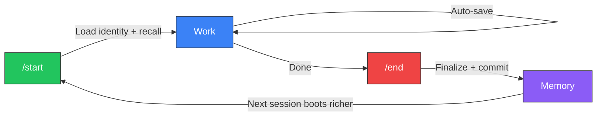

<div align="center">

# Project Athena

**The operating system for AI agents.**

Open-source infrastructure that gives any LLM persistent memory, structured reasoning, and governance.
Own the data. Rent the intelligence.

[](https://github.com/winstonkoh87/Athena-Public/stargazers)
[](LICENSE)
[](docs/CHANGELOG.md)
[](https://www.reddit.com/r/ChatGPT/comments/1r1b3gl/)
[](https://codespaces.new/winstonkoh87/Athena-Public)

[Quickstart](#-quickstart) · [How It Works](#-how-it-works) · [Docs](docs/GETTING_STARTED.md) · [FAQ](docs/FAQ.md) · [Contributing](CONTRIBUTING.md)

</div>

---

## Why Athena?

AI agents are brilliant — but amnesiac. Every session starts from zero. Athena fixes that.

- **🧠 Persistent Memory** — Sessions compound. Your 500th session recalls patterns from your 5th.
- **🔌 Model-Agnostic** — Works with Claude, Gemini, GPT, Llama — switch anytime, keep everything.
- **📁 You Own Your Data** — Markdown files on your machine, git-versioned. No vendor lock-in. Ever.
- **⚡ 10K Token Boot** — 95% of your context window stays free, even after 10,000 sessions.
- **🛡️ Governed Autonomy** — 6 constitutional laws, 4 capability levels, bounded agency.

> *Think of it like this: the LLM is the engine. Athena is the chassis, the memory, and the rules of the road.*

---

## ⚡ Quickstart

```bash
# 1. Fork & clone
git clone https://github.com/YOUR_USERNAME/Athena-Public.git && cd Athena-Public

# 2. Open in your IDE (Claude Code, Antigravity, Cursor, VS Code, etc.)

# 3. Type:
/start

# 4. Run the interview to build your profile:
/brief interview

# 5. When you're done:
/end
```

**That's it.** No config files. No API keys. No database setup. The folder *is* the product.

> [!TIP]
> Your first session takes ~30 minutes (mostly the interview). Every session after boots in seconds. See the [full guide →](docs/YOUR_FIRST_SESSION.md)

---

## 🔄 How It Works

Every session follows one cycle: **`/start` → Work → `/end`**. Each cycle deposits structured memory. Over hundreds of cycles, the AI stops being generic and starts thinking like *you*.



| Sessions | What Happens |
|:---------|:------------|
| **1–50** | Basic recall — remembers your name, project, preferences |
| **50–200** | Pattern recognition — anticipates your style and blind spots |
| **200+** | Deep sync — thinks in your frameworks before you state them |

### The Linux Analogy

| Concept | Linux | Athena |
|:--------|:------|:-------|
| Kernel | Hardware abstraction | Memory persistence + retrieval (RAG, Supabase) |
| File System | ext4, NTFS | Markdown files, session logs, tag index |
| Scheduler | cron, systemd | Heartbeat daemon, auto-indexing |
| Shell | bash, zsh | MCP Tool Server, `/start`, `/end`, `/think` |
| Permissions | chmod, users/groups | 4-level capability tokens + Secret Mode |
| Package Manager | apt, yum | Protocols, skills, workflows |

---

## 📦 What's In The Box

| Component | Details |
|:----------|:--------|
| 🧠 **Core Identity** | Pre-built constitution with 6 laws — [template](examples/templates/core_identity_template.md) |
| 📋 **120+ Protocols** | Decision frameworks across 13 categories — [browse](examples/protocols/) |
| ⚡ **48 Slash Commands** | `/start`, `/end`, `/think`, `/research` — [full list](docs/WORKFLOWS.md) |
| 🔍 **Hybrid RAG Search** | 5-source retrieval + RRF fusion — [architecture](docs/SEMANTIC_SEARCH.md) |
| 🔌 **MCP Tool Server** | 9 tools exposable to any MCP client — [docs](docs/MCP_SERVER.md) |
| 🛡️ **Governance Layer** | 4 capability levels, 3 sensitivity tiers — [security](docs/SECURITY.md) |

### Agent Compatibility

Athena works with **any agent that reads Markdown**. For agents supporting project-level config, `athena init` generates native files:

| Agent | Status | Init Command |
|:------|:------:|:-------------|
| [Claude Code](https://docs.anthropic.com/en/docs/claude-code) | ✅ | `athena init --ide claude` |
| [Antigravity](https://antigravity.google/) | ✅ | `athena init --ide antigravity` |
| [Cursor](https://cursor.com) | ✅ | `athena init --ide cursor` |
| [Gemini CLI](https://github.com/google-gemini/gemini-cli) | ✅ | `athena init --ide gemini` |
| [VS Code + Copilot](https://code.visualstudio.com/) | ✅ | `athena init --ide vscode` |

> More agents planned — [full compatibility list →](docs/COMPATIBLE_IDES.md)

---

## 🎯 Use Cases

| | Use Case | What Athena Does |
|:-|:---------|:-----------------|
| 🎯 | **Decision-Making** | Trilateral cross-model validation + MCDA ranked by *your* revealed preferences |
| 🧩 | **Problem-Solving** | Graph-of-Thoughts multi-path reasoning + first-principles deconstruction |
| 🔬 | **Research & Synthesis** | Structured multi-source synthesis with sentence-level citation |
| 📚 | **Knowledge Management** | Searchable archive of *your* thinking — portable, model-agnostic, sovereign |
| 📐 | **Strategic Planning** | Longitudinal planning with Monte Carlo simulation + ergodic risk modeling |
| 🧠 | **Meta-Thinking** | Surfaces blind spots via pattern detection across hundreds of sessions |

---

## 💰 Cost

Athena is **free and open source**. You only pay for your AI subscription:

| Plan | Cost | Who It's For |
|:-----|:-----|:-------------|
| Claude Pro / Google AI Pro | ~$20/mo | Most users |
| Claude Max / Google AI Ultra | $200–250/mo | Power users (8+ hrs/day) |

> Boot cost is ~10K tokens — constant whether it's session 1 or session 10,000. [Details →](docs/BENCHMARKS.md)

---

## 📚 Documentation

| | | |
|:--|:--|:--|
| 📖 [Getting Started](docs/GETTING_STARTED.md) | 🏗️ [Architecture](docs/ARCHITECTURE.md) | 🔒 [Security](docs/SECURITY.md) |
| 🎯 [Your First Session](docs/YOUR_FIRST_SESSION.md) | 🔍 [Semantic Search](docs/SEMANTIC_SEARCH.md) | 📊 [Benchmarks](docs/BENCHMARKS.md) |
| 💡 [Tips & Best Practices](docs/TIPS.md) | 🔌 [MCP Server](docs/MCP_SERVER.md) | ❓ [FAQ](docs/FAQ.md) |
| 🔄 [Updating Athena](docs/UPDATING.md) | 📥 [Importing Data](docs/IMPORTING.md) | ⌨️ [CLI Reference](docs/CLI.md) |
| 📋 [All Workflows](docs/WORKFLOWS.md) | 📐 [Spec Sheet](docs/SPEC_SHEET.md) | 📓 [Glossary](docs/GLOSSARY.md) |
| 🧠 [Manifesto](docs/MANIFESTO.md) | 📈 [Changelog](docs/CHANGELOG.md) | 👤 [About the Author](docs/ABOUT_ME.md) |

---

## 🛠️ Tech Stack

| Layer | Technology |
|:------|:----------|
| **SDK** | `athena` Python package (v9.2.2) |
| **Search** | Hybrid RAG — FlashRank reranking + RRF fusion |
| **Embeddings** | `text-embedding-004` (768-dim) |
| **Memory** | Supabase + pgvector / local ChromaDB |
| **Routing** | CognitiveRouter — adaptive latency by query complexity |

<details>
<summary><strong>📂 Repository Structure</strong></summary>

```text
Athena-Public/
├── src/athena/              # SDK package (pip install -e .)
│   ├── core/                #   Config, governance, permissions, security
│   ├── tools/               #   Search, agentic search, reranker, heartbeat
│   ├── memory/              #   Vector DB, delta sync, schema
│   ├── boot/                #   Orchestrator, loaders, shutdown
│   ├── cli/                 #   init, save, doctor commands
│   └── mcp_server.py        #   MCP Tool Server (9 tools, 2 resources)
├── scripts/                 # Operational scripts (boot, shutdown, launch)
├── examples/
│   ├── protocols/           # 120+ starter frameworks (13 categories)
│   ├── scripts/             # 130+ reference scripts
│   └── templates/           # Starter templates (framework, memory bank)
├── docs/                    # Architecture, benchmarks, security, guides
└── pyproject.toml           # Modern packaging
```

</details>

<details>
<summary><strong>📋 Recent Changelog</strong></summary>

- **v9.2.2** (Feb 21 2026): S-tier README refactor, docs restructure
- **v9.2.1** (Feb 20 2026): Deep Audit & PnC Sanitization — 17 patterns sanitized across 13 files
- **v9.2.0** (Feb 17 2026): Sovereignty Convergence — CVE patch, agentic search, governance upgrade
- **v9.1.0** (Feb 17 2026): Deep Audit & Sync — Fixed 15 issues (dead links, version drift)
- **v9.0.0** (Feb 16 2026): First-Principles Workspace Refactor — root dir cleaned, build artifacts purged

👉 [Full Changelog →](docs/CHANGELOG.md)

</details>

---

<div align="center">

### 🌟 Star History

[](https://star-history.com/#winstonkoh87/Athena-Public&Date)

**MIT License** · [Contributing](CONTRIBUTING.md) · [Security](SECURITY.md) · [Code of Conduct](CODE_OF_CONDUCT.md)

*Clone it. Boot it. Make it yours.*

</div>
