# 🏛️ Project Athena — The Linux OS for AI Agents


[](https://codespaces.new/winstonkoh87/Athena-Public)

**Last updated: 19 Feb 2026**

> **Athena is not an AI Agent. It is the Linux OS they run on.**
> Open Source · Sovereign · Model-Agnostic
> **12x Velocity**: Built in 3 months (vs 3 years manual).
> **10K Token Boot**: 95% of your context window stays free.

---

## 1. What Is Athena?

Athena gives AI agents something they don't have: **persistent memory, structure, and governance**.

Most AI agents reset every session — brilliant but amnesiac. Athena provides the **state layer** that any agent (Claude, Gemini, GPT, Llama) reads on boot and writes to on shutdown. Think of it as a **memory card** that works in any game console.

| OS Concept | Linux | Athena |
|:-----------|:------|:-------|
| **Kernel** | Hardware abstraction | Memory persistence + retrieval (VectorRAG, Supabase) |
| **File System** | ext4, NTFS | Markdown files, session logs, tag index |
| **Scheduler** | cron, systemd | Heartbeat daemon, daily briefing, auto-indexing |
| **Shell** | bash, zsh | MCP Tool Server, `/start`, `/end`, `/think` |
| **Permissions** | chmod, users/groups | 4-level capability tokens + Secret Mode |
| **Package Manager** | apt, yum | Protocols, skills, workflows |

**You own the data** (Markdown files on your machine, git-versioned). You only **rent the intelligence** (LLM API calls). Switch models tomorrow and your memory stays exactly where it is.

<details>
<summary><strong>💡 "But I have ChatGPT Memory / Claude Projects"</strong></summary>

You're confusing **RAM** with a **Hard Drive**.

| | SaaS Memory (ChatGPT/Claude) | **Athena** |
|:--|:---|:---|
| **Ownership** | Rented (Vendor Lock-in) | **Owned (Local Files)** |
| **Lifespan** | Until session/project deleted | **Forever (Git Versioned)** |
| **Structure** | Opaque Blob | **Structured Knowledge Graph** |
| **Search** | Basic keyword | **Hybrid RAG (5 sources + RRF fusion)** |
| **Agency** | Zero (waits for you) | **Bounded Autonomy (Heartbeat, Cron)** |

</details>

<details>
<summary><strong>📖 Jargon Decoder</strong></summary>

| Athena Term | What It Actually Is | Do You Need It? |
|:------------|:-------------------|:----------------|
| **"Memory"** | RAG — storing text in a database and retrieving it later | **Yes.** This is the core |
| **"Protocols"** | System prompts / reusable instructions | **Yes.** Saved templates for AI behavior |
| **"Cold Storage"** | Markdown files on your disk | **Yes.** Plain text you can read/edit anywhere |
| **"Hot Storage"** | Vector database (Supabase + pgvector) | **Optional.** Enables semantic search |
| **"Heartbeat"** | A background daemon that auto-indexes your files | **Optional.** Passive awareness without manual `/start` |
| **"Adaptive Latency"** | The AI uses more compute for hard tasks, less for easy ones | **Automatic.** You don't configure this |

> 👉 Full glossary: [docs/GLOSSARY.md](docs/GLOSSARY.md)

</details>

---

## 2. How Do I Use It?

### ⚡ Quickstart

| Step | Action |
|:-----|:-------|
| **1. Get an IDE** | [Antigravity](https://antigravity.google/) · [Cursor](https://cursor.com) · [VS Code + Copilot](https://code.visualstudio.com/) · [GitHub Codespaces](https://codespaces.new/winstonkoh87/Athena-Public) |
| **2. Clone this repo** | `git clone https://github.com/winstonkoh87/Athena-Public.git && cd Athena-Public` |
| **3. Open folder → Type `/start`** | The AI reads the repo structure and boots |
| **4. Type `/brief interview`** | Athena asks about YOU — goals, style, domain — and builds your personal profile |

**That's it.** No config files. No API keys. No database setup. The folder *is* the product.

> [!TIP]
> When you're done, type `/end` to save. Next time you `/start`, the agent picks up exactly where you left off.
> Your first session takes ~30 minutes (mostly the interview). Every session after that boots in seconds.

<details>
<summary><strong>🏗️ "I already have a project — where does Athena go?"</strong></summary>

Athena is your **Brain**. Your project is the **Body**. They don't need to live in the same place.

| Mode | Setup | Best For |
|:-----|:------|:---------|
| **Standalone** | Open `Athena/` as your workspace. Navigate to other repos from there. | Personal brain, all-in-one users |
| **Multi-Root (Sidecar)** | Open your project normally → `File → Add Folder to Workspace` → select `Athena/` | Devs with existing repos who want both in one window |
| **Nested** | Drop your project folder inside `Athena/` | Quick prototypes, small projects |

```
# Standalone (recommended)           # Multi-Root (Sidecar)
~/Athena/          ← open this        IDE Workspace:
  .context/                             ├── ~/MyApp/        ← your code
  .agent/                               └── ~/Athena/       ← the brain
  .framework/

# Nested
~/Athena/
  .context/
  .agent/
  MyApp/            ← project inside
```

**Recommendation**: Start with **Standalone**. If you need your project visible in the same window, use **Multi-Root**. All three modes work — pick what feels natural.

</details>

### 🪞 Your First Session

On your first `/start`, run `/brief interview`. Athena asks about **everything** — name, profession, goals, decision style, blind spots. This isn't small talk. It's the foundation that makes every future session compound.

| What Athena Asks | Why |
|:----------------|:----|
| **Identity** — Name, age, nationality | Communication style, cultural context |
| **Professional** — Role, industry, salary range | Domain expertise, decision-making context |
| **Goals** — 3-month, 1-year, 5-year | Aligns every response to your actual trajectory |
| **Decision Style** — Risk appetite, speed vs quality | Calibrates how options and tradeoffs are framed |
| **Blind Spots** — Recurring mistakes, weak areas | Athena proactively flags these before they bite |
| **Communication** — Tone, verbosity, directness | Sets the default voice across all interactions |

> [!IMPORTANT]
> **Everything stays local.** Your profile is stored as a Markdown file on your machine (`user_profile.md`). No cloud. No tracking. Be as candid as you want — this is *your* private operating system.

**Pattern:** The more you share → the faster Athena stops being generic → the sooner it starts thinking like **you**.

> 👉 [Full First Session Guide](docs/YOUR_FIRST_SESSION.md) — detailed walkthrough with examples

<details>
<summary><strong>🔧 CLI Reference</strong></summary>

```bash
pip install -e .              # Install SDK
athena                        # Boot session
athena init .                 # Initialize workspace in current directory
athena init --ide cursor      # Init with IDE-specific config
athena check                  # Basic health check
athena doctor                 # Full 15-check system diagnostics
athena doctor --fix           # Auto-repair fixable issues
athena doctor --json          # Machine-readable output
athena save "summary"         # Quicksave checkpoint
athena --end                  # Close session and save
athena --version              # Show version (v9.2.0)
```

</details>

<details>
<summary><strong>📥 Import Existing Data (ChatGPT, Gemini, Claude)</strong></summary>

Athena's memory is just Markdown files. Any text you can export becomes part of your memory:

| Source | How to Import |
|:-------|:-------------|
| **ChatGPT** | Settings → Data Controls → Export → Copy `.md` files into `.context/memories/imports/` |
| **Gemini** | [Google Takeout](https://takeout.google.com/) → Select "Gemini Apps" → Extract into `.context/memories/imports/` |
| **Claude** | Settings → Export Data → Copy transcripts into `.context/memories/imports/` |
| **Any Markdown** | Drop `.md` files into `.context/memories/` — indexed on next `/start` |

After importing, run `athena check` to verify files are detected.

</details>

---

## 3. What's Inside? (Starter Kit)

When you clone this repo, **you already have a working Agent.** Not a blank slate — a complete template with identity, memory structure, protocols, and governance pre-loaded.

| Component | What You Get | Customizable? |
|:----------|:-------------|:-------------:|
| **🧠 Core Identity** | Pre-built constitution with 6 laws ([Core_Identity Template](examples/templates/core_identity_template.md)) | ✅ Edit freely |
| **📋 120+ Protocols** | Decision frameworks across 13 categories ([examples/protocols/](examples/protocols/)) | ✅ Fork & extend |
| **📝 Memory Bank** | Structured templates for user profile, context, and session logs | ✅ Auto-fills over time |
| **⚡ 48 Slash Workflows** | `/start`, `/end`, `/think`, `/research`, and [more](docs/WORKFLOWS.md) | ✅ Add your own |
| **🔌 MCP Server** | [9 tools](docs/MCP_SERVER.md) exposable to any MCP-compatible client | ✅ Configure |
| **🛡️ Governance** | 4 capability levels, 3 sensitivity tiers, [Secret Mode](docs/SECURITY.md) | ✅ Adjust |

> [!TIP]
> **Day 1**: The AI knows *how* to think (laws, reasoning standards, protocols) but not *who* you are.
> **Day 2+**: As you use it, the templates fill with *your* data — sessions, decisions, preferences. The starter kit becomes *your* sovereign system.

Think of it as a **furnished apartment** — you move in and start living immediately. Over time, you replace the furniture with your own.

### 🔄 The Loop

After you install Athena, you repeat one cycle: **`/start` → Work → `/end`**. Every cycle deposits training data into memory. Over hundreds of cycles, Athena stops being generic and starts thinking like *you*.

```mermaid
flowchart TD
    START["🟢 /start"] -->|"Load identity + recall"| WORK["🔧 Work Session"]
    WORK -->|"Auto-save every exchange"| WORK
    WORK -->|"Done for the day"| END["🔴 /end"]
    END -->|"Finalize, sync, commit"| MEMORY["🧠 Memory"]
    MEMORY -->|"Next session boots richer"| START

    style START fill:#22c55e,color:#fff,stroke:#333
    style END fill:#ef4444,color:#fff,stroke:#333
    style MEMORY fill:#8b5cf6,color:#fff,stroke:#333
    style WORK fill:#3b82f6,color:#fff,stroke:#333
```



| Sessions | What Happens |
|:---------|:------------|
| **1–50** | Basic recall. Remembers your name and project. |
| **50–200** | Pattern recognition. Anticipates your preferences. |
| **200–500** | Deep sync. Knows your frameworks, blind spots, style. |
| **500–1,000+** | Full context. Anticipates patterns before you state them. |

### 💰 Token Economics

`/start` loads ~**10K tokens** of identity and context. This cost is **constant** — Session 1 and Session 10,000 cost the same to boot, because memory is compressed into structured Markdown (not growing chat history).

| Model | Context Window | Boot Cost | Remaining | Utilization |
|:------|:--------------|:----------|:----------|:------------|
| **Claude Opus 4.6** | 200K | ~10K | **190K** (95% free) | 5% |
| **Gemini 3 Pro** | 1M+ | ~10K | **990K+** (99% free) | ~1% |

> [!TIP]
> Most "memory" solutions dump entire chat history into context (grows linearly with usage). Athena's architecture keeps boot cost **flat** — your 10,000th session is as cheap as your first.

<details>
<summary><strong>❓ "Won't this eat my subscription tokens?"</strong></summary>

**No.** The 10K boot cost is per **context window** (5% of one session), not per subscription. Your subscription limits are based on **message count**, not token count — whether you send a 10K or 200K message, it counts as one message.

| User Type | Plan | Sessions/Day | Verdict |
|:----------|:-----|:-------------|:--------|
| **Casual** | Pro ($20/mo) | 1–2 | ✅ 95% of context stays free |
| **Daily Driver** | Max 5× ($100/mo) | 3–5 | ✅ Each session is independent |
| **Power User** | Max 20× ($200/mo) | 10+ parallel | ✅ Multiple agents, multiple projects |

**The trade**: You spend 5% of your context window so the remaining 95% is **dramatically smarter** — because the AI actually knows who you are, what you're building, and how you think.

</details>

### 🧠 Persistent Memory

Your data lives in **Markdown files you own** — on your machine, git-versioned. Optionally backed up to Supabase (cloud insurance).

- **Local-first**: No vendor lock-in. Switch models anytime.
- **Hybrid search**: Canonical + GraphRAG + Tags + Vectors + Filenames, fused via RRF
- **Auto-quicksave**: Every exchange is logged without manual action

---

## Repository Structure

```text
Athena-Public/
├── src/athena/              # SDK package (pip install -e .)
│   ├── core/                #   Config, governance, permissions, security
│   ├── tools/               #   Search, agentic search, reranker, heartbeat
│   ├── memory/              #   Vector DB, delta sync, schema
│   ├── boot/                #   Orchestrator, loaders, shutdown
│   ├── cli/                 #   init, save, doctor commands
│   └── mcp_server.py        #   MCP Tool Server (9 tools, 2 resources)
├── scripts/                 # Operational scripts (boot, shutdown, launch)
├── examples/
│   ├── protocols/           # 120+ starter frameworks (13 categories)
│   ├── scripts/             # 130+ reference scripts
│   ├── templates/           # Starter templates (framework, memory bank)
│   └── quickstart/          # Runnable demos
├── docs/                    # Architecture, benchmarks, security, guides
├── community/               # Contributing, roadmap
├── pyproject.toml           # Modern packaging (v9.2.0)
└── .env.example             # Environment template
```

---

## 📣 Community

> **"I gave Gemini a brain..."** — Viral on r/GeminiAI and r/ChatGPT ([700K+ views](https://www.reddit.com/r/ChatGPT/comments/1r1b3gl/))

---

## 📚 Further Reading

<details>
<summary><strong>🏗️ Architecture & Design</strong></summary>

| Document | Description |
|:---------|:-----------|
| [ARCHITECTURE.md](docs/ARCHITECTURE.md) | System design, data flow, hub architecture |
| [SPEC_SHEET.md](docs/SPEC_SHEET.md) | Technical specification, data schema, API surface |
| [GRAPHRAG.md](docs/GRAPHRAG.md) | Knowledge graph layer ⚠️ **~$50 API cost** |
| [VECTORRAG.md](docs/VECTORRAG.md) | Semantic memory implementation |
| [SEMANTIC_SEARCH.md](docs/SEMANTIC_SEARCH.md) | Hybrid RAG implementation |
| [MCP_SERVER.md](docs/MCP_SERVER.md) | MCP architecture & IDE configuration |
| [KNOWLEDGE_GRAPH.md](docs/KNOWLEDGE_GRAPH.md) | Compressed concept index |

</details>

<details>
<summary><strong>🚀 Getting Started & Guides</strong></summary>

| Document | Description |
|:---------|:-----------|
| [GETTING_STARTED.md](docs/GETTING_STARTED.md) | Step-by-step setup guide |
| [YOUR_FIRST_AGENT.md](docs/YOUR_FIRST_AGENT.md) | 5-minute quickstart |
| [WHAT_IS_AN_AI_AGENT.md](docs/WHAT_IS_AN_AI_AGENT.md) | Beginner primer |
| [DEMO.md](docs/DEMO.md) | Live walkthrough |
| [WORKFLOWS.md](docs/WORKFLOWS.md) | All 48 slash commands |
| [FAQ.md](docs/FAQ.md) | Common questions |
| [GLOSSARY.md](docs/GLOSSARY.md) | Key terms and definitions |

</details>

<details>
<summary><strong>📊 Performance & Case Studies</strong></summary>

| Document | Description |
|:---------|:-----------|
| [BENCHMARKS.md](docs/BENCHMARKS.md) | Boot time, search latency, token economics |
| [Blog Evolution](docs/case-studies/Case_Blog_Evolution_2026.md) | Content strategy analysis |
| [Web Design 2026](docs/case-studies/Case_Web_Design_2026.md) | Design decision framework |
| [Decision Framework](docs/case-studies/Decision_Framework_Application.md) | Applied decision protocol |
| [TOP_10_PROTOCOLS.md](docs/TOP_10_PROTOCOLS.md) | MCDA-ranked essential protocols |
| [ENGINEERING_DEPTH.md](docs/ENGINEERING_DEPTH.md) | Technical depth overview |

</details>

<details>
<summary><strong>🔒 Security & Data</strong></summary>

| Mode | Where Data Lives | Best For |
|:-----|:----------------|:---------|
| **Local** | Your machine only | Sensitive data, air-gapped environments |
| **Cloud** | Supabase (your project) | Cross-device access |
| **Hybrid** | Local files + cloud embeddings | Best of both |

- Use `SUPABASE_ANON_KEY` for client-side. Never expose `SUPABASE_SERVICE_ROLE_KEY`.
- Enable Row-Level Security on Supabase tables.
- Restrict agent working directories — never grant access to `~/.ssh` or `.env`.

> 👉 [SECURITY.md](docs/SECURITY.md) · [LOCAL_MODE.md](docs/LOCAL_MODE.md)

</details>

<details>
<summary><strong>🧠 Philosophy & Deep Dives</strong></summary>

| Document | Description |
|:---------|:-----------|
| [MANIFESTO.md](docs/MANIFESTO.md) | The Bionic Unit philosophy |
| [USER_DRIVEN_RSI.md](docs/USER_DRIVEN_RSI.md) | How you and AI improve together |
| [TRILATERAL_FEEDBACK.md](docs/TRILATERAL_FEEDBACK.md) | Cross-model validation ("Watchmen") |
| [Quadrant IV](docs/concepts/Quadrant_IV.md) | How Athena surfaces unknown unknowns |
| [Adaptive Latency](examples/concepts/adaptive_latency.md) | Macro-Robust, Micro-Efficient (RETO) |
| [REFERENCES.md](docs/REFERENCES.md) | APA-formatted academic citations |
| [ABOUT_ME.md](docs/ABOUT_ME.md) | About the author |

</details>

<details>
<summary><strong>⚙️ Prerequisites (Optional)</strong></summary>

The quickstart needs **zero configuration**. These are only needed for advanced features:

```bash
# Required for cloud features
SUPABASE_URL=https://your-project.supabase.co
SUPABASE_ANON_KEY=your-anon-key
ANTHROPIC_API_KEY=your-anthropic-key

# Optional (for multi-model validation)
GOOGLE_API_KEY=your-google-api-key
OPENAI_API_KEY=your-openai-key
```

```bash
cp .env.example .env
# Add your keys
```

</details>

<details>
<summary><strong>🛠️ Tech Stack</strong></summary>

| Layer | Technology | Purpose |
|:------|:----------|:--------|
| **SDK** | `athena` Python package (v9.2.0) | Core search, reranking, memory |
| **Reasoning** | Claude Opus (primary) | Main reasoning engine |
| **Optimization** | DSPy | Prompt optimization & self-correction |
| **Reranking** | FlashRank | Lightweight cross-encoder RRF |
| **IDE** | Antigravity, Cursor, VS Code | Agentic development environment |
| **Embeddings** | `text-embedding-004` (768-dim) | Google embedding model |
| **GraphRAG** | NetworkX + Leiden + ChromaDB | Knowledge graph ⚠️ **~$50 API** |
| **Memory** | Supabase + pgvector / local ChromaDB | Vector database |
| **Routing** | CognitiveRouter | Adaptive latency by query complexity |

</details>

<details>
<summary><strong>📋 Changelog</strong></summary>

### February 2026

- **v9.2.0** (Feb 17 2026): **Sovereignty Convergence** — Root↔Public unification via cherry-pick. CVE-2025-69872 security patch active, production-grade cache, agentic search, governance upgrade, 8 new modules. Fixed split-brain editable install. Titanium Airlock preserved.
- **v9.1.0** (Feb 17 2026): **Deep Audit & Sync** — Fixed 15 issues (dead links, version drift, dependency sync, AGENTS.md path errors, workflow count corrections). Cleaned tracked artifacts.
- **v9.0.0** (Feb 16 2026): **First-Principles Workspace Refactor** — Root directory cleaned (28→14 files), 114 stub session logs archived, build artifacts purged, dead `.framework/v7.0` archived, `.gitignore` hardened. Zero regressions (17/17 tests pass).
- **v8.6.0** (Feb 15 2026): **Massive Content Expansion** — 200 protocols (was 75), 535 scripts (was 16), 48 workflows (was 14), 36 templates. 23 protocol categories. Repo audit for recruiter readiness. Content sanitization pass.
- **v8.5.0** (Feb 12 2026): **Phase 1 Complete** — MCP Tool Server (9 tools, 2 resources), Permissioning Layer (4 levels + secret mode), Search MRR +105% (0.21→0.44), Evaluator Gate (50 queries). SDK v2.0.0.
- **v8.3.1** (Feb 11 2026): **Viral Validation Release** — 654K+ Reddit views, 1,660+ upvotes, 5,300+ shares. #1 All-Time r/ChatGPT, #2 All-Time r/GeminiAI.
- **v8.2.1** (Feb 9 2026): Metrics Sync — Fixed `batch_audit.py` automation, linked orphan files, reconciled tech debt, 8,079 tags indexed

👉 **[Full Changelog](docs/CHANGELOG.md)** — Complete version history from v1.0.0 (Dec 2025)

</details>

---

## License

MIT License — see [LICENSE](LICENSE)

---

*This is a complete Starter Kit. Clone it, run `/start`, and you have a working Agent on Day 1. Over time, it stops being generic and starts thinking like **you**.*
