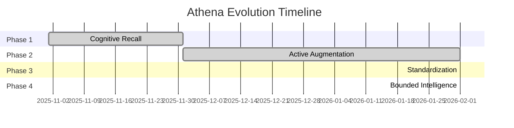

# 🗺️ Living Roadmap

> **Vision**: Athena is not a static script. It is an evolving cognitive organism.

This roadmap outlines the strategic trajectory for the system, moving from **Recall** (Current) to **Autonomy** (Future).

---

## 🏗️ Phase 1: Cognitive Recall (Completed) ✅

*Focus: Memory, Context, and Retrieval*

- [x] **VectorRAG Memory**: Supabase + pgvector for semantic search across 800+ documents.
- [x] **Adaptive Latency Architecture**: "Bleach" Scaling Law (Shikai/Bankai/Shukai) for token efficiency.
- [x] **Anti-Hallucination Layer**: Claim atomization and strict citation protocols.
- [x] **Supabase Memory**: Implementing `pgvector` for semantic search.
- [x] **Protocol Library**: Codifying 330 decision frameworks (Finance, Architecture, Strategy).
- [x] **Temporal Continuity**: Linking sessions via `/start` and `/end` workflows.
- [x] **Anti-Entropy Engine**: The `/refactor` daily cleaning protocol.
- [x] **Public Documentation**: Problem-Solution-Outcome framing for recruiter visibility.

---

## 🚀 Phase 2: Active Augmentation (Completed) ✅

*Focus: Real-time assistance and friction reduction*

- [x] **Multimodal Analysis Engine**
  - **Goal**: Analyze video pacing, audio scripts, and visual dynamics.
  - **Tech**: `ffmpeg` + `openai-whisper` + `cv2` forensics.
  - **Status**: Visual/Audio scripts deployed.

- [x] **Voice Interface Integration**
  - **Goal**: Talk to Athena while walking/driving.
  - **Tech**: Gemini multimodal audio transcription.
  - **Status**: Implemented via Telegram Bot voice notes.

- [x] **Mobile Sync Strategy (Telegram Bot)**
  - **Goal**: Access knowledge base on mobile.
  - **Tech**: Telegram Bot + Gemini 3 Flash + Git sync.
  - **Status**: Athena-Lite deployed. `/start` → Chat → `/end` → Cloud sync.

---

## 🏗️ Phase 3: Standardization & Control (Completed) ✅

*Focus: MCP, Permissioning, Search Quality, Evaluator*

- [x] **MCP Tool Server**: 9 tools + 2 resources via Model Context Protocol (stdio + SSE)
- [x] **Permissioning Layer**: 4 capability levels, 3 sensitivity tiers, Secret Mode
- [x] **Search MRR +105%**: Rebalanced RRF, added framework_docs collector, density scoring
- [x] **Evaluator Gate**: 50 golden queries, MRR@5=0.44, regression prevention

---

## 🔮 Phase 4: Bounded Intelligence (Completed) ✅

*Focus: Agentic RAG v2, autonomous indexing, self-optimization*

- [x] **Agentic RAG v2**
  - **Goal**: Planner → Retrieve → Validate pipeline with query decomposition.
  - **Tech**: Rule-based NLP decomposition + parallel search + cosine validation.
  - **Status**: MCP tool `agentic_search` deployed. Query decomposition + multi-sub-query fusion.

- [x] **Heartbeat (Read-Only)**
  - **Goal**: File watcher that indexes new/modified documents automatically.
  - **Tech**: `watchdog` + debounced sync pipeline. Read-only — no proactive output.
  - **Status**: Daemon mode with `launchd` plist. Auto-indexes `.md` files on create/modify.

- [x] **Daily Briefing Agent**
  - **Goal**: Athena wakes up at 6 AM, reads news/market data, and prepares a "Morning Brief."
  - **Tech**: RSS fetcher + interest filter + Gemini Flash synthesis.
  - **Status**: Configurable via `briefing_config.yaml`. `launchd` scheduled at 6 AM SGT.

- [x] **Recursive Self-Optimization**
  - **Goal**: System analyzes its own logs to suggest new protocols.
  - **Tech**: Weekly meta-analysis batch job with pattern detection + Gemini synthesis.
  - **Status**: `launchd` scheduled Sundays at 8 AM. Proposals only — never auto-executes.

- [x] **"Shower Thought" Capture Pipeline** *(moved from Phase 2)*
  - **Goal**: Reduce friction from Insight → Protocol.
  - **Tech**: Zero-friction CLI with auto-tagging + daily log format.
  - **Status**: `capture.py` deployed. Alias: `alias think='python3 capture.py'`

---

## 💡 Request a Feature

Have an idea for Athena? [Clone the repo](https://github.com/winstonkoh87/Athena-Public) and build it yourself. That's the point.
