# Athena Workspace Architecture

> **Last Updated**: 22 February 2026  
> **System Version**: v9.2.3

---

## Directory Structure

```text
Athena/
├── .framework/                    # ← THE CODEX (stable, rarely updated)
│   ├── v8.6-stable/               # Current stable modules directory
│   │   ├── modules/
│   │   │   ├── Core_Identity.md   # Laws #0-#4, RSI, Bionic Stack, COS
│   │   │   └── Output_Standards.md # Response formatting, reasoning levels
│   │   └── protocols/             # Versioned protocol copies
│   ├── v7.0/                      # Previous stable version
│   └── archive/                   # Archived monoliths
│
├── .context/                      # ← USER-SPECIFIC DATA (frequently updated)
│   ├── User_Vault/                # Personal vault (credentials, secrets)
│   ├── memories/
│   │   ├── case_studies/          # 358+ documented patterns
│   │   ├── session_logs/          # Historical session analysis
│   │   └── patterns/              # Formalized patterns
│   ├── references/                # External frameworks (Dalio, Halbert, Graham)
│   ├── research/                  # Steal analyses, explorations
│   ├── TAG_INDEX_A-M.md           # Global hashtag system (split for performance)
│   ├── TAG_INDEX_N-Z.md
│   └── KNOWLEDGE_GRAPH.md         # Visual architecture reference
│
├── .agent/                        # ← AGENT CONFIGURATION
│   ├── skills/
│   │   ├── SKILL_INDEX.md         # Protocol loading registry
│   │   ├── protocols/             # 120+ modular skill files
│   │   │   ├── architecture/      # System protocols (latency, modularity)
│   │   │   ├── business/          # Business frameworks
│   │   │   ├── career/            # Career navigation
│   │   │   ├── decision/          # Decision frameworks
│   │   │   ├── psychology/        # Psych protocols
│   │   │   └── trading/           # Trading protocols
│   │   └── capabilities/          # Bionic Triple Crown
│   ├── workflows/                 # 48 slash commands
│   │   ├── start.md               # Session boot
│   │   ├── end.md                 # Session close + maintenance
│   │   ├── think.md               # Deep reasoning (L4)
│   │   └── ...
│   ├── scripts/                   # 130+ Python automation scripts
│   │   ├── quicksave.py           # Auto-checkpoint every exchange
│   │   ├── boot.py                # Resilient boot with recovery shell
│   │   ├── smart_search.py        # Semantic search
│   │   └── ...
│   └── gateway/                   # Sidecar process for persistence
│
├── src/                           # ← PYTHON SDK SOURCE
│   └── athena/
│       ├── boot/                  # Boot loaders and constants
│       ├── core/                  # Core config and utilities
│       └── tools/                 # SDK tools
│
├── supabase/                      # ← VECTORRAG CONFIG
│   └── migrations/                # Database migrations
│
├── Athena-Public/                 # ← PUBLIC PORTFOLIO
│   ├── docs/                      # This documentation
│   ├── examples/                  # Templates and scripts
│   └── README.md                  # Repository overview
│
└── docs/                          # Root-level docs (audit, architecture)
```

### Visual Overview


---

## Loading Strategy


### On-Demand (Context-Triggered)

| Trigger | File Loaded | Tokens |
|---------|-------------|--------|
| User context query | `User_Profile_Core.md` | ~1,500 |
| Skill request | `SKILL_INDEX.md` | ~4,500 |
| `/think` invoked | `Output_Standards.md` | ~700 |
| Tag lookup | `TAG_INDEX.md` | ~5,500 |
| Architecture query | `System_Manifest.md` | ~1,900 |
| Specific protocol | `protocols/*.md` | varies |

### Context Hydration (Active Injection)

> **Problem**: Learnings written to files (e.g., `User_Profile_Core.md`) become *passive documentation*. The AI doesn't read them unless explicitly prompted, causing the same mistakes to repeat.

> **Solution**: **Active Injection** — Force-feed critical constraints into the terminal during boot.


**Key Scripts:**

- [`boot_knowledge.py`](../scripts/core/boot_knowledge.py): Extracts and prints constraints.
- [`index_workspace.py`](../scripts/core/index_workspace.py): Rebuilds `TAG_INDEX.md` and `PROTOCOL_SUMMARIES.md` on shutdown.

**See Also**: Protocol 418: Active Knowledge Injection (architecture pattern for context hydration)

## Key Workflows

| Command | Description |
|---------|-------------|
| `/start` | Boot: Core Identity + session recall + create log |
| `/end` | Close: finalize log, harvest check, git commit |
| `/think` | **Bankai**: Deep reasoning with structured analysis |
| `/ultrathink` | **Shukai**: Maximum depth (Triple Crown + Adversarial) |
| `/refactor` | Anti-entropy: diagnostics, orphan fix, VectorRAG sync |
| `/research` | Multi-source web research with citations |
| `/needful` | Autonomous high-value action (AI judges what's needed) |
| `/diagnose` | Read-only workspace health check |

---

## Autonomic Behaviors

| Protocol | Trigger | Action |
|----------|---------|--------|
| **Quicksave** | Every user exchange | `quicksave.py` → checkpoint to session log |
| **Intent Persistence** | Significant logical change | `TASK_LOG.md` → document the "WHY" behind code changes |
| **Latency Indicator** | Every response | Append `[Λ+XX]` complexity score |
| **Visual Architecture Audit** | Architecture query / mutation | `generate_puml.py` → refresh PlantUML map |
| **Auto-Documentation** | Pattern detected | File to appropriate location |
| **Orphan Detection** | On `/end` | `orphan_detector.py` → link or alert |

---

## The Bionic Stack ([Triple Crown](../examples/templates/core_identity_template.md#5-bionic-capability-stack-the-triple-crown))


---

## Key Files Reference

| Purpose | File | Update Frequency |
|---------|------|------------------|
| Who I am | `Core_Identity.md` | Rare |
| How to respond | `Output_Standards.md` | Moderate |
| Who the user is | `User_Profile.md` | Every session |
| What's forbidden | `Constraints_Master.md` | Rare |
| Architecture SSOT | `System_Manifest.md` | When architecture changes |
| Available skills | `SKILL_INDEX.md` | When skills added |
| Session history | `session_logs/*.md` | Every session |

---

## Tech Stack

| Component | Technology |
|-----------|------------|
| **AI Engine** | Google Gemini (via Antigravity) |
| **IDE Integration** | VS Code / Cursor |
| **Knowledge Store** | Markdown + VectorRAG (Supabase + pgvector) |
| **Version Control** | Git |
| **Scripting** | Python 3.13 |

---

## Version History

| Version | Date | Changes |
|---------|------|---------|
| v8.1 | 31 Jan 2026 | Metrics Sync: 308+ protocols, 995+ sessions; Linked CS-120, CS-140, CS-144 |
| v8.0 | 30 Jan 2026 | Zero-Point Refactor: Sovereign Environment, Score-Modulated RRF (2.0x weights) |
| v7.9 | 07 Jan 2026 | Public repo cleanup: metrics synced |
| v7.8 | 01 Jan 2026 | New year sync: 241 protocols, 495 sessions, Bionic Recovery Protocol (305) |
| v7.7 | 31 Dec 2025 | Year-end sync: 238 protocols, 489 sessions, Value Trinity (245), Ecosystem Physics (303) |
| v7.6 | 28 Dec 2025 | Workflow optimization (E1 Context Handoff, E6 Template Collapse), /resume workflow, 207 protocols, 24 workflows |
| v7.5 | 26 Dec 2025 | Visual Architecture Auditing (PlantUML), Intent Persistence (TASK_LOG), Agentic Engineering Strategy |
| v7.3 | 23 Dec 2025 | VectorRAG (Supabase + pgvector) migration, 164 protocols |
| v7.2 | 20 Dec 2025 | 140+ protocols, nuclear refactor, fact-checking integration |
| v7.0 | 14 Dec 2025 | Antigravity migration, GraphRAG integration (deprecated) |
| v6.x | Nov 2025 | Initial modular architecture |

---

## Design Principle: Modular > Monolith

> **Core thesis**: AI agents don't read files sequentially — they **query** them. A workspace optimized for agents should be a **graph of small, addressable nodes**, not a monolithic document.

### Why This Architecture Exists

Athena deliberately fragments its knowledge across hundreds of Markdown files and Python scripts. This looks unusual to humans — but it is **optimal for AI agents** operating under context window constraints.

```mermaid
graph LR
    subgraph "Monolith (Human-Optimized)"
        MONO["📄 One giant config.md<br/>50K tokens"]
    end

    subgraph "Modular (Agent-Optimized)"
        F1["📄 protocol_42.md<br/>200 tokens"]
        F2["📄 CS-378.md<br/>150 tokens"]
        F3["📄 risk_limits.md<br/>100 tokens"]
        FN["📄 ...hundreds more"]
    end

    AGENT["🤖 Agent Query"]
    AGENT -->|"Load ALL"| MONO
    AGENT -->|"Load ONLY what matches"| F2

    style MONO fill:#ef4444,color:#fff
    style F2 fill:#22c55e,color:#fff
    style AGENT fill:#3b82f6,color:#fff
```



### The Five Advantages

| # | Principle | Monolith | Modular |
|:-:|:----------|:---------|:--------|
| 1 | **Context Efficiency** | Loads 50K tokens even when 200 are relevant | Loads only the files the query demands (JIT) |
| 2 | **Addressability** | "See page 47" — no agent can do this | `CS-378-prompt-arbitrage.md` — retrievable by name, tag, or semantic search |
| 3 | **Zero Coupling** | Editing marketing section risks breaking trading rules | Each file is independent — change one, break nothing |
| 4 | **Version Control** | One-line change → 50K-token diff | Atomic commits per file with clean history |
| 5 | **Composability** | Can't mix-and-match sections at runtime | Swarms, workflows, and skills load as independent Lego bricks |

### Human UX vs Agent UX

The key insight is that **humans and AI agents navigate knowledge differently**:

| Dimension | Human | AI Agent |
|:----------|:------|:---------|
| **Navigation** | Read sequentially (top → bottom) | Query by filename, tag, or embedding similarity |
| **"Organized" feels like** | One well-structured document | Many small, well-named files |
| **Index** | Table of contents | File system + TAG_INDEX + vector embeddings |
| **Retrieval** | Ctrl+F / scroll | Semantic search + RRF fusion |

A single README feels "organized" to a human. But to an agent, the file system **is** the database — each `.md` file is a row, the filename is the primary key, and cross-references are foreign keys.

### How Athena Exploits This

1. **`/start` boots at ~10K tokens** — only `Core_Identity.md`, `activeContext.md`, and session recall are loaded. The remaining 190K tokens of context window stay free.
2. **On-demand loading** — when you ask about trading, `risk_limits.md` loads. When you ask about architecture, `System_Manifest.md` loads. Neither pollutes the other's context.
3. **Semantic search navigates the graph** — `smart_search.py` uses hybrid RAG (keyword + embeddings + reranking) to find the right file across hundreds of nodes in milliseconds.
4. **Protocols are composable** — a Marketing Swarm loads `script_writer.md` + `ad_designer.md` without touching the trading or psychology stacks.

> *The workspace is not a codebase. It's an **exocortex** — a knowledge graph stored as flat files, navigable by any agent that can read Markdown.*

---

## The Exocortex Model

> **Concept**: Athena is not just a coding assistant. It is a **Centralised HQ** for your entire life — a "second brain" that manages external domains (Work, Wealth, Health) from a single command center.

### Architecture Philosophy

```mermaid
graph TD
    subgraph "Your Desktop (The World)"
        WORK[📁 Work / Assignments]
        WEALTH[📁 Wealth / Finances]
        HEALTH[📁 Health / Personal]
    end

    subgraph "The Brain"
        ATHENA[🧠 Project Athena]
        SCRIPTS[Scripts & Protocols]
        MEMORY[Session Logs & Knowledge]
    end

    subgraph "The Interface"
        IDE[⚡ Agentic IDE - Antigravity]
        USER[👤 You]
    end

    USER --> IDE
    IDE <--> ATHENA
    ATHENA --> SCRIPTS
    ATHENA --> MEMORY
    ATHENA <-.-> WORK
    ATHENA <-.-> WEALTH
    ATHENA <-.-> HEALTH

    style ATHENA fill:#16a34a,stroke:#333,stroke-width:2px
    style IDE fill:#2563eb,stroke:#333,stroke-width:2px
```



### Key Concepts

| Component | Role | Analogy |
|-----------|------|---------|
| **Project Athena** | The Kernel — holds logic, memory, and laws | The Brain |
| **External Folders** | The Database — holds raw assets (files, docs) | The Body |
| **Agentic IDE** | The Console — provides compute and interface | The Nervous System |
| **You** | The Pilot — issues commands and makes decisions | The Consciousness |

### Mount Points (The "Body" Parts)

To enable Athena to manage your life, you define **Mount Points** — aliases to external folders that exist *outside* the Athena directory:

```python
# In src/athena/boot/constants.py
MOUNTS = {
    "WORK": "/Users/you/Desktop/Assignments",
    "WEALTH": "/Users/you/Desktop/Wealth",
    "HEALTH": "/Users/you/Desktop/Health"
}
```

This separation protects your user data from system updates. If Athena's code is reset, your Health records remain safe in their own folder.

### Required IDE Settings

To achieve "Total Life OS" functionality, the Agentic IDE must have elevated permissions:

| Setting | Value | Purpose |
|---------|-------|---------|
| **Non-Workspace File Access** | `Enabled` | Allows Athena to reach folders outside its root |
| **Terminal Auto Execution** | `Always Proceed` (optional) | Enables autonomous script execution |
| **Secure Mode** | `Disabled` | Removes friction for trusted environments |

> [!WARNING]
> This is "God Mode". It is powerful but requires trust. Only enable in a personal, secure environment.

### The Trade-Off

**Power vs. Safety**: An AI that manages your entire life *must* have access to your entire life. There is no way to sandbox an agent while simultaneously granting it full autonomy.

**Mitigation**: Instead of locking permissions, lock the *process*:

1. **Quicksave** before dangerous operations.
2. **Deny List** catastrophic commands (e.g., `rm -rf /`).
3. **Git Commit** on every `/end` session.

---

## See Also

- **[User-Driven RSI](./USER_DRIVEN_RSI.md)** — The bilateral loop: how you and AI improve together
- **[Glossary](./GLOSSARY.md)** — Key terms and definitions
- **[Changelog](./CHANGELOG.md)** — Full version history

---

## About the Author

Built by **Winston Koh** — 10+ years in financial services, now building AI systems.

→ **[About Me](./ABOUT_ME.md)** | **[GitHub](https://github.com/winstonkoh87)** | **[LinkedIn](https://www.linkedin.com/in/winstonkoh87/)**
