# Features & Capabilities

> **Last Updated**: 23 February 2026

> What Athena can do — with examples

---

## 🧠 Persistent Memory

### The Problem

Normal AI chats forget everything when you close the tab. Every conversation starts from scratch.

### The Solution

Athena writes to disk. Every exchange is captured.

```markdown
.context/memories/session_logs/archive/2025-12-18-session-15.md

### ⚡ Checkpoint [10:10 SGT]
Renamed GitHub repo from AI-LLM to Athena. Updated local git remote URL.

### ⚡ Checkpoint [10:11 SGT]
Updated Checkpoint Protocol to MANDATORY quicksave after EVERY exchange.

### ⚡ Checkpoint [10:12 SGT]
Explained recovery flow: /start recalls session log, data persists on disk.
```

**Result**: Perfect recall across sessions. No context loss.

---

## ⚡ Slash Workflows

### Available Commands

| Command | Purpose | Example Use |
|---------|---------|-------------|
| `/start` | Boot with context | Begin any session |
| `/end` | Close & synthesize | End of day wrap-up |
| `/think` | Deep reasoning | Complex decisions |
| `/ultrathink` | Maximum depth | Strategic analysis |
| `/research` | Multi-source investigation | Due diligence |
| `/save` | Manual checkpoint | Before risky actions |
| `/refactor` | Workspace optimization | Periodic cleanup |

### Example: `/think` Workflow

```markdown
# /think — Deep Reasoning Mode

## Phase 1: Problem Decomposition
Break the question into component parts.

## Phase 2: Multi-Path Exploration
- Track A: Domain-specific analysis
- Track B: Adversarial (find flaws)
- Track C: Cross-domain patterns

## Phase 3: Synthesis
Combine insights. Label assumptions. Output conclusion.
```

---

## 🛡️ Data Protection

### Auto-Quicksave

Every user exchange triggers an automatic save:

```text
User: "Let's discuss strategy"
AI: [response]
→ Quicksave [10:15 SGT] logged to session file
```

**No manual action required.** The system protects itself.

### Recovery Flow

```mermaid
flowchart LR
    A["Platform Crash ⚠️"] --> B["/start"]
    B --> C["Load Core Identity"]
    C --> D["Read Last Session Log"]
    D --> E["All Checkpoints Restored"]
    E --> F["Continue Where You Left Off ✅"]
```



---

## 📈 Self-Improvement (Synthetic RLHF)

### How It Works

Each session ends with a calibration log:

```markdown
## Synthetic RLHF Log

### User Model Updates
- **Learned**: User prefers concise responses with code examples
- **Updated**: Response formatting preferences

### AI Calibration  
- **What worked**: Quick iteration, proactive suggestions
- **What to adjust**: Less verbose explanations
```

**Result**: The AI adapts to your preferences over time.

---

## 🧩 Modular Skills

### Skill Architecture

Skills are separate files, loaded on-demand:

```text
.agent/skills/
├── protocols/
│   ├── [examples/protocols/decision/75-synthetic-parallel-reasoning.md](examples/protocols/decision/75-synthetic-parallel-reasoning.md)
│   ├── [77-adaptive-latency-architecture.md](examples/protocols/architecture/77-adaptive-latency-architecture.md)
│   └── [examples/protocols/architecture/96-latency-indicator.md](examples/protocols/architecture/96-latency-indicator.md)
└── capabilities/
    ├── web-research.md
    └── code-generation.md
```


### Adding a New Skill

1. Create: `.agent/skills/protocols/XX-new-skill.md`
2. Register: Add entry to `SKILL_INDEX.md`
3. Use: AI automatically loads when relevant

**No core changes needed.** The system grows without breaking.

---

## 🔄 Git Integration

### Automatic Versioning

Every `/end` commits to Git:

```bash
git commit -m "Session 15: Renamed repo, updated quicksave protocol"
```

### Benefits

- **Full history** of every decision
- **Rollback** any change
- **Collaboration** ready
- **Backup** to remote (GitHub)

---

## 🎯 Latency Indicator

### What It Is

Every AI response includes a difficulty rating:

```text
[Λ+5]   → Quick recall
[Λ+30]  → Multi-step reasoning
[Λ+80]  → Deep analysis
[Λ+100] → Maximum depth (ULTRATHINK)
```

### Why It Matters

- **Transparency**: Know how hard the AI worked
- **Calibration**: Match expectations to complexity
- **Trust**: No hidden shortcuts

---

## 🔍 Adaptive Context Loading

### The Context Problem

Loading everything upfront wastes context window and slows responses.

### The On-Demand Solution

Athena loads modules **on-demand**:

| Trigger | What Loads |
|---------|------------|
| "Find files about X" | `TAG_INDEX.md` |
| "Deep research" | Research protocols |
| "Analyze strategy" | Reasoning frameworks |
| "Who am I?" | User profile |

**Result**: Fast boot, rich context when needed.

---

---

## 🛠️ Bionic Operational Physics (v7.1)

### The Vision

Human + AI as a single, high-velocity bionic unit. Derived from the combined frameworks of **Paul Graham** and **Taylor Pearson**.

### Integrated Paradigms

1. **Founder Mode**: Direct, detail-obsessive engagement. Athena rejects "black-box" management and skip-levels into the architecture to ensure the user stays grounded in the engine.
2. **Maker Block Protection**: Athena detects synthesis phases and batch-filters interruptions to protect the 4-hour "Maker" blocks required for deep work.
3. **Schlep Acceptance**: Explicit logic for manual, unscalable work. We bootstrap the "crank" manually before building the automation.
4. **Mismatch Detection (OODA)**: Athena's "Orientation" phase is dedicated to finding where user models conflict with reality (The "Alien Truth").

**Result**: A cognitive partner that doesn't just execute, but optimizes for the user's specific cognitive tempo.

---

## 📅 Real-Time Grounding (Context Capture)

### The Hallucination Problem

AI models exist in a timeless void. They often think it's 2023 or widely guess the current date.

### The Athena Solution

The `context_capture.py` script grounds every session in reality:

```text
=== 📅 CONTEXT CAPTURE ===
Date: Friday, 20 December 2025
Time: 14:30 Local
Week: 51 of 2025
==========================
🧠 Remember: Today is 20 December 2025.
```

**Result**: Accurate scheduling, timely reminders, and zero "what year is it?" confusion.

---

## 🧩 Pattern Recognition (e.g., Baseline Anchoring)

### Beyond Code

Athena isn't just for coding; it's for thinking. It stores cognitive patterns to help navigate complex situations.

### Example: Baseline Anchoring (Pattern 04)

**The Pattern**: When negotiating or diagnosing, humans often drift.
**The Fix**: Athena anchors to the "Baseline" — the statistical norm or the zero-point of the system.

- **Trigger**: "This deal looks amazing!"
- **Athena Response**: "Protocol 04 Check: What is the baseline failure rate for this asset class? Anchor to that first."

**Result**: Automated sanity-checking for high-stakes decisions.

---

## 📱 Mobile Access (Telegram Bot)

### The Problem

Desktop-bound AI is useless when you're in a meeting, on a walk, or away from your laptop.

### The Solution

**Athena-Lite**: A private Telegram bot that runs an **Infinite Cascade** model (Gemini 3 Flash Preview → 2.5 Pro → 1.5).

| Feature | Description |
|---------|-------------|
| **Text Chat** | Full conversational AI |
| **Voice Notes** | Auto-transcribed and logged |
| **Photo Analysis** | Gemini Vision for images |
| **Session Sync** | `/end` pushes to Git + Supabase |

### The Workflow

```
/start → Chat freely → /end → Synced to cloud
```

**Result**: Your Digital Personal Assistant in your pocket. ~$30/month PA replacement for $0.

---

> *Features are promises kept.*
