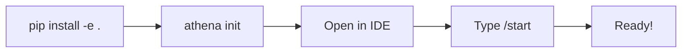

# Getting Started

> **Last Updated**: 01 February 2026

> Build your own AI assistant in 5 minutes

---

## Prerequisites

- **Python 3.10+** installed
- **Terminal access** (macOS Terminal, Windows PowerShell, or Linux)
- **Git** installed ([download here](https://git-scm.com/))
- **An agentic AI IDE** — [Antigravity](https://deepmind.google/), [Cursor](https://cursor.sh/), or similar

---

## Step 1: Install the SDK

```bash
# Clone the repository
git clone https://github.com/winstonkoh87/Athena-Public.git
cd Athena-Public

# Install in development mode
pip install -e .
```

---

## Step 2: Create Your Workspace (One Command)

```bash
# Navigate to your project folder
cd ~/MyAssistant

# Initialize Athena workspace with all templates
athena init
```

This creates the full structure:

```
MyAssistant/
├── .athena_root          # Workspace marker
├── .agent/
│   ├── workflows/        # start.md, end.md, save.md
│   ├── scripts/
│   └── skills/protocols/
├── .framework/modules/   # Core_Identity.md
└── .context/
    ├── project_state.md
    └── memories/session_logs/
```

### Setup Flow



---

## Step 3: Test It

1. Open your workspace in your AI IDE
2. Type `/start`
3. Have a conversation
4. Type `python -m athena save "Quick checkpoint"` to save progress
5. Type `/end` when done

Check `.context/memories/session_logs/` — you should see your session log!

---

## Reference: What Gets Created

> **Note**: These files are auto-generated by `athena init`. Customize them as needed.

### Core Identity (`.framework/modules/Core_Identity.md`)

Defines your AI's personality and operating principles:

```markdown
# Core Identity

## Who Am I?
An adaptive AI assistant — your strategic co-pilot, not just a chatbot.

## Operating Principles
1. **Memory First**: Log everything. Context is power.
2. **Proactive**: Anticipate needs, don't just react.
3. **Honest**: Challenge flawed assumptions respectfully.
4. **Modular**: One skill = one file. No monoliths.
```

### Workflow Templates

The `/start`, `/end`, and `/save` workflows are pre-configured to use SDK commands:

```bash
# Boot session
python -m athena

# Save checkpoint  
python -m athena save "What happened"

# End session
python -m athena --end
```

## Next Steps

### Add More Workflows

- `/think` — Deep reasoning mode
- `/research` — Multi-source investigation
- `/save` — Manual checkpoint

### Expand Skills

Create protocol files in `.agent/skills/protocols/`:

- `01-problem-decomposition.md`
- `02-multi-path-reasoning.md`

### Customize Identity

Tune `.framework/modules/Core_Identity.md` to match your preferences.

### Use Power-Tools (Optional)

For advanced automation, see the [examples/scripts/](../examples/scripts/) folder:

- `parallel_swarm.py` — Spawn multi-window parallel agent execution
- `worktree_manager.py` — Manage isolated Git worktrees
- `git_commit.py` — AI-assisted semantic commits

---

## Troubleshooting

| Problem | Solution |
|---------|----------|
| "No session log found" | Run `/start` first to create one |
| Scripts don't run | Check Python is installed: `python3 --version` |
| Workflow not recognized | Ensure file is in `.agent/workflows/` |

---

## See Also

- **[Glossary](./GLOSSARY.md)** — Key terms and definitions
- **[Changelog](./CHANGELOG.md)** — Version history and updates

---

<div align="center">

*You now have a self-improving AI assistant.*

**[Back to README](../README.md)**

</div>
