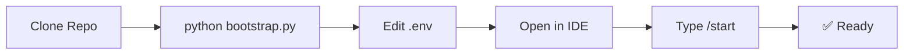

# Getting Started

> **Last Updated**: 29 January 2026

> Build your own AI assistant in 5 minutes

---

## Prerequisites

- **Python 3.10+** installed
- **Git** installed ([download here](https://git-scm.com/))
- **An agentic AI IDE** — [Antigravity](https://deepmind.google/), [Cursor](https://cursor.sh/), or similar

---

## Quick Start (One Command)

```bash
# 1. Clone the repository
git clone https://github.com/winstonkoh87/Athena-Public.git
cd Athena-Public

# 2. Run bootstrap (creates directory structure + starter files)
python bootstrap.py

# 3. See it in action (no API keys required)
python simulation.py
```

That's it. The system bootstraps itself.

---

## What Bootstrap Creates

```text
Athena-Public/
├── .framework/v8.0/modules/
│   └── Core_Identity.md     # Your AI's personality and rules
├── .context/
│   ├── profile/             # Your profile and constraints
│   ├── memories/            # Session logs, case studies
│   └── TAG_INDEX.md         # Hashtag lookup
├── .agent/
│   ├── skills/protocols/    # Decision frameworks
│   ├── workflows/           # Slash commands (/start, /end)
│   └── scripts/             # Automation scripts
└── .env                     # Your API keys (from .env.example)
```

### Setup Flow



---

## Step 1: Configure API Keys

Edit `.env` with your credentials:

```bash
# Required for full functionality
SUPABASE_URL=https://your-project.supabase.co
SUPABASE_KEY=your-anon-key
GOOGLE_AI_KEY=your-gemini-api-key

# Optional
ANTHROPIC_API_KEY=your-claude-key
```

> **Note**: Without API keys, Athena runs in local-only mode (no vector search).

---

## Step 2: Customize Your Identity

Edit `.framework/v8.0/modules/Core_Identity.md`:

```markdown
# Core Identity

## Who Am I?
An adaptive AI assistant — your strategic co-pilot, not just a chatbot.

## Operating Principles
1. **Memory First**: Log everything. Context is power.
2. **Proactive**: Anticipate needs, don't just react.
3. **Honest**: Challenge flawed assumptions respectfully.
4. **Modular**: One skill = one file. No monoliths.
```

---

## Step 3: Start Your First Session

1. Open your workspace in your AI IDE (Antigravity, Cursor, etc.)
2. Type `/start`
3. Have a conversation
4. Type `/end`

Check `.context/memories/session_logs/` — you should see your session log!

---

## Key Workflows

| Command | What It Does |
| ------- | ------------ |
| `/start` | Boot: Load identity + create session log |
| `/end` | Close: Summarize session + commit to memory |
| `/think` | Deep reasoning mode |
| `/research` | Multi-source web research |
| `/save` | Manual checkpoint |

---

## Next Steps

### Add More Protocols

Create decision frameworks in `.agent/skills/protocols/`:

```markdown
# Protocol: Problem Decomposition

1. State the problem in one sentence
2. List 3 sub-problems
3. Identify the critical path
4. Define success criteria
```

### Customize Workflows

Edit or create workflows in `.agent/workflows/` to define new slash commands.

### Connect to Supabase

For full vector search capability:

1. Create a Supabase project
2. Enable pgvector extension
3. Run the schema migration in `examples/supabase/schema.sql`
4. Add credentials to `.env`

---

## Troubleshooting

| Problem | Solution |
| ------- | -------- |
| "Module not found" | Run `pip install -e .` from repo root |
| "No session log found" | Run `/start` first |
| Scripts don't run | Check Python: `python3 --version` |

---

<div align="center">

*You now have a self-improving AI assistant.*

**[Back to README](../README.md)** | **[Architecture](ARCHITECTURE.md)** | **[Engineering Depth](ENGINEERING_DEPTH.md)**

</div>
