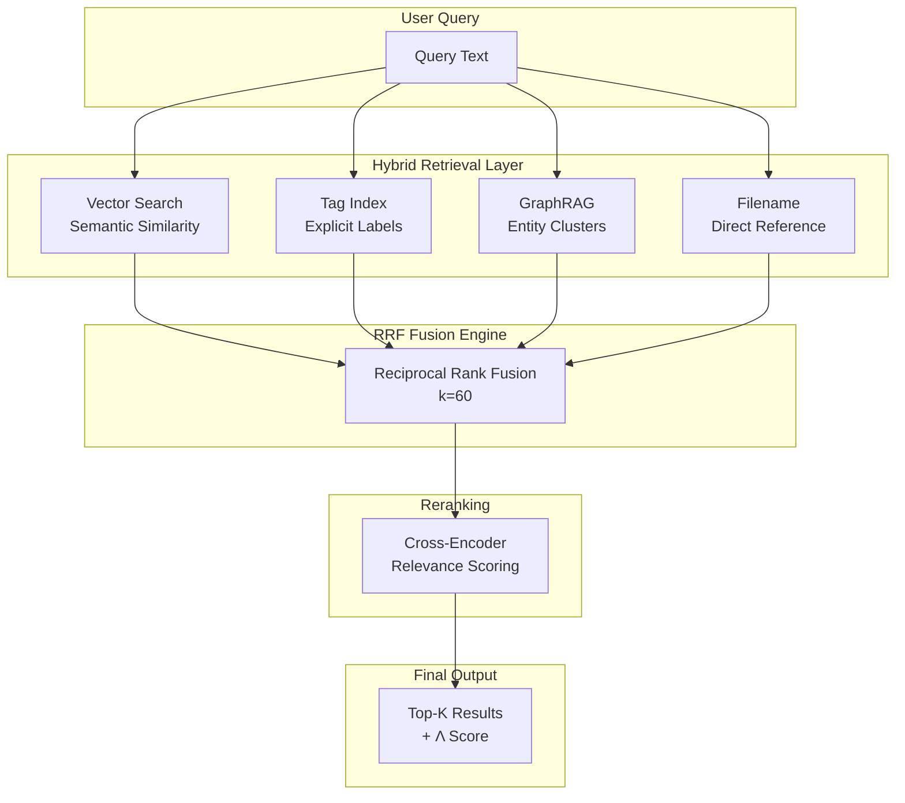
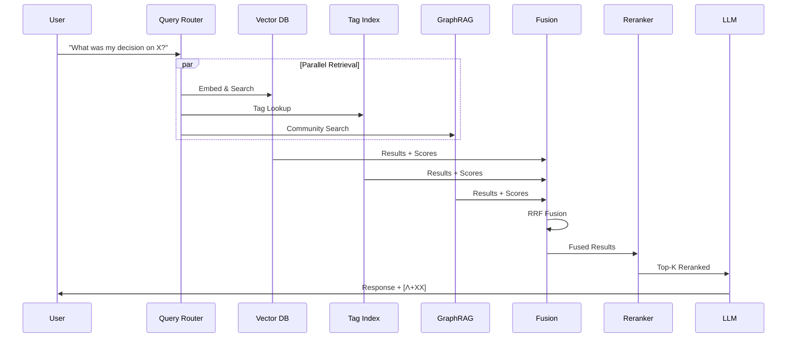

# Knowledge Graph Architecture

> Visual representation of Athena's hybrid retrieval system.

---

## System Overview



---

## RRF Fusion Formula

```text
RRF_score(doc) = Σ (1 / (k + rank_i))
```

Where:

- `k` = 60 (smoothing constant)
- `rank_i` = document rank in retrieval source `i`

---

## Retrieval Source Weights

| Source | Weight | Description |
| ------ | ------ | ----------- |
| Vector (Semantic) | 30% | pgvector cosine similarity |
| Tag Index | 25% | Explicit hashtag matching |
| GraphRAG | 25% | Leiden community detection |
| Filename | 20% | Direct path matching |

---

## Data Flow



---

## Component Details

### Vector Search (Supabase + pgvector)

- **Embedding Model**: Google `text-embedding-004` (768-dim)
- **Distance Metric**: Cosine similarity
- **Index Type**: IVFFlat

### Tag Index (Sharded Markdown)

- **Format**: Alphabetically sharded `.md` files
- **Lookup**: O(1) via shard routing
- **Git-friendly**: Human-readable diffs

### GraphRAG (NetworkX + Leiden)

- **Community Detection**: Leiden algorithm
- **Entity Extraction**: LLM-based NER
- **Resolution**: 0.5 (balanced granularity)

---

## Architecture Principles

| Principle | Implementation |
| --------- | -------------- |
| **Robustness > Speed** | RRF handles score-distribution mismatch |
| **Portability > Platform** | Markdown files are version-controlled |
| **Transparency > Magic** | Λ scores expose cognitive effort |
| **Recoverability > Efficiency** | Atomic writes prevent corruption |

---

*See [ENGINEERING_DEPTH.md](ENGINEERING_DEPTH.md) for implementation details.*
