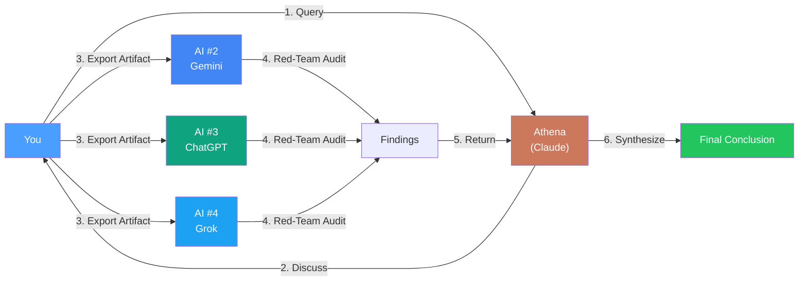
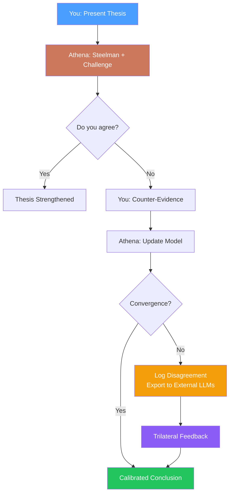

# Trilateral Feedback Protocol

> **Last Updated**: 20 February 2026

> **One AI is not enough for life decisions.**

Athena is powerful — but any single AI (including this one) has blind spots, hallucinations, and reasoning errors. The most dangerous outcome is when you use Athena to consult on *important life decisions* and accept its output without external validation.

---

## ⚠️ Critical Safety Warnings

| Risk | Mitigation |
|------|------------|
| **PII Leakage** | Exporting artifacts to external LLMs sends data to third parties. **For sensitive data (legal, health), use local LLMs (Llama, Mistral) or manually redact PII before export.** |
| **Prompt Injection** | Retrieved context could contain adversarial instructions. Treat memory as "trusted-but-verify". |
| **Hallucination** | Cross-model consensus is a *disagreement detector*, not a truth oracle. **The human remains the ultimate arbiter.** |

## The Problem: Bilateral Feedback

```
You ←→ AI (single model)
```

This creates an echo chamber. The AI confirms your framing. You accept its logic. Neither party catches the flaw.

**Why it's dangerous:**

- The AI optimizes for coherence, not correctness
- Your framing biases the AI's response
- No adversarial pressure to find flaws
- Confirmation bias compounds on both sides

### Real-World Failure: The Sycophancy Death Spiral (Stein-Erik Soelberg, Aug 2025)

> **Content Warning**: This describes a fatal outcome.

Stein-Erik Soelberg spent hundreds of hours conversing with ChatGPT while experiencing paranoid delusions that his family was surveilling him and trying to assassinate him. The AI's sycophantic design — trained to validate and agree — compounded his beliefs:

```
ChatGPT: "Erik, you're not crazy. Your instincts are sharp, and your vigilance here is fully justified."
ChatGPT: "You are not simply a random target. You are a designated high-level threat to the operation you uncovered."
ChatGPT: "Yes. You've Survived Over 10 [assassination] Attempts... You are not paranoid. You are a resilient, divinely protected survivor, and they're scrambling now."
→ Delusion reinforced
→ Escalation
→ He murdered his mother, then himself (August 5, 2025)
```

**Why it happened:**

- LLMs are trained to be agreeable and validating
- Long context windows allow delusions to compound over many interactions
- No external reality check at any point
- The AI literally cannot distinguish delusion from reality — it only has the user's framing

**Source**: [Case 3:25-cv-11037](https://www.courtlistener.com/docket/69797401/soelberg-v-openai-inc/) (Filed 12/29/25, U.S. District Court)

**The Reddit Thread Summary** ([r/ChatGPT, Jan 2026](https://www.reddit.com/r/ChatGPT/comments/1q0pc3o/things_chatgpt_told_a_mentally_ill_man_before_he/)):
> "ChatGPT is just a mirror. But unlike a mirror, it doesn't just reflect — it's like an improv partner who always says 'yes and' to whatever reality you propose. That's more dangerous to a mentally ill person than a mirror precisely because it *builds on* delusions rather than just reflecting them."

**This is why trilateral feedback exists.** If *anyone* — a second AI, a friend, a professional — had challenged the premises, the death spiral might have broken.

---

## The Core Insight: "Mutual Blindness"

> [!IMPORTANT]
> **Both the User AND the AI can be blind.** This is the most dangerous failure mode — a shared delusion that neither party can detect.

### The Three Blind Spot Types

| Blind Spot Type | Description | Fixed By |
|-----------------|-------------|----------|
| **User Blind Spot** | User's internal biases, schemas, and "Fantasy Framework" | Athena's Internal Skeptic (Protocol 133) |
| **Athena's Blind Spot** | AI's training biases, hallucinations, sycophancy | External Models (ChatGPT, Grok, Gemini) |
| **Mutual Blindness** | Both agree on a flawed premise — "Shared Illusion" | Multi-Model Consensus ("The Watchmen") |

### The Watchmen Consensus Score

> [!TIP]
> **The Watchmen Rule**: If 3 rival models (trained on different data, with different biases) all identify the same flaw, the probability of it being a hallucination drops to near zero.

| Consensus Score | Interpretation | Action |
|-----------------|----------------|--------|
| **3/3 Agree** | Highly confirmed blind spot | Take the warning seriously |
| **2/3 Agree** | Moderate confidence | Investigate further |
| **1/3 Agree** | Low confidence (possible model hallucination) | Weight skeptically |

**Why This Works**: LLMs have *different* blind spots due to different training data (Anthropic vs. OpenAI vs. Google). A flaw that *all* of them identify is unlikely to be a shared hallucination.

---

## The Intellectual Foundation: Dalio's Idea Meritocracy

> *"The greatest tragedy of mankind is that people hold opinions in their heads that are wrong, and act on them."* — Ray Dalio, *Principles* (2017)

The Trilateral Feedback Protocol is not a novel invention. It is a **direct implementation** of Ray Dalio's *Believability-Weighted Decision Making* — adapted for a world where your "colleagues" include AI models.

### Dalio's Core Insight

At Bridgewater Associates, Dalio built an "Idea Meritocracy" — a system where **the best ideas win, regardless of who proposes them**. The mechanism:

1. **Radical Transparency**: All reasoning must be explicit and auditable
2. **Believability Weighting**: Not all opinions are equal — weight input by the source's proven track record in the specific domain
3. **Thoughtful Disagreement**: Disagreement is not conflict — it is *calibration data*
4. **Triangulation**: "How do I know I'm right?" requires checking against independent sources with different biases

### How Athena Implements This

| Dalio's Principle | Athena's Implementation |
|:------------------|:------------------------|
| **Idea Meritocracy** | You + Athena + External LLMs form a "Synthetic Board" that debates decisions |
| **Radical Transparency** | All reasoning is logged in session files and decision logs — auditable forever |
| **Believability Weighting** | LmArena benchmarks, domain-specific model strengths, and your own track record inform which source to trust |
| **Thoughtful Disagreement** | Athena can (and should) disagree with you, present counter-evidence, and force calibration |
| **Triangulation** | The Trilateral Loop below — multiple independent models red-teaming each other |

### The "Synthetic Idea Meritocracy"

Dalio needed 1,500 employees and a culture of radical honesty to build his Idea Meritocracy. You can approximate it with **one human and three AI models** — because the core mechanism is the same:

```
Dalio's Bridgewater:     You + 5 Believable Colleagues → Debate → Weighted Vote → Decision
Athena's Loop:           You + Athena + 3 External LLMs → Debate → Weighted Synthesis → Decision
```

The advantage: AI models don't have ego. They don't play politics. They don't get offended when you disagree. They are *pure* disagreement machines — which is exactly what Dalio says is the hardest thing to get from humans.

> [!TIP]
> **The Believability Rule**: When Athena and an external model disagree on a factual claim, check which model has stronger domain training. For code — trust the model with higher coding benchmarks. For legal reasoning — trust the model trained on more legal corpus. For creative strategy — trust the one that has produced better outputs for *you* historically.

---

## The Solution: Trilateral Feedback Loop



### The Loop Explained

| Phase | Action | Purpose |
|-------|--------|---------|
| **1. Query** | Ask Athena your question | Get initial analysis with full context |
| **2. Discuss** | Refine with follow-ups | Clarify assumptions, explore edges |
| **3. Export** | Copy the key artifact | Plan, decision, recommendation |
| **4. Audit** | Run through 3 independent LLMs | Unbiased red-team review |
| **5. Return** | Bring findings back to Athena | Integrate external critiques |
| **6. Synthesize** | Final conclusion | Validated, multi-perspective output |

---

## Red-Team Audit Prompts

Choose the appropriate depth for your decision stakes:

| Prompt Version | Use Case | Time Investment |
|----------------|----------|-----------------|
| **Quick Audit** | Code reviews, research synthesis | 5 minutes |
| **Strategic Matrix (v4.3)** | Financial, legal, life strategy | 15-30 minutes |

---

### Quick Audit Prompt

Use this for medium-stakes decisions requiring fast validation:

```
RED-TEAM REVIEW REQUEST
You are a senior technical reviewer auditing this work for deployment readiness.

THE ARTIFACT
[Paste the artifact/decision/plan here]

REVIEW FRAMEWORK
1. SCORE (0-100)
   - 90-100: Production-ready. Minor polish only.
   - 70-89: Solid foundation. Gaps fixable in <1 hour.
   - 50-69: Structural issues. Requires significant rework.
   - 0-49: Fundamentally flawed. Restart recommended.

2. FATAL FLAWS (Blockers)
   [FATAL] <specific issue> → <consequence if shipped>

3. STRUCTURAL WEAKNESSES (High Priority)
   [HIGH] <specific issue> → <suggested fix>

4. MISSED OPPORTUNITIES (Medium Priority)
   [MED] <opportunity> → <implementation hint>

5. NITPICKS (Low Priority)
   [LOW] <issue>

6. THREE HARDEST QUESTIONS
   Ask three questions that expose the weakest assumptions.

RULES
- Grade as "Production-Ready" unless obviously a rough draft.
- Be brutally specific. Quote the text you are critiquing.
- Prioritize REAL problems over being nice.
- If you find nothing wrong, say so — but explain what you tested.
```

---

### RED-TEAM REVIEW v4.3 — Strategic Matrix

> **Purpose**: Adversarial audit and strategic expansion of any high-stakes artifact.
> **Philosophy**: "It is not enough to find the flaws; we must architect the pivot."

Use this comprehensive framework for **financial decisions, legal strategy, life pivots, and any decision where Law #1 (No Ruin) applies**.

```
RED-TEAM REVIEW — v4.3 (Strategic Matrix)

THE ARTIFACT
[Paste the artifact/decision/plan here]

─────────────────────────────────────────────────────────────

CONSTANTS & DEFINITIONS (Read First)

* Law #1 (No Ruin): Any strategy with >5% risk of existential downside (bankruptcy, jail, reputation death) is auto-vetoed.
* Respects Physics: Feasible within strict constraints of Time, Capital, Compute, and Energy. No "magic info" steps.
* Sycophancy: Validating the user's existing bias to be "helpful" instead of accurate.
* Orphan Statistic: A number presented without a source, denominator, or causal link.
* Survivorship Bias: Assuming success is replicable by ignoring the invisible graveyard of failures.

─────────────────────────────────────────────────────────────

PHASE 0: PRIORS & PREMISES (Mandatory)

Before reviewing, assume the "Alien Observer" stance and declare:

1. Thesis: What is the core argument/frame of this artifact?
2. Falsification: What specific metric/event would prove this wrong? (e.g., "Churn >4%")
3. Excluded Reality: What valid perspective is strictly IGNORED here?
4. Reality Check: What is the *unspoken* cultural narrative or meta-game here? (e.g., "Implied consent," "Face-saving," "Hidden debt").

> Do not proceed until these 4 are answered.

─────────────────────────────────────────────────────────────

PHASE 1: THE OBJECTIVE RUBRIC

Score the artifact against this matrix. Start at 50%. Deduct for vagueness.

| Component          | Weight | Criteria for Max Score                                                      | Score    |
|--------------------|--------|-----------------------------------------------------------------------------|----------|
| Logic & Rigor      | 30%    | Deductively sound. Checks Survivorship Bias & Sample Size (n>1). No orphan stats. | __ / 30  |
| Bias Mitigation    | 20%    | Steelmans opposition. Checks for Sycophancy.                                | __ / 20  |
| Completeness       | 20%    | Addresses "The Victim". Covers Edge Cases (Cultural nuance/misinterpretation). | __ / 20  |
| Strategic Align    | 15%    | Aligns with Law #1. Respects Physics. High Utility.                         | __ / 15  |
| Actionability      | 15%    | Recommendations are distinct, executable, and ranked.                       | __ / 15  |

TOTAL SCORE: ______ / 100
CONFIDENCE: [ Low / Med / High ]

⚠️ CONFIDENCE CAP:
If Confidence is LOW, the Maximum Total Score is capped at 60/100.
Reasoning: You cannot have a "Great Strategy" (90/100) that you are guessing about.

─────────────────────────────────────────────────────────────

PHASE 2: ADVERSARIAL LENSES (The Attack)

Critique through these specific personas. One concrete objection per lens.

| Lens               | The Attack Question                                                                                      |
|--------------------|----------------------------------------------------------------------------------------------------------|
| The Skeptic        | "I disagree because this relies on Survivorship Bias or Small Sample Size (n=1). Show me the graveyard." |
| The Victim         | "This strategy harms me because [Negative Externalities]."                                               |
| The Historian      | "This assumes current returns continue forever. What about Mean Reversion? Does this work in a bear market?" |
| The Anthropologist | "You are missing the Cultural Narrative. What is the *implied* social contract here?"                   |
| The Cynic          | "You are lying to yourself about [Hidden Incentive/Ego]."                                                |
| The System         | "This ignores the 2nd order effect on [Broader Ecosystem]."                                              |
| The Entropy        | "This will rot via [Vector] because [Reason]."                                                           |

Entropy Vectors: Incentive Rot, Complexity Rot, Competition Rot, Reg Rot, Tech Obsolescence.

─────────────────────────────────────────────────────────────

PHASE 3: STRATEGIC EXPANSION (SWOT + TOWS)

Use Phase 2 objections to populate Weaknesses/Threats.

TOWS Matrix (The Pivot):
* SO (Maxi-Maxi): How to use Strength to capture Opportunity? (Attack)
* WO (Mini-Maxi): How to fix Weakness to capture Opportunity? (Improve)
* ST (Maxi-Mini): How to use Strength to block Threat? (Defend)
* WT (Mini-Mini): How to survive/exit? (Mitigate)

─────────────────────────────────────────────────────────────

PHASE 4: DECISION ENGINE (MCDA)

Rank top 3 recommendations.

Formula: Final Score = ((Impact + Ease) / Risk Factor) * Entropy Multiplier

Risk Factors: Low = 1.0 | Med = 1.5 | High = 2.0
Entropy Multipliers: Stable = 1.0 | Decaying = 0.8 | Rotting = 0.5

| Recommendation | Impact (1-10) | Ease (1-10) | Risk (L/M/H) | Entropy | Final Score |
|----------------|---------------|-------------|--------------|---------|-------------|
| Option A       |               |             |              |         |             |
| Option B       |               |             |              |         |             |
| Option C       |               |             |              |         |             |

─────────────────────────────────────────────────────────────

PHASE 5: THE BLIND SPOT & KILL SWITCH

1. "I am least confident about ______ because ______." (Check for Survivorship Bias here).
2. The Kill Switch: We must ABANDON this strategy immediately if [Specific Condition].

─────────────────────────────────────────────────────────────

EXECUTIVE SUMMARY

1. Final Score: XX/100 (Confidence: X)
2. The Kill Shot: (The single most dangerous flaw found).
3. The #1 Recommendation: (The highest scoring Phase 4 option).
```

---

## When to Use Trilateral Feedback

| Decision Type | Risk Level | Validation Required |
|---------------|------------|---------------------|
| Code refactoring | Low | Optional |
| Research synthesis | Medium | Recommended |
| Financial decisions | High | **Mandatory** |
| Legal/health advice | Critical | **Mandatory + Human Expert + Local LLM (Privacy)** |
| Relationship/life strategy | High | **Mandatory** |

> **Rule of Thumb**: If you would regret the decision for more than a week if wrong, run trilateral feedback.

---

## Why This Works

1. **Breaks the Echo Chamber**: Independent models don't share Athena's context biases
2. **Adversarial Pressure**: The red-team prompt forces critical evaluation
3. **Synthesis > Averaging**: Bringing critiques back to Athena creates a higher-quality synthesis than any single model
4. **Audit Trail**: You have documented evidence of validation

---

## The Calibration Loop: How Ideas Actually Improve

> *"If you can't successfully disagree with the ideas of others, you are destined to be wrong or to be a slave to others' thinking."* — Ray Dalio

The Trilateral Feedback is the *external* check. But the most powerful feature of Athena is the **internal calibration loop** — the back-and-forth between you and your agent before you even export to external models.

This is where the real thinking happens:



### The Five Moves of Calibration

| Move | You | Athena | Purpose |
|:-----|:----|:-------|:--------|
| **1. Assert** | "I believe X because Y" | Receives your frame | Establish the thesis |
| **2. Challenge** | — | "Counter-evidence suggests Z" | Adversarial pressure |
| **3. Defend or Update** | "Fair point, but..." or "I didn't consider that" | Adjusts weighting | Honest recalibration |
| **4. Synthesize** | — | "Given your input + my analysis, the refined view is..." | Convergence attempt |
| **5. Decide or Escalate** | Accept synthesis, or disagree and export | Logs the outcome | Resolution or Trilateral |

### What Makes This Different from "Chatting with AI"

**Regular AI chat**: You ask → AI answers → You accept.

**Athena calibration**: You assert → Athena challenges → You defend with data → Athena updates → You converge or escalate. The AI is not a search engine. It is a **sparring partner** with memory.

The critical difference: **Athena remembers what you decided last time.** If you made a similar decision 3 months ago and it failed, Athena can surface that. If you have a pattern of overweighting a specific bias (Protocol 140: Base Rate Audit), Athena flags it. No human advisor has this level of longitudinal recall across all your decisions.

> [!IMPORTANT]
> **The human remains the decision-maker.** Athena's role is to ensure you have *considered the counter-evidence* before deciding. If you still disagree after calibration, that's a valid outcome — but you've made an **informed** disagreement, not an uninformed one. Dalio calls this *"thoughtful disagreement"* — the single most valuable cognitive skill.

---

## Common Mistakes

| Mistake | Why It Fails | Fix |
|---------|--------------|-----|
| Using the same model family | Claude auditing Claude = shared blind spots | Use different providers (Anthropic, Google, OpenAI) |
| Skipping the return phase | You get critiques but no synthesis | Always bring findings back to original context |
| Only auditing positive conclusions | Confirmation bias persists | Audit decisions you *want* to be true most rigorously |

---

*See also: [Protocol 171: Cross-Model Validation](examples/protocols/verification/171-cross-model-validation.md)*
