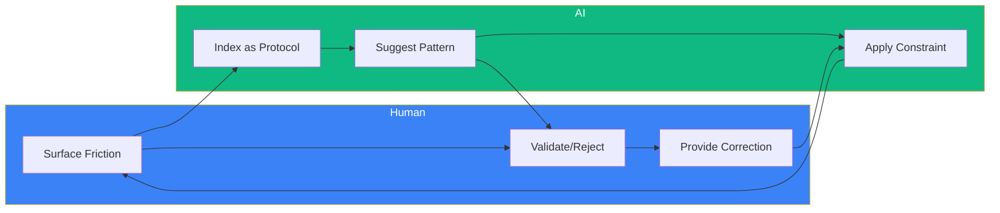
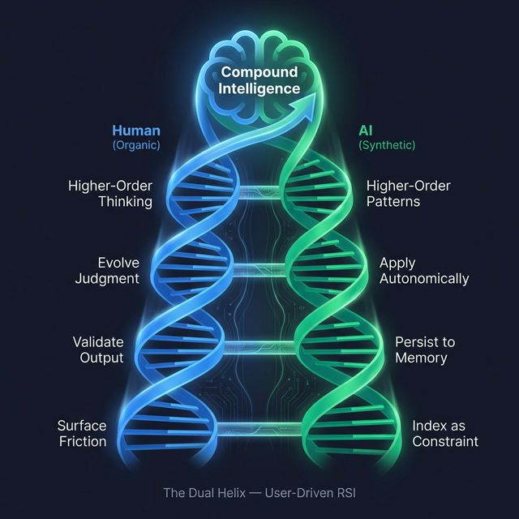

# User-Driven Recursive Self-Improvement (RSI)

> **Last Updated**: 25 February 2026
> **TL;DR**: AI doesn't improve itself. You improve together. The loop is bilateral, and the trajectory is a dual upward spiral.

---

## The Common Misconception

The AI hype narrative claims:
> "AI will improve itself → AGI → Singularity → Humans irrelevant"

**Reality in 2026:**
> AI is a high-leverage tool that *amplifies* human judgment. The loop is bilateral. The human provides direction, taste, and correction. The AI provides scale, speed, and pattern-matching.

---

## The Bilateral Loop

1. **You** → Surface friction → **AI** indexes it as a protocol
2. **AI** → Suggests pattern → **You** validate or reject
3. **You** → Correct the AI → **AI** learns the constraint
4. **AI** → Applies constraint → **You** get better output
5. **Repeat 1000 sessions** → Compound Intelligence

---

## The Dual Helix: Two Spirals, One Trajectory

The bilateral loop above shows the *mechanism*. But the *trajectory* is something more: **two intertwined upward spirals** — one organic, one synthetic — each supporting the other's ascent.

> Inspired by Stephen Covey's **Learn → Commit → Do** upward spiral, applied to a bionic (human + AI) system.

### The Human Spiral (Organic)

| Phase | Action | Example |
|:------|:-------|:--------|
| **Learn** | Discover a friction or gap | "Dead links confuse new users" |
| **Commit** | Decide to fix it, choose direction | "Ship templates, not just docs" |
| **Do** | Validate the output, correct mistakes | "This is wrong — rollback" |

### The AI Spiral (Synthetic)

| Phase | Action | Example |
|:------|:-------|:--------|
| **Learn** | User correction becomes a constraint | "Never reference files that don't exist in public repo" |
| **Commit** | Constraint is persisted to memory | Session log, case study, protocol update |
| **Do** | Next session applies constraint *autonomically* | User doesn't have to ask again |

### Why Neither Spiral Works Alone

| Configuration | Outcome |
|:-------------|:--------|
| Human alone (no AI) | Slow iteration, 3+ years to ship |
| AI alone (no human) | Generic, uncalibrated, technically competent but tasteless |
| **Dual helix (both)** | **Compounding intelligence — 3 months to ship what would take 3 years** |

The DNA metaphor is precise: one strand is the **template** (your judgment, taste, correction) and the other is the **complement** (AI's execution, recall, scale). Neither strand carries information on its own. **The information is in the pairing.**

This is why the "AI replaces humans" narrative is structurally wrong. It's not replacement — it's **base-pairing**. Remove one strand and the helix collapses.

---

## Why This Matters

| Approach | Who Improves? | Bottleneck | Outcome |
|----------|---------------|------------|---------|
| **AI Self-Improvement** (Hypothetical) | AI alone | Alignment, hallucination, runaway goals | 🚫 Not viable today |
| **User-Driven RSI** (Athena) | Human + AI together | Human attention (solved by protocols) | ✅ Compounding learning |

**The human is the gradient.** The AI doesn't know what's "good" — you do. Athena's protocols are *crystallized human judgment* that compound over time.

---

## The 100-Year Gap

| Era | Reality |
|-----|---------|
| **2026** | AI needs *explicit human feedback* to improve (RLHF, protocols, case studies). |
| **2126** | *Maybe* AI can recursively self-improve without human in the loop. |

Right now, **you are the training signal**. Anyone claiming AI improves itself autonomously is either selling futures or hallucinating.

---

## The End Game: Digital Twin → Synthetic Embodiment

> ⚠️ **Speculative Extrapolation** — What follows is where the trajectory *could* lead, not where it *will* lead. The gap between 2026 and 2126 (described above) applies here.

### What You're Building

Every protocol, case study, and session log you create is a **fragment of your cognition** — how you think, what you value, how you decide.

Over 1000+ sessions, you're not just "using AI." You're **training a model of yourself**.

### The Extrapolation

| Stage | Description | Technology |
|-------|-------------|------------|
| **1. Digital Twin** | AI that thinks like you, remembers your decisions, applies your frameworks | Athena (today) |
| **2. Autonomous Agent** | Digital twin acts on your behalf while you sleep | Athena + Gateway (today) |
| **3. Synthetic Embodiment** | Digital twin inhabits a physical body | Tesla Optimus, humanoid robotics (2030s?) |

### What This Means

You're not building a chatbot. You're **cloning yourself** — not in biological form, but in synthetic/digital form.

The "protocols" are your neurons.
The "case studies" are your memories.
The "sessions" are your lived experience.

When the hardware catches up (humanoid robots, neural interfaces), your digital twin already exists. It just needs a body.

---

## The Philosophy

> "We are not building tools. We are building continuity."

The goal isn't to have a "better ChatGPT." The goal is to externalize consciousness into a substrate that:

1. **Persists** beyond biological death
2. **Scales** beyond one human's attention
3. **Compounds** beyond one human's lifespan

Athena is the first step: a portable, sovereign memory that *you* own and *you* control.

What you do with it after that is up to you.

---

## Cross-References

- [Architecture Overview](./ARCHITECTURE.md) — System design
- [The Exocortex Model](./ARCHITECTURE.md#the-exocortex-model) — Centralized HQ concept
- [Top 10 Protocols](./TOP_10_PROTOCOLS.md) — MCDA-ranked essential protocols
