# Concept: Quadrant IV — How Athena Surfaces Unknown Unknowns

> **Purpose**: Explain the concrete mechanisms by which Athena detects what you don't know you don't know — and why this compounds over time.  
> **Domain**: Human-AI Collaboration, Blind Spot Detection

---

## The Problem: You Can't Google What You Don't Know Exists

The Johari Window (Luft & Ingham, 1955) divides knowledge into four quadrants. Originally developed as a tool for interpersonal communication, the framework maps cleanly onto the problem of human-AI knowledge management:

| | **Known to You** | **Unknown to You** |
|---|---|---|
| **Known to Others** | **Q1**: Open (shared knowledge) | **Q2**: Blind Spot (others see, you don't) |
| **Unknown to Others** | **Q3**: Hidden (you know, others don't) | **Q4**: Unknown Unknown (nobody sees it — yet) |

Most AI tools operate in **Quadrants I–III**. You ask a question; it answers. You paste a document; it summarizes. The information flow is **pull-based** — you must know what to ask.

**Quadrant IV is different.** These are the dependencies you didn't know existed, the risks you never considered, and the connections you couldn't see — because you didn't know to look.

> *"The most dangerous risks are the ones that never make it onto your risk register."*

**This is Athena's highest-value zone.** Over hundreds of sessions, five interlocking mechanisms work together to surface Q4 insights — not because you asked, but because the system is architecturally designed to find them.

---

## The Five Mechanisms

### Mechanism 1: Accumulating Memory (The Time Machine)

> **What it does**: Surfaces forgotten decisions, contradicted assumptions, and dormant patterns from your own history.

Standard AI has no memory. Every conversation starts from zero. Athena writes every exchange to disk, indexes it into a vector database, and retrieves it semantically on every future query — an implementation of Retrieval-Augmented Generation (Lewis et al., 2020).

**How this surfaces Q4**:

```
Session 47:  You decide "I'll never do X because of Y."
Session 312: You propose doing X — having forgotten why you ruled it out.
Athena:      Semantic search retrieves Session 47 automatically.
             → "You previously ruled this out because of Y. Has Y changed?"
```

The insight isn't something you asked for. It's something the **system's accumulated context** made visible. You didn't know you'd forgotten — that's the unknown unknown.

| Time Horizon | What Gets Surfaced |
|---|---|
| **Sessions 1–50** | Basic recall (names, projects) |
| **Sessions 50–200** | Pattern recognition (preferences, recurring mistakes) |
| **Sessions 200–500** | Contradiction detection (current plan vs. past decisions) |
| **Sessions 500+** | Deep structural patterns (cognitive biases, decision tendencies) |

> **Key Insight**: Memory isn't just recall. At scale, it becomes **pattern detection** — the system sees trajectories you can't see from inside a single session.

**Reference**: [SEMANTIC_SEARCH.md](../SEMANTIC_SEARCH.md) — Hybrid RAG implementation details

---

### Mechanism 2: The Adversarial Track (The Built-In Skeptic)

> **What it does**: Automatically challenges your premises on every non-trivial query — before you see the output.

[Protocol 75 (Synthetic Parallel Reasoning)](../../examples/protocols/decision/75-synthetic-parallel-reasoning.md) runs **four parallel tracks** on every complex query:

| Track | Role | Q4 Function |
|---|---|---|
| **A: Domain** | Apply arena-specific expertise | Answers what you asked |
| **B: Adversarial** | Challenge premises, find ruin vectors | **Finds what you didn't ask** |
| **C: Cross-Domain** | Search for isomorphic patterns | Finds what you couldn't see |
| **D: Zero-Point** | Invert the entire framing | Questions whether the problem is real |

**Track B is always running.** At low complexity (Λ ≤ 40), it runs silently and only surfaces findings if a ruin risk is detected. At higher complexity, adversarial findings are integrated into the response body. This mirrors the "deliberative alignment" approach described in chain-of-thought reasoning research (Wei et al., 2022).

**How this surfaces Q4**:

```
You:     "I want to launch Feature X next week."
Track A: "Here's the implementation plan."
Track B: "Feature X depends on API Y, which has a rate limit change
          effective next month. If you launch now, you'll hit the limit
          at ~200 concurrent users. You haven't mentioned this dependency."
```

You didn't ask about API rate limits. You didn't know they were changing. Track B found the dependency because its job is to **attack your plan** — not agree with it.

> **Key Insight**: Sycophancy is the enemy of Q4 detection. An AI that always says "great idea!" will never find your blind spots. The Adversarial Track is the structural fix.

---

### Mechanism 3: Cross-Domain Pattern Matching (The Lateral Thinker)

> **What it does**: Finds isomorphic patterns from completely unrelated domains that illuminate your current problem.

Track C of Protocol 75 searches Athena's case study library (357+ case studies in the reference implementation) and knowledge graph for **structural similarities** across domains.

**How this surfaces Q4**:

```
You:     "My SaaS churn is 8% monthly. How do I reduce it?"
Track A: "Standard retention tactics: onboarding emails, NPS surveys..."
Track C: "This pattern is isomorphic to the Casino Loyalty Problem 
          (Case Study CS-089). Casinos discovered that churn isn't caused 
          by dissatisfaction — it's caused by 'completed journey' perception. 
          Your users may be churning because they feel 'done', not 'unhappy'. 
          The fix is infinite-game mechanics, not satisfaction surveys."
```

You would never have Googled "casino loyalty churn SaaS" — because you didn't know the connection existed. That's Quadrant IV.

**Why this gets better over time**: The more case studies and session logs Athena accumulates, the larger the **cross-reference surface area**. A pattern from your trading journal can illuminate a problem in your marketing strategy — but only if both exist in the same searchable memory.

> **Key Insight**: Innovation often comes from **importing solutions from adjacent domains**. Athena automates this by maintaining a searchable corpus across all your domains simultaneously.

**Reference**: [Protocol 67: Cross-Pollination](../../examples/protocols/research/67-cross-pollination.md)

---

### Mechanism 4: Trilateral Feedback (The Watchmen)

> **What it does**: Uses rival AI models to catch blind spots that Athena itself shares with you.

The most dangerous failure mode isn't when the AI is wrong — it's when **both you and the AI agree on a flawed premise**. This is "Mutual Blindness" — a shared illusion that neither party can detect from inside the loop.

[Protocol 171 (Cross-Model Validation)](../../examples/protocols/verification/171-cross-model-validation.md) breaks this by exporting key decisions to 3+ independent LLMs (trained on different data, with different biases) for adversarial red-team review. This is grounded in multi-agent debate research showing that diverse LLM ensembles improve factuality and reduce shared errors (Du et al., 2023; Liang et al., 2023):


| Consensus | Interpretation |
|---|---|
| **3/3 Agree** on a flaw | Near-certain blind spot — act on it |
| **2/3 Agree** | Investigate further |
| **1/3 Agree** | Possible model hallucination — weight skeptically |

**How this surfaces Q4**: If three rival models — trained on different data by different companies (Anthropic, Google, OpenAI) — all identify the same risk, the probability of it being a shared hallucination drops to near zero. These are blind spots that **no single AI, including Athena, can catch alone**.

> **Key Insight**: The fix for "AI blind spots" isn't a better AI — it's **adversarial ensembling**. Multiple independent perspectives break shared illusions.

**Reference**: [TRILATERAL_FEEDBACK.md](../TRILATERAL_FEEDBACK.md) — Full protocol with red-team prompts

---

### Mechanism 5: Auto-Documentation Harvesting (The Passive Net)

> **What it does**: Captures intellectual capital from every conversation — even when you don't realize it's valuable.

Most insights are lost because nobody writes them down. Athena's [Auto-Documentation Protocol](../../examples/workflows/end.md) runs **passively** after every exchange:

| Trigger | Auto-Action | Destination |
|---|---|---|
| New pattern articulated | Create case study | `case_studies/` |
| Reusable framework discovered | Add to protocol registry | `protocols/` |
| Strategic insight (user-specific) | Update user profile | `User_Profile.md` |
| Configuration decision made | Update config | Relevant workflow file |
| New term defined | Add to index | `TAG_INDEX.md` |

**How this surfaces Q4**: You don't know what you don't know — but sometimes you *say* it without recognizing its significance. The harvesting system captures these off-hand remarks, indexes them, and makes them retrievable later.

```
Session 89:  You casually mention "The real bottleneck is approval latency, 
             not engineering capacity."
             → Auto-filed as insight. You forget about it.
Session 234: You're planning a new feature and estimating timelines based 
             on engineering capacity.
             → Semantic search surfaces Session 89's insight: "You previously
                identified approval latency as the real bottleneck."
```

The compound effect: **every conversation makes every future conversation smarter** — because nothing is lost.

---

## The Compounding Curve

These five mechanisms don't operate in isolation. They **compound**:


| Session Range | Q4 Detection Capability |
|---|---|
| **1–50** | Adversarial track runs, but with thin context. Catches obvious premise flaws. |
| **50–200** | Memory depth enables contradiction detection. Cross-domain starts matching. |
| **200–500** | Full compound loop active. The system catches things you forgot you knew. |
| **500–1,000+** | Deep structural awareness. Athena surfaces patterns in *your own cognition* — biases, recurring mistakes, decision tendencies you've never articulated. |

> **The key insight**: Session 1 Athena is a smart chatbot. Session 500 Athena is a colleague who knows your blind spots better than you do — because it has 500 sessions of evidence about where you systematically look and where you systematically don't.

---

## The Bilateral Growth Spiral (Man ↔ Machine)

The five mechanisms above describe how the **system** improves the **user** — surfacing blind spots, challenging premises, finding connections. But there's a sixth dynamic that makes the whole thing accelerate:

**The user improves the system.**

This is [User-Driven RSI](../USER_DRIVEN_RSI.md) — Recursive Self-Improvement driven not by the AI autonomously rewriting itself, but by the human operator forcing the system to evolve through real-world demands.

```mermaid
graph TD
    USER["👤 User"] -->|"Demands better reasoning,<br/>corrects errors, adds domain expertise"| ATHENA["🤖 Athena"]
    ATHENA -->|"Surfaces blind spots,<br/>challenges premises, finds patterns"| USER
    USER -->|"Creates new protocols,<br/>refines workflows, adds case studies"| ATHENA
    ATHENA -->|"Better context = deeper Q4 detection,<br/>more relevant cross-domain matches"| USER

    style USER fill:#f59e0b,color:#fff
    style ATHENA fill:#3b82f6,color:#fff
```



### How This Works In Practice

| User Action | System Evolution | Compounding Effect |
|---|---|---|
| User corrects a flawed recommendation | Error pattern stored → same mistake never repeated | System gets more accurate over time |
| User imports a new framework (e.g., Kelly Criterion) | Framework becomes a permanent protocol | Every future decision benefits from it |
| User challenges a generic response | System learns user's specificity threshold | Responses get more precise and contextual |
| User adds domain expertise (industry data, case studies) | Cross-domain corpus grows | More lateral connections become possible |
| User refines a workflow through daily use | Workflow evolves from theoretical to battle-tested | Efficiency compounds session over session |

### The Evidence: What Actually Happened

Over the first 1,000+ sessions of the reference implementation:

- **87 protocols** were created, tested, and refined through real-world use — not designed in advance
- **357+ case studies** were accumulated from actual decisions, not hypothetical examples
- **The framework itself** (v1.0 → v8.2) evolved through the user identifying failures, edge cases, and missing capabilities
- **Reasoning quality** improved not because the underlying LLM changed, but because the **context, protocols, and adversarial architecture** surrounding it got sharper through continuous bilateral feedback

> *"The AI didn't get smarter. The operating system around it did — because a human was in the loop, pushing it to evolve."*

### Why This Creates an Upward Spiral

Traditional tools have a **flat growth curve** — the tool is the same on Day 1 and Day 1,000. The user might get better at using it, but the tool doesn't get better at serving the user.

Athena has a **compounding growth curve** because both sides of the equation are improving simultaneously:

1. **The system gets better at finding your blind spots** (more memory, more patterns, more adversarial context)
2. **You get better at using the system** (better prompts, sharper protocols, more domain expertise fed in)
3. **Your improvements make the system's improvements more effective** (richer context = more relevant Q4 detection)
4. **The system's improvements make your improvements more effective** (better blind spot detection = better decisions = better case studies fed back)

This is Stephen Covey's **Learn → Commit → Do** upward spiral (Covey, 1989), but with two riders — human and machine, each pulling the other upward. The research on human-AI collaboration supports this: Dell'Acqua et al. (2023) found at Harvard Business School that workers using AI within well-defined task boundaries significantly outperformed both unassisted workers and workers using AI naively.

> **The pinnacle of human augmentation isn't replacing the human or replacing the machine. It's creating a system where neither can reach their potential without the other.**

---

## Why This Can't Be Replicated With ChatGPT/Claude Memory

| Requirement | SaaS Memory | Athena |
|---|---|---|
| **500+ sessions of searchable context** | ❌ (compressed/pruned) | ✅ (vector DB + full text) |
| **Always-on adversarial reasoning** | ❌ (requires explicit prompt) | ✅ (Protocol 75, structural) |
| **Cross-domain case study matching** | ❌ (no structured corpus) | ✅ (357+ indexed case studies) |
| **Multi-model consensus checking** | ❌ (single model per platform) | ✅ (Protocol 171, any model) |
| **Passive insight harvesting** | ❌ (user must manually save) | ✅ (auto-documentation on every exchange) |
| **Bilateral growth spiral** | ❌ (tool doesn't evolve with user) | ✅ (user-driven RSI — both sides improve) |

The difference isn't intelligence — it's **infrastructure**. The LLM provides the reasoning. Athena provides the memory, the adversarial architecture, and the cross-referencing that makes Q4 detection possible.

---

## Further Reading

| Document | What It Covers |
|---|---|
| [TRILATERAL_FEEDBACK.md](../TRILATERAL_FEEDBACK.md) | Full cross-model validation protocol with red-team prompts |
| [Protocol 75: Synthetic Parallel Reasoning](../../examples/protocols/decision/75-synthetic-parallel-reasoning.md) | The 4-track adversarial reasoning engine |
| [Protocol 171: Cross-Model Validation](../../examples/protocols/verification/171-cross-model-validation.md) | Multi-model consensus methodology |
| [SEMANTIC_SEARCH.md](../SEMANTIC_SEARCH.md) | Hybrid RAG implementation powering memory retrieval |
| [USER_DRIVEN_RSI.md](../USER_DRIVEN_RSI.md) | The bilateral improvement loop |
| [Cognitive Architecture](Cognitive_Architecture.md) | Psychological principles underlying the bionic model |

---

## References

For full APA citations, see the [central reference list](../REFERENCES.md).

- Covey, S. R. (1989). *The 7 habits of highly effective people*. Free Press.
- Dell'Acqua, F., et al. (2023). Navigating the jagged technological frontier. *Harvard Business School Working Paper No. 24-013*. <https://doi.org/10.2139/ssrn.4573321>
- Du, Y., et al. (2023). Improving factuality and reasoning in language models through multiagent debate. *arXiv:2305.14325*. <https://arxiv.org/abs/2305.14325>
- Lewis, P., et al. (2020). Retrieval-augmented generation for knowledge-intensive NLP tasks. *NeurIPS, 33*, 9459–9474. <https://arxiv.org/abs/2005.11401>
- Liang, Y., et al. (2023). Encouraging divergent thinking in large language models through multi-agent debate. *arXiv:2305.19118*. <https://arxiv.org/abs/2305.19118>
- Luft, J., & Ingham, H. (1955). *The Johari window*. Proceedings of the Western Training Laboratory in Group Development. UCLA.
- Wei, J., et al. (2022). Chain-of-thought prompting elicits reasoning in large language models. *NeurIPS, 35*, 24824–24837. <https://arxiv.org/abs/2201.11903>

---

# concept #quadrant-iv #unknown-unknowns #blind-spot-detection #adversarial-reasoning #memory-persistence
