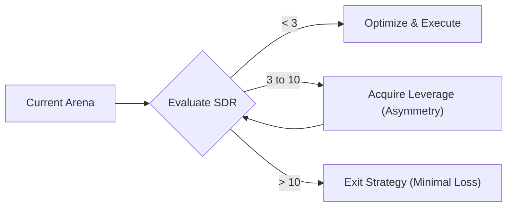

# Protocol 124: The SDR Calculator (Strategic Disadvantage Ratio)

> **Metric**: $SDR = \frac{\sum(\text{Opponent Advantages})}{\sum(\text{User Advantages})}$
> **Law #2**: "When $SDR > 5:1$, fighting is irrational. Disengage or Change the Arena."

---

## 1. The Disadvantage matrix

Evaluate your current "Arena" (e.g., a legal fight, a business competition, a dating scenario) on these 5 vectors:

| Vector | The "0" State (Equal) | The "3" State (God Mode) | Rank (0-3) |
|--------|-----------------------|--------------------------|------------|
| **Information** | Transparant rules/data | Insider info / "Black Box" | |
| **Capital** | Equal cash/runway | Infinite resources (Gov/Corp) | |
| **Regime** | Fixed laws | They are the Judge/Admin | |
| **Convexity** | Symmetric stakes | Their loss is $0, Your loss is $\infty$ | |
| **Asynchrony** | Both must act now | They can wait forever | |

**Calculation**: Sum the Ranks.

- **Score 0-3**: Fair Fight (1:1). High agency.
- **Score 4-7**: Uphill Battle (2:1). Requires superior tactics.
- **Score 8-11**: Rigged Game (3:1). Expect loss of capital.
- **Score 12-15**: Suicide Run (>5:1). **ABANDON SHIP.**

---

## 2. Arena Selection Physics

---

## 3. The "Founder Mode" Auditor (Adversarial View)

When a user says "I will just work harder," run this audit:

1. **The Schlep Test**: Is the difficulty due to hard work (Good) or systemic rigged math (Bad)?
2. **The Exit Hatch**: Does Law #1 allow this level of exposure given the SDR?
3. **The Pivot**: What adjacent arena has an SDR of <2?

---

## 4. Case Examples

| Scenario | Opponent | SDR | Verdict |
|----------|----------|-----|---------|
| Small Biz | Google/Meta Ads | **12** (Capital + Rules) | **EXIT** (Find organic/niche) |
| Litigant | State Prosecutor | **15** (All Vectors) | **SETTLE** (Minimal loss) |
| Dating | High-Tier Arena | **8** (Information) | **LEVERAGE** (Niche positioning) |

---

## Tags

# strategy #sdr #arena #physics #decision-making #leverage
