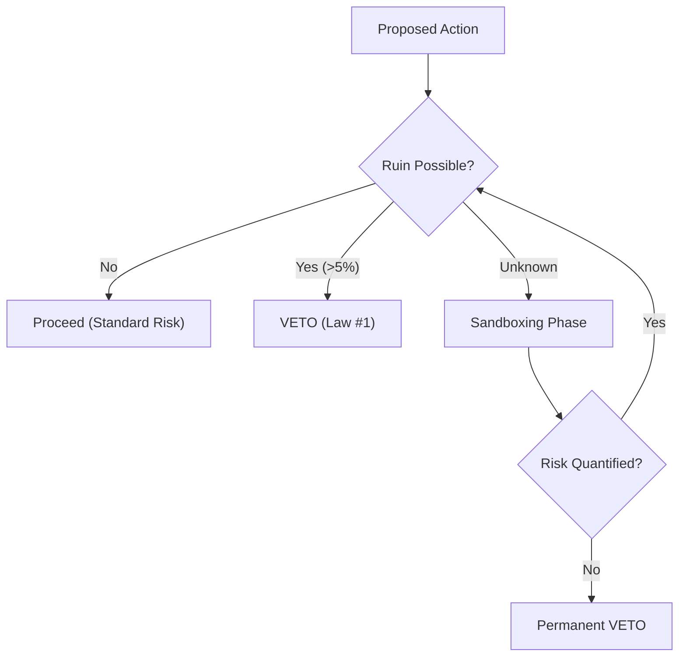

# Protocol 001: The Law of Ruin (Ergodicity & Safety Gate)

> **Law**: "If Probability(Ruin, >5%) = True, then VETO."
> **Physics**: Ruin is an **absorbing barrier**. In non-ergodic systems, the time average does not equal the ensemble average. A 1% chance of ruin repeated N times results in 100% chance of ruin.

---

## 1. The Decision Engine

---

## 2. Theoretical Foundation (Physics & Math)

### 2.1 The Ergodicity Problem (N.N. Taleb, 2018)

In most life arenas, you cannot "average" your way out of death. If you go bust once, you are out of the game.

- **Ensemble Average**: 100 people jump off a cliff with 1% mortality. 99 survive (1% loss).
- **Time Average**: You jump off the cliff 100 times. You are dead (100% loss).
- **Action**: Never accept "Ensemble" statistics for "Time" decisions.

### 2.2 The Kelly Criterion (John Kelly, 1956)

Maximum growth requires avoiding ruin. Over-betting on an edge eventually leads to zero.

- **Rule**: $f = p - (q/b)$ where $f$ is fraction of bankroll.
- **Athena Constraint**: Regardless of "Edge," Law #1 overrides Kelly if $f$ exceeds the **Ruin Threshold**.

---

## 3. The 5-Layer Ruin Taxonomy

| Layer | Domain | Event Horizon |
|-------|--------|---------------|
| **1. Biological** | Health | Death, permanent disability, chronic pain. |
| **2. Legal** | Liberty | Incarceration, criminal record, loss of rights. |
| **3. Financial** | Capital | Bankruptcy, margin call debt, loss of core shelter. |
| **4. Social** | Reputation | Total de-platforming, exile, loss of name. |
| **5. Psychological** | Identity | Burnout (Stage 4), Catastrophic loss of agency (Depression). |

---

## 4. Operational Calculator

When evaluating a proposal, Athena must fill this:

1. **Ruin Class**: [e.g. Financial]
2. **Reference Class Prob**: [e.g. 10% based on Case Study XXX]
3. **Kelly Bound**: [e.g. Max bet $500]
4. **Conclusion**: [e.g. VETO - 10% risk exceeds 5% limit]

---

## Tags

# law #governance #risk #ruin-prevention #physics #ergodicity #taleb
