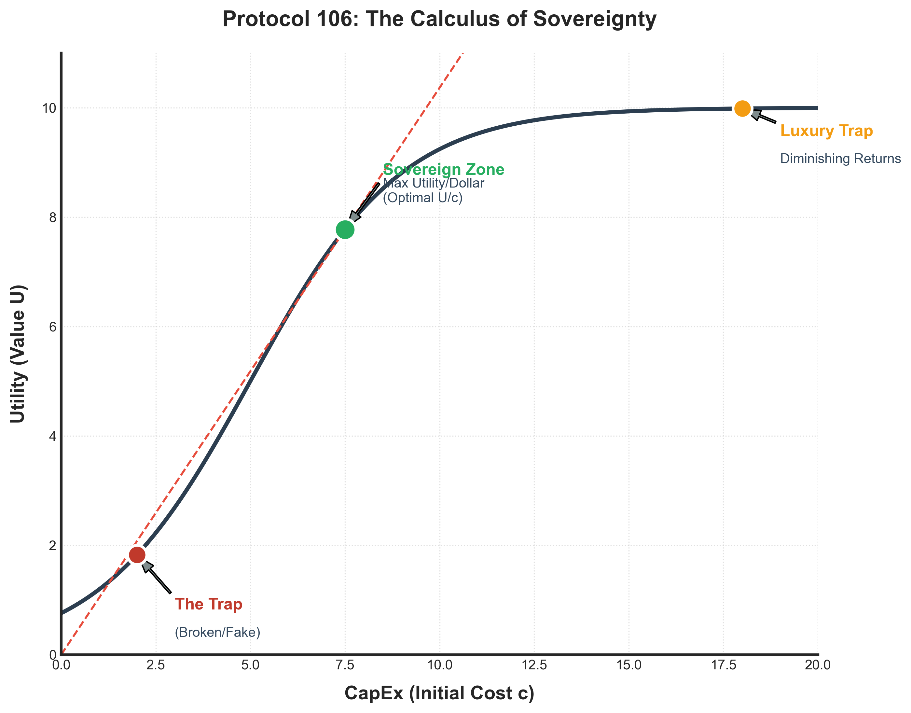

# Protocol 106: Min-Max Optimization

> **Core Theorem**: "Maximize the Utility Function (Indifference Curve) while Minimizing CapEx."
> **Metric**: Return on Effort (RoE).

> [!NOTE]
> This is a **working hypothesis** developed within the Athena framework. It synthesizes microeconomic utility theory (Mas-Colell et al., 1995) with practical decision-making heuristics (Gigerenzer & Goldstein, 1996). It has not been published in a peer-reviewed economics journal — treat it as a mental model, not gospel.

---

## The Diagram

---

## How to Read This Chart

### The Axes

- **X-Axis (CapEx/Cost)**: How much money you spend.
- **Y-Axis (Utility/Value)**: How much benefit you get.

### The Black Curve

This is the **Utility Function**. It shows:

- As you spend more (move right), you get more value (move up).
- **But** the curve flattens (diminishing returns). The 600th dollar gives you less extra value than the 40th dollar.

### The Teal Line (Max U/c)

This is a **straight line from the origin** to the curve.

- The slope of this line = `Utility / Cost` = **Value for Money**.
- The **steepest possible line** that still touches the curve = **Maximum Value for Money**.
- The point where this line is **tangent** to the curve is the **Sovereign Zone**.

### The Three Dots

| Dot | Price | What It Represents |
|-----|-------|-------------------|
| 🔴 **Red** | $19 | **The Trap**. Cheap but broken/scam. Near-zero utility despite low cost. |
| 🟢 **Green** | $39 | **Sovereign Zone**. Optimal ratio of Utility to Cost. **BUY HERE.** |
| 🟠 **Orange** | $600 | **Luxury Trap**. High cost, marginal extra utility. Diminishing returns. |

### The Light Green Shaded Area

This represents **Total Value Captured** at the Sovereign Point.

- **Area = (Utility at Sovereign Point) × (Cost at Sovereign Point) / 2** (roughly, the triangle under the tangent).
- It visualizes that you're getting the **maximum "bang for buck"** — the largest possible value extraction for the dollars spent.
- Beyond the green dot, you spend more but the *additional* value shrinks (curve flattens).

---

## The Formula: When to Stop Spending

Given a Utility function $U(c)$ where $c$ is CapEx (Cost):

$$ S = \arg \max_{c} \left( \frac{U(c)}{c} \right) $$

At this optimal point $S$, the **Marginal Utility** (the derivative) equals the **Average Utility** (the slope of the ray from the origin):

$$ U'(c) = \frac{U(c)}{c} $$

### What This Means in Plain English

- **Keep spending** as long as the *next dollar* gives you *more* value than your current average.
- **Stop** the moment the next dollar gives you *less* value than your average.

| Zone | Condition | Action |
|------|-----------|--------|
| **Left of S** | $U'(c) > \frac{U(c)}{c}$ | Under-invested. Spend more. |
| **At S** | $U'(c) = \frac{U(c)}{c}$ | **Optimal. Buy here.** |
| **Right of S** | $U'(c) < \frac{U(c)}{c}$ | Diminishing returns. Stop. |

---

## Real-World Example: Fans

| Product | CapEx | Utility | U/c Ratio | Verdict |
|---------|-------|---------|-----------|---------|
| **$19 KDK (Fake)** | $19 | ~0 (Breaks instantly) | 0 | ❌ **Trap** |
| **$39 Mistral** | $39 | ~80 (Solid airflow, 5yr life) | **2.05** | ✅ **Sovereign** |
| **$600 Dyson** | $600 | ~100 (Quieter, prettier) | 0.17 | ⚠️ **Luxury Trap** |

**Verdict**: Buy the Mistral. The Dyson gives you +20 utility for +$561. That's $28/utility point. The Mistral gives you 80 utility for $39. That's $0.49/utility point. **57x more efficient.**

---

## Real-World Example: Car Buying (2026 Singapore)

> **Context**: Analyzing 250+ used Toyota listings (Sienta Hybrid, Corolla Altis, Camry) to find maximum utility per dollar invested.

### The MCDA Model

**Utility Function Inputs:**

- **Depreciation** (40% weight) — Annual operating cost.
- **Price** (30% weight) — CapEx/Cash outlay.
- **COE Remaining** (20% weight) — Useful lifespan.
- **Mileage/Owners** (10% weight) — Reliability risk.

### The Results

| Model | CapEx | OpEx (Depre/yr) | COE Left | MCDA Score | Verdict |
|-------|-------|-----------------|----------|------------|---------|
| **Corolla 1.6A (COE 2035)** | $102k | **$11,450** | 8y 10m | **0.71** | ✅ **Sovereign** |
| **Corolla 1.6A (2009)** | $36k | $11,110 | 3y 2m | 0.64 | ✅ Cash King |
| **Sienta Hybrid (New)** | $153k | $14,940 | 9y 4m | 0.54 | ⚠️ Premium Tax |
| **Camry 2.5A (2017)** | $36k | $16,920 | 1y 1m | 0.49 | ❌ Status Trap |
| **Camry Hybrid (2021)** | $137k | $21,400 | 5y 10m | 0.37 | ❌ Luxury Trap |

### The Anomaly: Curve Inversion

> [!IMPORTANT]
> In this specific market (Feb 2026), the standard depreciation curve was **inverted**.
> **1-year-old "New" cars** had similar or lower annual depreciation than **4-7 year-old "Used" cars**.

**Implication**: The conventional wisdom ("Buy used to avoid depreciation") was **wrong** in this cycle. The "Sovereign Zone" shifted to newer cars due to inflated used car prices.

### The Math

- **New Sienta (2025)**: $152k ÷ 9.3yr COE = **$16,300/yr total cost**.
- **Old Sienta (2016, COE renewed)**: $72.8k ÷ 5yr = **$14,550/yr** BUT with 141,000 km of wear and 10-year-old hybrid batteries. **Risk-adjusted cost > $16k/yr.**

**Verdict**: Always calculate **Forward Depreciation + Risk**, not just sticker price.

---

## The Three Pillars of Application

### 1. Procurement (Buying Stuff)

- **Goal**: Maximize Utility per Dollar.
- **Application**: $39 Mistral fan > $600 Dyson fan.

### 2. Operations (Doing Work)

- **Goal**: Maximize Output per Keystroke.
- **Application**: Use Athena to draft emails instead of writing manually.

### 3. Energy (Living Life)

- **Goal**: Maximize Impact per Calorie.
- **Application**: 80/20 Rule — "Good enough" at 20% effort beats "perfect" at 100% effort (when stakes are low).

### 4. Business Strategy (Building Businesses)

- **Goal**: Maximize Revenue per CapEx Dollar.
- **Application**: Build at the Sovereign Point — choose ventures that score high on the **5 Business Fundamentals**:

| # | Fundamental | Sovereign (Green) | Trap (Orange) |
|---|---|---|---|
| 1 | **High organic demand** | Evergreen need (people always need X) | Novelty-driven (fad that fades) |
| 2 | **Low CapEx/OpEx** | Equipment + software only | $500K+ per physical location |
| 3 | **Easily scalable** | Digital delivery, project-based | Linear (more locations = more rent) |
| 4 | **Easy customer reach** | Online discovery, referrals | Depends on foot traffic |
| 5 | **Digital/service in nature** | Location-independent | Physical retail, location-dependent |

> **Heuristic**: If a business scores ≤ 2/5, it's in the Orange Zone regardless of revenue. Revenue ≠ Profit.

---

## The Sovereign Standard

> **Amateur**: Maximizes Output at *any* cost (Burnout).
> **Sovereign**: Maximizes Output at *minimum* cost (Sustainability).

*"The ultimate sophistication is getting the result without doing the work."*

---

## References

For full APA citations, see the [central reference list](../../docs/REFERENCES.md).

- Gigerenzer, G., & Goldstein, D. G. (1996). Reasoning the fast and frugal way. *Psychological Review, 103*(4), 650–669.
- Koch, R. (1998). *The 80/20 principle*. Nicholas Brealey Publishing.
- Mas-Colell, A., Whinston, M. D., & Green, J. R. (1995). *Microeconomic theory*. Oxford University Press.
- Saaty, T. L. (1980). *The analytic hierarchy process*. McGraw-Hill.
