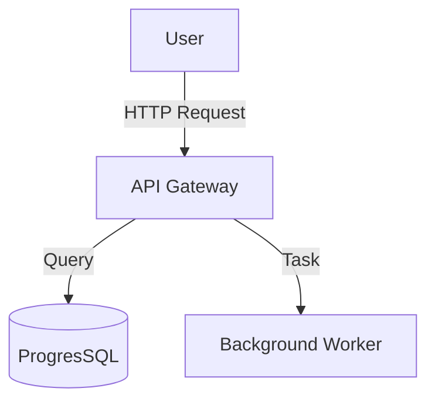

# /diagram — Architecture Visualization

> **Purpose**: Generate visual representations of the codebase to understand structure and relationships without reading thousands of lines.

## Usage

```bash
/diagram [type]
```

## Options

- **`all`**: Generate all diagrams (Architecture + Database + Project Structure).
- **`architecture`**: Visualizes high-level system components and data flow.
- **`database`**: Visualizes database schema, collections, and relationships.
- **`structure`**: Visualizes the file/folder structure of the project.

## Implementation Steps

1. **Analyze Request**: Determine the scope (architecture, db, structure, or all).
    - If `all`, run `python3 .agent/scripts/visualize_graph.py --all`
    - If `architecture`, run `python3 .agent/scripts/visualize_graph.py --arch`
    - If `database`, run `python3 .agent/scripts/visualize_graph.py --db`
    - If `structure`, run `tree -L 2 -I "node_modules|.git|.venv|__pycache__|dist|build"` (or equivalent)

2. **Generate Artifact**: The script should output the diagram to `.context/visualizations/` using Mermaid or ASCII format.

3. **Display**: Show the output to the user or link to the generated file.

## Example


